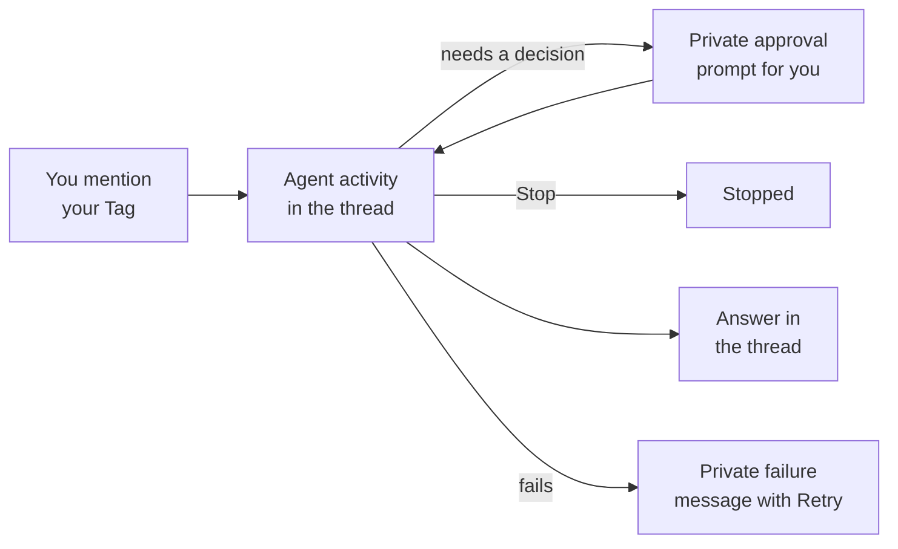

# Control your Tag

You choose who can ask your Tag to work, which sources it can use, and when to
stop a task. Some agent actions also ask for a decision while the task is running.

## Respond to a Codex approval request

Codex normally reviews actions that need additional permissions automatically.
If a supported request reaches Tag, it pauses for your decision and shows
**Codex needs approval** with a short action category. You will not see this
prompt for every task.

### Example: update the budget spreadsheet in your shared folder

You ask Tag to add this month's expenses to the budget spreadsheet in your
team's shared folder. The folder is available on the computer running Tag,
and your agent has a tool that can edit the spreadsheet.

If the shared folder is outside the locations Codex is allowed to write to,
the edit may need additional file access. When Codex sends Tag a file-change
approval request, you see this private message in Slack:

> **Tag**
>
> **Codex needs approval** to change files outside the workspace sandbox.
> Choose the scope you want to allow.
>
> **Allow once** · **Allow for this task** · **Deny** · **Deny and stop**

Choose **Allow once** if you expected Tag to edit the shared budget. Choose
**Deny** if you want to review the changes first; you can then ask Tag to
prepare a separate draft in its workspace. Approval does not grant access
that your local account lacks or change the shared folder's permissions for
other people.

### Other actions that may need approval

| Your task | Why approval may be needed |
| --- | --- |
| Update your team's weekly report in its existing folder | The report is outside the locations Codex can write to. |
| Extract the figures from a scanned invoice | A required document tool needs to be installed using additional permissions. |
| Refresh a report with the latest sales export | The download command needs network access that the current sandbox does not allow. |

These are possible triggers, not a fixed list of tasks that always show a
prompt. Existing permissions and Codex's automatic review determine whether
the action is allowed, refused, or sent to you for a decision. Tag shows these
buttons only when Codex sends it a supported approval request.

### Make your decision

1. Read the action category and any proposed permission or rule details.
   If the action is not what you expected, choose **Deny**.
2. Select one of the choices Codex supports for that request:

   | Choice | Effect |
   | --- | --- |
   | **Allow once** | Approve the pending command or file change. |
   | **Allow for this turn** | Grant the requested permissions for the current agent turn. |
   | **Allow for this task** | Use Codex's session-scoped approval for this Tag task, including follow-up turns. It does not carry over to later Slack requests. |
   | **Always allow this prefix** | Save Codex's proposed command-prefix rule for future matching commands. |
   | **Always allow this host** / **Always deny this host** | Save Codex's proposed network rule for that host. |
   | **Deny** | Refuse the action; Codex may continue with another approach. |
   | **Deny and stop** | Refuse the action and interrupt the agent turn. |

   Not every request offers every choice. Tag respects Codex's explicit choice
   list when provided. Persistent choices appear only when Codex proposes a rule;
   review the complete prefix or host in the private prompt before confirming it.
   These rules are saved by Codex and can affect future Codex runs.
3. Tag replaces the controls with an acknowledgment that your choice was sent
   to Codex. The task's activity and final response show what happened next.

If automatic review already denied an action, supported denials instead offer
**Approve retry** / **Dismiss**. The private prompt identifies the denied action
and shows Codex's stated reason. Common credentials and URL credentials/query
parameters are redacted, and long details are marked as truncated or omitted.
Terminal input content is withheld. If Codex provides no reason, Tag says so.
Approve retry applies only to that exact action
and the retry still undergoes automatic review; this override has no persistent
or session-wide option.

In a channel, only the person who started the task sees the approval prompt.
In a direct message, it appears in that conversation. Only the original
requester can decide, and they must still be authorized to use Tag there.

If Tag says the request has expired or was already decided, the old buttons
cannot approve it. Review the task's latest status before starting another
request. Unsupported or unavailable approval requests are refused rather than
approved automatically by Tag.

## Respond to a Claude approval request

Claude runs in its `auto` permission mode by default, so most actions proceed
without a prompt. When Claude would still ask, Tag privately shows **Claude
needs approval** with a short row: **Allow once**, the broadest saved rule on
offer, and **Deny**. **More options** shows every choice, including **Deny and
stop**, with the exact rule beside each button. Codex approvals use the same
layout. When Claude proposes a rule or a folder for the action, such as
`Bash(claude --chrome --version)` or a folder outside the workspace, Tag also
offers:

- **Allow for this task** — applies the rule or folder access until this Slack
  request ends.
- **Always allow** — saves it for future requests to this Tag.
- **Always allow this prefix** — for a plain shell command with a subcommand,
  saves a rule for the program and its first argument, such as
  `Bash(claude --chrome:*)`, like Codex's prefix rules.

Saved choices ask for confirmation, then go to this Tag's workspace
`.claude/settings.local.json`. Other Tags and the operator's own Claude
settings are not changed. Remove the line from that file to revoke it.

Claude has no **Approve retry** choice. The same requester and expiry rules
apply, and unanswered or unavailable requests are denied. The operator can choose another
mode with `OPENTAG_CLAUDE_PERMISSION_MODE`; see the
[backend reference](../../references/backends.md).

## Follow a task as it works

With Codex or Claude, **Agent activity** shows readable tool steps in the Slack
thread, such as reading a file or reviewing changes. Repeated steps are grouped,
and the card shows complete when the task succeeds. See the
[live activity example](../reference/supported-capabilities.md#watch-tag-work).
Short activity descriptions are shared with the thread; full tool inputs and
results are not shown. The separate Activity button in Slack is currently hidden.

On the computer running Tag, the Tag's **Activity** tab in the app keeps a
summary of each reply, grouped by Slack thread, with its saved steps. From the
terminal, `tag logs --json` lists the same records, and
`tag logs --activity RUN_ID` shows one request's saved steps.

## Stop a task

Use Slack's **Stop** control to interrupt an active Codex or Claude task.
Stopping a task does not undo files it already changed or actions it already
completed. Check the result before asking Tag to try again.

Approval buttons, live activity, and Stop require Codex App Server or the Claude
Agent SDK, Tag's default connections. They are not available with the legacy
Codex exec or Claude print transports.

If a request fails, only you see the failure message. It explains what went
wrong and offers **Retry**, **Fix with coding agent**, which copies a short
handoff for a coding agent, and **Report issue**, which helps you copy an error
report to review before sharing. See [Error reports](../reference/error-reporting.md).

## Choose who and what Tag can access

By default, only you can give your Tag instructions. See
[Sharing access](sharing-access.md) before authorizing another person.
[What Tag knows](what-tag-knows.md) explains the conversations and indexed
sources available to it; [Adding integrations](adding-integrations.md) covers
connected tools and accounts.

Tag uses the local account running its backend, subject to the backend's
permissions. Its workspace folder alone does not restrict access to other files,
and approval prompts do not appear before every action. See
[Your own Tag](access.md#the-work-happens-on-your-computer) for the execution
model and ways to limit the files and accounts available on the host.
