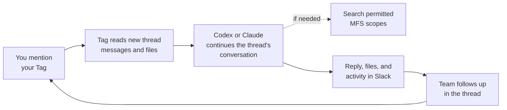

# How Tag works

Here is the basic model:

> Slack is where your team delegates. The agent does the work. MFS supplies
> permitted context when the task needs it.

## The three parts

| Part | What it does | What the operator chooses |
| --- | --- | --- |
| **Slack** | Holds the request, thread context, working state, and result | App installation, authorized callers, and selected channels |
| **Agent workspace** | Runs Codex or Claude in the Tag's folder (`~/Tag/<id>`) and gives the agent files and locally available tools | AI connection, model and thinking level, local tools, and process permissions |
| **MFS** | Acts as a searchable context layer over indexed sources | Connectors, credentials, indexed sources, and allowed retrieval scopes |

Slack is the shared interface, not the place where commands run. The CLI agent
does the work, but it does not automatically know the organization's history.
MFS gives it searchable context without opening every indexed source to Tag.

## What happens after a mention

While the agent works, the thread shows its live activity. If it needs a
decision, only the requester gets a private approval prompt.

A later mention in the same thread continues the same agent conversation and
receives only the new thread messages. A new or fresh conversation receives one
page of up to 30 thread messages, and the triggering request separately. You can
ask your Tag to "compare that with the current plan" without restating the
discussion. By default, only the owner can request work from their Tag.
Teammates can add details in the thread for the owner's next request to draw
on. See [Sharing access to your Tag](sharing-access.md) if the owner needs to
let others make requests.
Anything outside that slice of the thread must come from the workspace, an
approved MFS source, or a tool available to the agent.

## What persists

| Information | Persists where | Available on a later mention? |
| --- | --- | --- |
| Current conversation | Slack thread and the agent conversation for that thread | Yes, for the same requester, until 4 idle hours or the size limit |
| Files and task output | Configured workspace | Yes, while they remain in that workspace |
| Indexed organizational context | MFS | Yes, while the source remains indexed and permitted |
| Earlier tool results and reasoning | The thread's agent conversation | Yes, in the same thread |
| The Tag's model and thinking level | Tag's settings | Yes, for every request to that Tag |

A follow-up works because Tag continues the thread's conversation and because
the workspace and indexed sources are still there. See
[ADR 0009](../adr/0009-thread-scoped-agent-conversations.md).

## When Tag uses MFS

Tag does not search MFS for every request. The current thread may already have
the answer, or the task may only involve files in the workspace.

When outside context is needed, the agent uses Tag's bundled helpers, which
call the local MFS server's HTTP API. They search only roots listed in
`MFS_ALLOWED_SCOPES`. Search results can then be reopened for more precise
evidence. A source must be both indexed in MFS and permitted to this Tag
deployment before the agent can retrieve it through the bundled helpers.

## What operators control

The operator configures:

- who can invoke Tag;
- the Slack channels where Tag may run;
- whether Codex or Claude performs the work, through a shared AI connection;
- the Tag folder in which the agent runs;
- the MFS sources and roots available for retrieval;
- credentials and grants used by connectors and local tools;
- the Tag's model and thinking level, timeouts, and retries.

For the exact current feature set, see
[Supported capabilities](../reference/supported-capabilities.md). For the
implementation-level behavior contract, see the
[runtime agent reference](../../references/runtime-agent.md).
