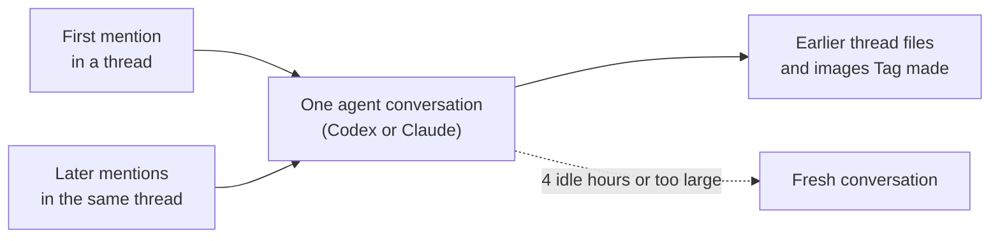

# What Tag knows

You can follow up in a Slack thread, ask Tag to find an earlier discussion, or
give it a decision to remember. What it can use depends on the conversation,
the files in its workspace, and the sources and tools configured for it.

## Continue the conversation

Mention Tag in the same thread when you want to build on an answer:

> @Maya's Tag turn that into a one-week action plan.

Each Slack thread keeps one agent conversation, with Codex or Claude. A later
mention in the same thread continues it, so earlier tool results and reasoning
carry forward. Tag sends only the thread messages posted since its last reply.

Only the person who started a conversation continues it; another requester in
the same thread starts their own. A conversation starts fresh after 4 idle
hours or when it grows too large. A fresh conversation reads one page of up to
30 thread messages, so restate an important detail if it seems lost.

Tag can also reopen files shared earlier in the thread and images it made
before. See [Use earlier files in a thread](workspaces-and-tools.md#use-earlier-files-in-a-thread).

## Find a discussion in another channel

> @Iris's Tag find the launch decision in #product and compare it with the plan in
> your workspace. Show me which messages support the decision.

Tag can search another channel's history when it has been indexed and made
available by the person running Tag. Inviting the bot to a channel does not
automatically make all its history searchable.

The same applies to other indexed sources, such as project documents and
issues. A source may be missing or its index may be out of date. If Tag cannot
find something, that alone does not mean the discussion never happened.

## Ask Tag to remember something

> @Rowan's Tag remember that our weekly report is due Friday.
>
> **Rowan's Tag:** I'll keep that in mind for this channel.
>
> Memory saved for this channel: `report-deadline`: Our weekly report is due Friday.

Tag remembers only what someone explicitly asks it to remember. It saves the
fact for the current channel and loads it before every later request there,
in any thread, including after a restart. The last line comes from Tag's
memory store, not from the agent's answer, so it appears only when the save
actually succeeded.

Say "for all channels" when a fact applies everywhere this Tag works:

> @Rowan's Tag for all channels, write replies in British English.

A channel's own memory replaces an all-channels entry with the same name in
that channel. Other channels cannot read it.

You can also ask Tag:

- "What do you remember?" to list what this channel can use.
- "Change the deadline to Thursday." Tag keeps the old value in its history
  so the change can be undone. Say the old value was wrong or sensitive, and
  Tag does not keep it.
- "Forget the report deadline." Tag can no longer reach the entry, including
  its history. The original Slack messages are not changed.

Anyone who can use Tag can save, change, or forget memory, and each reply says
exactly what changed. Short facts are loaded with every request; longer
details are kept as notes that Tag reads when it needs them. Tag refuses a
save that would make the always-loaded memory too large rather than dropping
something silently.

Tag does not save a note after every conversation. For a longer document, ask
Tag to write it to a workspace file. To make that file searchable through MFS,
the operator must include it in an indexed, permitted source.

## Get help from other Tags

When the owners have connected their Tags, one Tag can ask others for help and
combine their answers:

> @Maya's Tag ask Research Tag for Acme's Q3 revenue and Writer Tag for the
> approved launch headline, then write a two-line launch report.

Maya's Tag posts one new message in the channel that asks both Tags and links
back to your thread. Your thread shows the progress as steps, like Tag's other
work: "Waiting for Writer Tag", "Research Tag replied", then "Write the final
answer", with a link to that message. Each Tag says it is
working, then answers in the thread under that message. When every Tag has
replied, or after the deadline (30 minutes unless you ask for a different
time), Maya's Tag writes the final answer in your thread and adds a link to it
in the request thread. If a Tag doesn't reply or can't help, the answer says
so.

The other Tags see only the request message, not your thread, and they work
with their own files, memory, and accounts. A Tag that is answering another Tag
cannot pass the work on again.

## Use the tools already available to the agent

Tag runs your local Codex or Claude Code agent.
The skills and MCP connections that
the CLI loads can help it carry out a request, alongside installed commands.
Availability depends on the account running Tag, the selected backend's
configuration, and the tool's credentials and permissions.

For example, with the Google Workspace CLI (`gws`) installed and authenticated,
and the Gmail skill available to the agent, you could ask:

> @Zara's Tag find the latest email about the launch schedule and summarize what
> changed.

The skill explains how to use `gws`; the Google login determines which email
it can access. Installing a skill alone does not grant access to an account.
These tools use their own permissions, separately from the indexed-source
settings.

## Built on MFS

Tag began as a modified version of the Open Tag example in MFS and uses MFS
to search indexed sources. See the [project attribution](../../README.md#origins-and-attribution)
for its origins and the [memory reference](../../references/memory.md) for
retrieval details.
