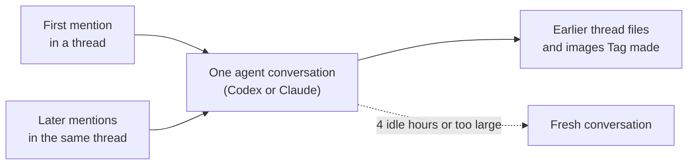

# What Tag knows

You can follow up in a Slack thread, ask Tag to find an earlier discussion, or
give it a decision to remember. What it can use depends on the conversation,
the files in its workspace, and the sources and tools configured for it.

## Continue the conversation

Mention Tag in the same thread when you want to build on an answer:

> @Maya's Tag turn that into a one-week action plan.

Each Slack thread keeps one agent conversation, with Codex or Claude. A later
mention in the same thread continues it, so earlier tool results and reasoning
carry forward. Tag sends only the thread messages posted since its last reply.

Only the person who started a conversation continues it; another requester in
the same thread starts their own. A conversation starts fresh after 4 idle
hours or when it grows too large. A fresh conversation reads one page of up to
30 thread messages, so restate an important detail if it seems lost.

Tag can also reopen files shared earlier in the thread and images it made
before. See [Use earlier files in a thread](workspaces-and-tools.md#use-earlier-files-in-a-thread).

## Find a discussion in another channel

> @Iris's Tag find the launch decision in #product and compare it with the plan in
> your workspace. Show me which messages support the decision.

Tag can search another channel's history when it has been indexed and made
available by the person running Tag. Inviting the bot to a channel does not
automatically make all its history searchable.

The same applies to other indexed sources, such as project documents and
issues. A source may be missing or its index may be out of date. If Tag cannot
find something, that alone does not mean the discussion never happened.

## Ask Tag to remember a decision

> @Rowan's Tag save our Friday report deadline in reporting-notes.md.
>
> **Rowan's Tag:** Saved in reporting-notes.md: Our weekly report is due Friday.

Tag does not provide a dedicated saved-note command or local memory store.
For a decision you need later, ask Tag to write it to a specific workspace
file. To make that file searchable through MFS, the operator must include it
in an indexed, permitted source. Saving a file and indexing it are separate
steps; ask Tag to confirm what it actually completed.

Tag does not automatically save a note after every conversation. Files it
writes in the workspace remain available while they are kept there, and
indexed conversations can be searched without turning each one into a note.

## Use the tools already available to the agent

Tag runs your local Codex or Claude Code agent.
The skills and MCP connections that
the CLI loads can help it carry out a request, alongside installed commands.
Availability depends on the account running Tag, the selected backend's
configuration, and the tool's credentials and permissions.

For example, with the Google Workspace CLI (`gws`) installed and authenticated,
and the Gmail skill available to the agent, you could ask:

> @Zara's Tag find the latest email about the launch schedule and summarize what
> changed.

The skill explains how to use `gws`; the Google login determines which email
it can access. Installing a skill alone does not grant access to an account.
These tools use their own permissions, separately from the indexed-source
settings.

## Built on MFS

Tag began as a modified version of the Open Tag example in MFS and uses MFS
to search indexed sources. See the [project attribution](../../README.md#origins-and-attribution)
for its origins and the [memory reference](../../references/memory.md) for
retrieval details.
