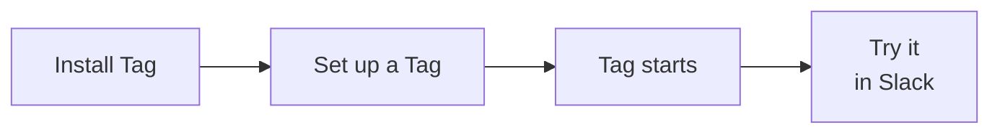
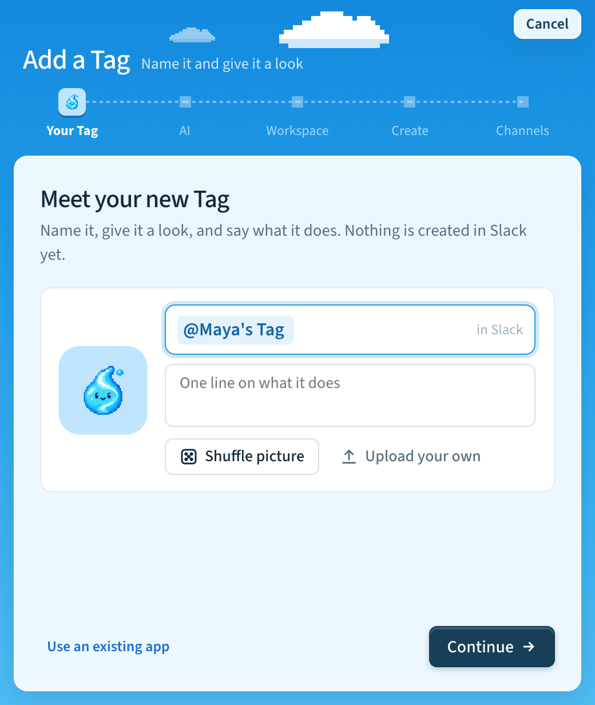
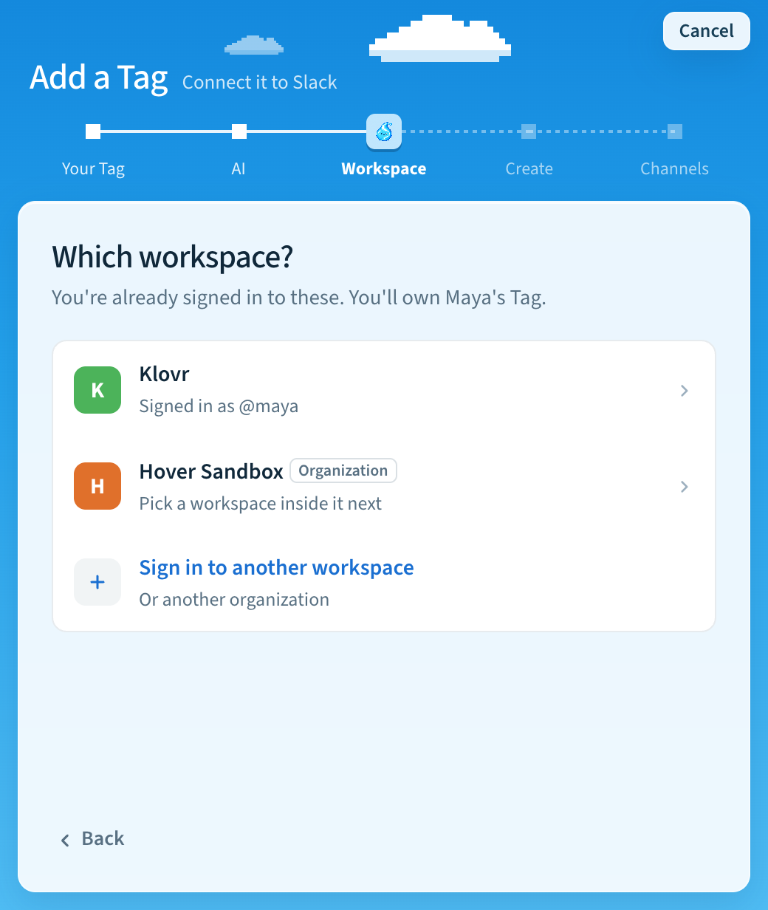
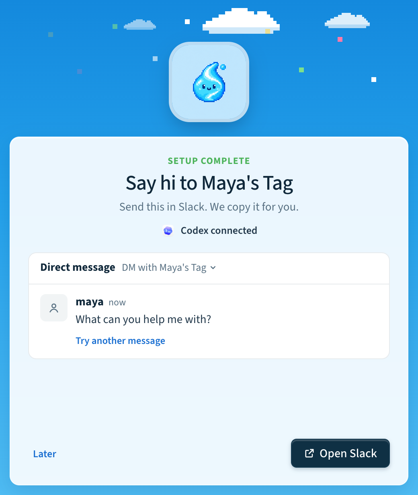

# Set up Tag

Install Tag, connect it to Slack, then try a task in a thread. The easiest way
is the Tag desktop app. You can also use the terminal, or ask your coding agent.

## Before you begin

Use a computer that can stay awake and connected to the internet while Tag
handles requests. The Tag app is for macOS; the Windows and Linux app is coming
soon. On Windows or Linux, use the terminal or your coding agent. You'll need:

- An AI connection: Codex or Claude Code signed in on that computer, a ChatGPT
  plan, or an API key. Setup checks it and helps you sign in.
- Permission to create and install a Slack app in your workspace. Your workplace
  may require an administrator to approve it.

By default, only you can ask your Tag to work. Other people in the channel can
read your requests and Tag's replies. See [Your own Tag](../concepts/access.md)
for how Tag uses your agent's files, tools, and connected accounts.



## Set up with the app

The Tag app runs on macOS. It installs everything Tag needs and walks you
through your first Tag.

### Install the app

1. Download Tag for your Mac from the
   [Tag guide](https://www.hover.team/tag/) or
   [GitHub releases](https://github.com/klovr-co/hover-tag/releases), and open
   it.
2. Choose **Install Tag**. Installation takes a few minutes and needs about
   650 MB. It needs no administrator password.
3. Choose **Set up your first Tag**.

### Name your Tag

Give your Tag the name people will @mention in Slack, a one-line description,
and a picture. Choose **Shuffle picture** for a new one, or **Upload your own**.
Nothing is created in Slack yet.



Already have a Slack app you want to use? Choose **Use an existing app**
instead. See [Use an existing app](../tag-management.md#use-an-existing-app).

### Choose the AI and the workspace

1. **AI.** Choose the model and thinking level for every request. If no AI
   connection works yet, the app opens **AI connections** so you can sign in,
   then returns.
2. **Workspace.** Pick a Slack workspace you're already signed in to, or choose
   **Sign in to another workspace**. The Slack account you pick becomes your
   Tag's owner.



An **Organization** row is an Enterprise Grid organization or a developer
sandbox. See [Enterprise Grid and developer sandboxes](../reference/slack-organizations.md).

### Create it in Slack

1. **Create.** Check the recap. Nothing changes in Slack until you choose
   **Create in Slack**. Tag then creates the Slack app, sets its picture,
   installs it, and connects it.
2. **Channels.** Choose where your Tag can reply. You can choose **Skip for
   now** and `/invite` your Tag to a channel later.

### Say hi

Your Tag starts by itself, and the app shows each step. When it's ready, the
app suggests a first message. Choose where to send it, then choose **Open
Slack**. The app copies the message for you. Paste it in Slack and send it. The
app tells you when your Tag replies.



To keep your Tag running after you restart the computer, turn on **Open Tag at
login** and **Keep Tags running** in **Settings** → **General**.

For more about the app, see [A quick tour of the app](../tag-management.md#a-quick-tour-of-the-app).
Then continue to [Try your Tag in Slack](#try-your-tag-in-slack).

## Set up in your terminal

Run the installer. On macOS and Linux:

```bash
curl -fsSL https://hover.team/tag/install | sh
```

On Windows, see [Install from a terminal](../installation.md#install-from-a-terminal)
for the PowerShell command. You don't need Python or Slack CLI; the installer
installs private copies.

If your terminal cannot find `tag`, add its command directory to your path:

```bash
export PATH="$HOME/.local/bin:$PATH"
```

Add the same line to your shell configuration (`~/.zshrc` for zsh or
`~/.bashrc` for bash) to keep it available in new terminals.

Start guided setup:

```bash
tag setup
```

Setup asks the same questions as the desktop app, in the same order: name, description,
and picture; AI model; Slack workspace; a recap; then channels. Tag makes your
signed-in Slack account its owner. Private channels need an invitation before
they appear. New setups include channels the app has already joined; later
invitations also make channels eligible for replies and history indexing.

Setup saves completed answers. If you pause or encounter an error, run
`tag setup` again to resume. When setup finishes, bring Tag online:

```bash
tag start
```

For detailed setup options, see [Set up and manage Tag](../tag-management.md).

## Set up with your coding agent

Codex or Claude Code can install and set up Tag for you. Install the setup
skill from your terminal. This command requires
[Node.js and npm](https://nodejs.org/en/download):

```bash
# Codex
npx skills add klovr-co/hover-tag --skill hover-tag-setup -a codex -g
# Claude Code
npx skills add klovr-co/hover-tag --skill hover-tag-setup -a claude-code -g
```

Open a new session and ask:

```text
Use the hover-tag-setup skill to set up Tag for me.
```

Your agent checks what's already installed and proposes all your setup choices
together. Reply **Use these defaults** or list all changes in one message.
After you approve the plan, it installs Tag if needed and drives setup.

If Slack login is needed, your agent shows a one-time connection in the
conversation. In the Slack workspace you want to connect, paste it into the
message box of **any channel or DM** and send it; it does not need to be a Tag
channel. Choose **Confirm**, then return the short code from the next Slack
window in one reply. These values are single-use and short-lived. Slack's
illustrated
[authorization guide](https://docs.slack.dev/tools/slack-cli/guides/authorizing-the-slack-cli/)
shows where the command and short code appear.

## Keep Tag running

Tag runs in the background, so you can close the app's window or your terminal.
Keep the computer awake and connected. Check it anytime in the app's Home or
with `tag status`. Stop it with the Tag's switch in the app or `tag stop`, and
start it again with `tag start`.

To start your Tags again after you restart the computer, turn on **Keep Tags
running** in the app or run `tag autostart on`.

On the first successful start, if the Tag has exactly one owner account, Tag
sends that account a welcome DM with a first-task suggestion and a
[Hover Community help link](https://join.slack.com/t/hover-community/shared_invite/zt-4aghkshid-n7fRukS7_J5sR2jDLBXK9A).
When sent, the welcome confirms the connection; try a task to verify your
agent's first reply.

## Try your Tag in Slack

In a channel connected during setup, post a short planning note. You can use
the example below or write one for your own work.

Reply in that message's thread and mention your Tag. These examples use
Maya's Tag; select your own app's mention from Slack's suggestions. The replies
below are illustrative. Continue in the same thread to assign the support
briefing and update the checklist:

> **Maya:** We need to prepare the launch. Maya will finish the FAQ by Tuesday.
> Jules will test signup by Wednesday. Nobody has taken the support briefing yet.
>
> **Maya:** @Maya's Tag turn this into a checklist with owners and deadlines. Flag anything missing.
>
> **Maya's Tag:** Here's the launch checklist:
>
> ☐ Finish the FAQ — Maya, by Tuesday.
>
> ☐ Test signup — Jules, by Wednesday.
>
> ☐ Brief support — owner and deadline missing. Who will take this, and by when?
>
> **Maya:** @Maya's Tag I'll handle the support briefing on Thursday. Update the checklist.
>
> **Maya's Tag:** Updated the checklist:
>
> ☐ Finish the FAQ — Maya, by Tuesday.
>
> ☐ Test signup — Jules, by Wednesday.
>
> ☐ Brief support — Maya, on Thursday.
>
> All three tasks now have an owner and a deadline.

Check that the first reply appears in the same thread, keeps the two assigned
tasks and their deadlines, and flags the missing owner and deadline for the
support briefing. That confirms Tag received your request, ran your AI agent, and
returned a result to Slack.

The updated checklist should include your follow-up alongside the earlier
tasks. Tag uses the thread messages as context.

Once this works, explore [Working with files](../concepts/workspaces-and-tools.md)
or [Adding integrations](../concepts/adding-integrations.md).

## Need help?

Run `tag doctor` to check for problems, or open the Tag's **Logs** tab in
the app. Then follow [Troubleshooting](../troubleshooting.md).
