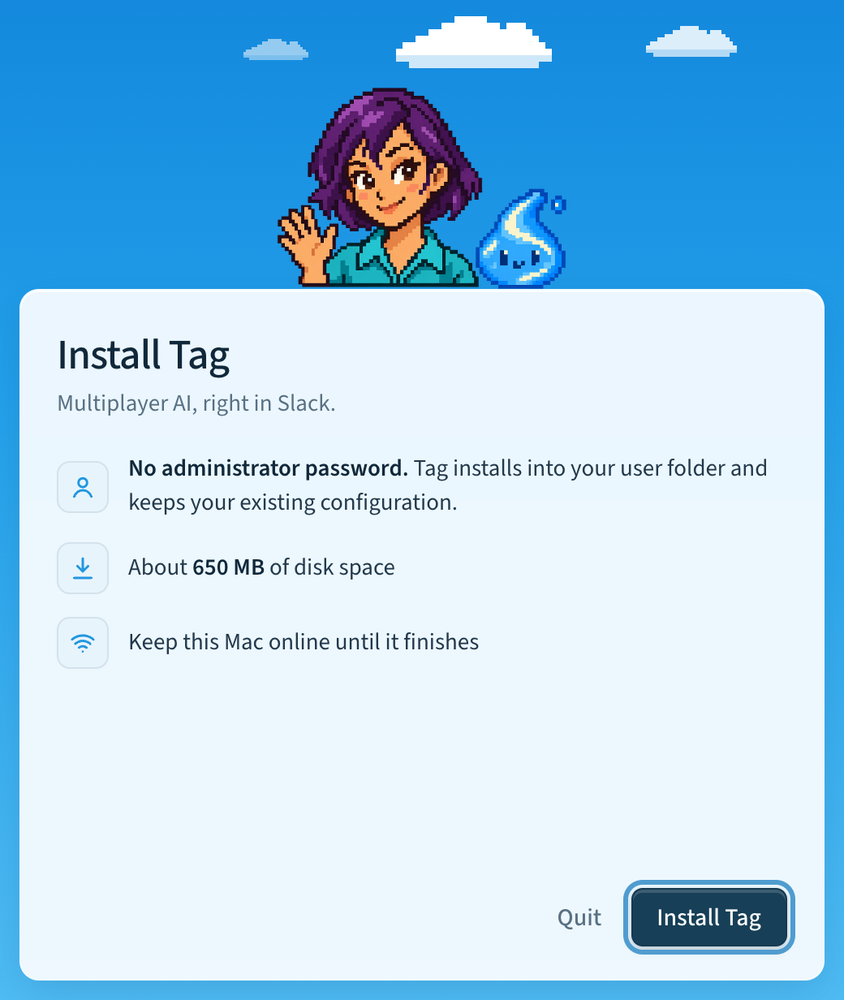
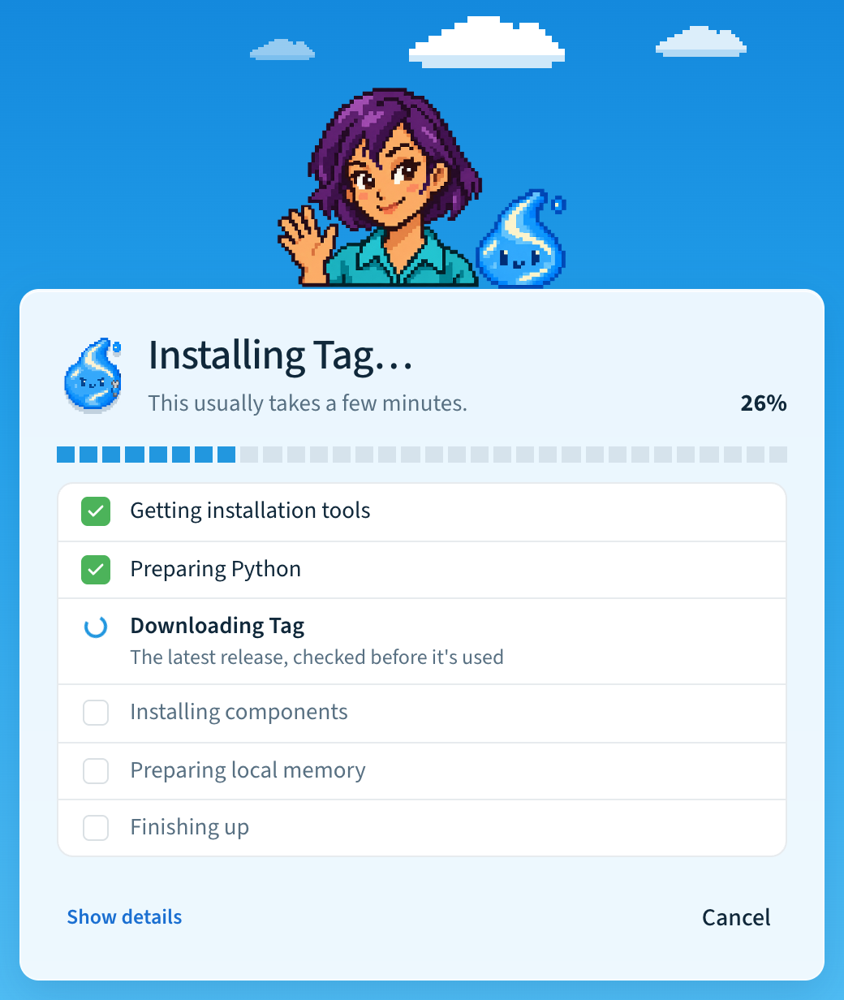
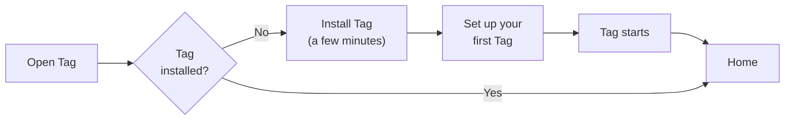
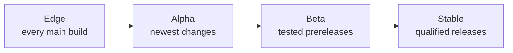

# Install Tag

Install Tag in three steps. It takes a few minutes.

## 1. Download Tag

Download Tag from the [Tag guide](https://www.hover.team/tag/) or from
[GitHub releases](https://github.com/klovr-co/hover-tag/releases):

| Your computer | Download | Then |
| --- | --- | --- |
| Mac | `Tag-VERSION-macos.dmg` | Open it and drag Tag to **Applications**. |

Windows and Linux: coming soon. Until then, use the terminal installer. See
[Install from a terminal](#install-from-a-terminal).

During the 0.3 beta, downloads are prereleases.

## 2. Open it and click Install Tag

Open Tag and click **Install Tag**. You don't need an administrator password.
Keep your computer online until it finishes.



Tag shows each step with a progress bar. **Preparing local memory** takes
the longest.



If a step fails, the app tells you why. Click **Try again**. It is safe to
retry. To share what went wrong, click **Show details**, then **Copy details**.

## 3. Set up your first Tag

Click **Set up your first Tag**. The app asks for:

1. Your Tag's name, description, and picture.
2. Its AI model.
3. Its Slack workspace.

Then it shows a recap. When you approve it, the app creates the Slack app and
lets you choose channels. Your Tag then starts by itself. See
[Add a Tag](tag-management.md#add-a-tag).



When you're done, the app opens on **Home**. Mention your Tag in Slack to try
it. See [Your first task](getting-started/first-task.md).

The app stays in the menu bar when you
close the window. To keep your Tags running after a restart, open
**Settings** → **General** and turn on **Open Tag at login** and **Keep Tags
running**.

## Before you begin

- [ ] A computer that can stay awake and online while Tag answers: macOS 12 or
  later for the desktop app. The terminal installer also supports Windows 10
  or 11 and 64-bit Linux.
- [ ] About 650 MB of free disk space.
- [ ] An AI account. Use Codex or Claude Code if you have one. You can also
  connect a [ChatGPT plan](reference/chatgpt-connection.md) or an
  [API key](reference/api-connections.md) during setup.
- [ ] Permission to add an app to your Slack workspace. Your workplace may
  need an administrator to approve it.

You don't need to install anything else. Tag brings its own copy of Python and
Slack CLI. It doesn't install or change Codex or Claude Code.

## Install from a terminal

You can install the same `tag` command without the app.

Mac and Linux:

```sh
curl -fsSL https://hover.team/tag/install | sh
```

Windows PowerShell (5.1 or later):

```powershell
$installer = Join-Path $env:TEMP 'tag-install.ps1'
Invoke-WebRequest https://raw.githubusercontent.com/klovr-co/hover-tag/main/install.ps1 -OutFile $installer
& $installer
```

Then run `tag setup` and `tag start`. For install options, coding-agent setup,
where files live, and running from source, see
[Installation details](reference/installation-details.md).

## Update Tag

The app checks for updates every six hours. When one is ready, you see
**Update Tag**. Click it. Updates never install without your click. Your
settings are kept. If an update stops halfway, click **Try again**.

In the terminal: `tag upgrade`.

## Release channels

A release channel decides how new the updates you get are.



- **Stable** gets fully tested releases.
- **Beta** gets prereleases that are being tested.
- **Alpha** gets the newest changes first.
- **Edge** gets every build. It is for developers and is terminal-only.

The app follows the channel it was downloaded from, so a beta download follows
beta. To change it, open **Settings** → **Updates** → **Release channel**.
The app shows what will change, then updates the app and your Tags together.

If you switch to a channel whose newest release is older than yours, you keep
your release until that channel catches up.

In the terminal: `tag upgrade --channel beta`.

## Upgrade from v0.2

Download Tag, or run `tag upgrade --channel beta` (during the 0.3 beta).
The app finds your Tags and opens Home. You don't need to set up again.

What you'll notice:

- Your first Tag has a new name made from its Slack workspace and app IDs.
- Each Tag has one model and thinking level. Change it in the Tag's
  **Details** tab. The old **Configure** view in Slack is gone.
- Files Tag saves also appear in the Slack thread.
- If Slack needs you to sign in again or an administrator to approve,
  Tag tells you exactly what to do.

If a Tag doesn't restart, see
[Troubleshooting](troubleshooting.md#after-an-upgrade). For the full list of
changes, see
[Upgrade migrations from v0.2](reference/installation-details.md#upgrade-migrations-from-v02).

## Uninstall

Choose the smallest step that does what you need. Each step keeps your Slack
app unless you choose to delete it.

| Goal | Do this |
| --- | --- |
| Remove one Tag | In the Tag's **Details** tab, click **Remove this Tag…**. Its files move to an `abandoned` folder. The Slack app stays. |
| Remove one Tag and its Slack app | Click **Remove this Tag…**, then **Also delete the Slack app…**. This is permanent. A new app gets a different App ID and bot. |
| Stop Tags starting at login | In **Settings** → **General**, turn off **Keep Tags running** and **Open Tag at login**. |
| Start one Tag's setup over | In the terminal: `tag NAME reset`. |

To uninstall Tag completely:

1. In the Tag app, click **Stop all** for each workspace. Then run
   `tag autostart off` and `tag memory stop` in a terminal.
2. Quit the app and delete it. Drag it to the Trash.
3. Remove the `tag` command from its folder.
4. Back up anything you want to keep. Then delete Tag's files and each Tag's
   folder in `~/Tag`. See
   [Where Tag keeps files](reference/installation-details.md#where-tag-keeps-files).

Your Codex and Claude settings and MFS data in `~/.mfs` stay in place. Slack
apps stay in Slack until you delete them there.

If you reinstall later, your Tags come back.
