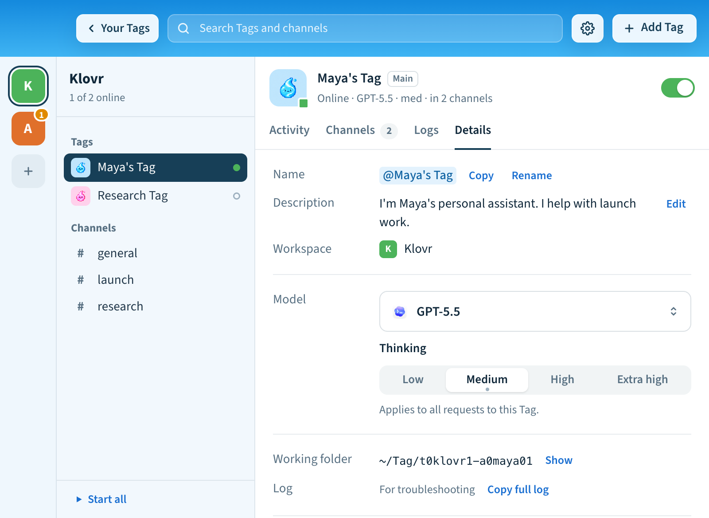
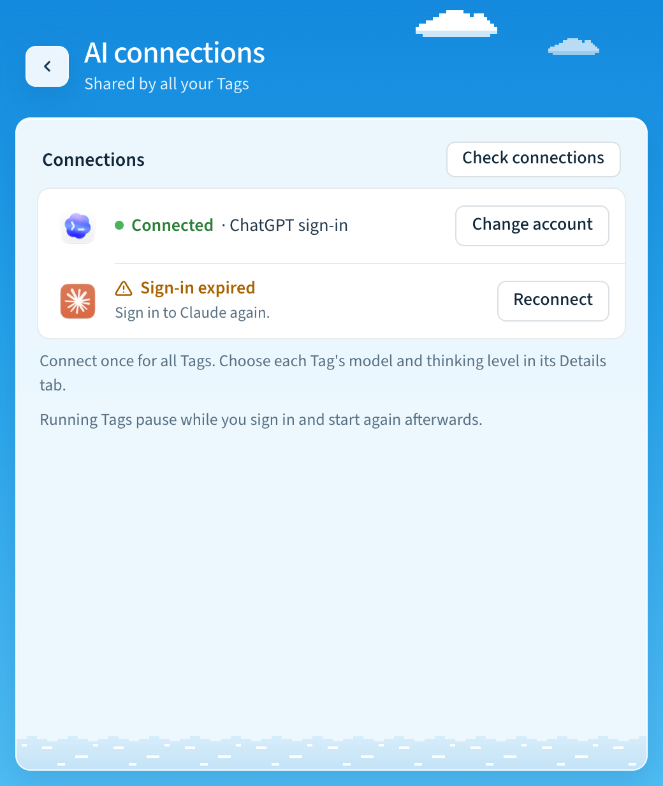
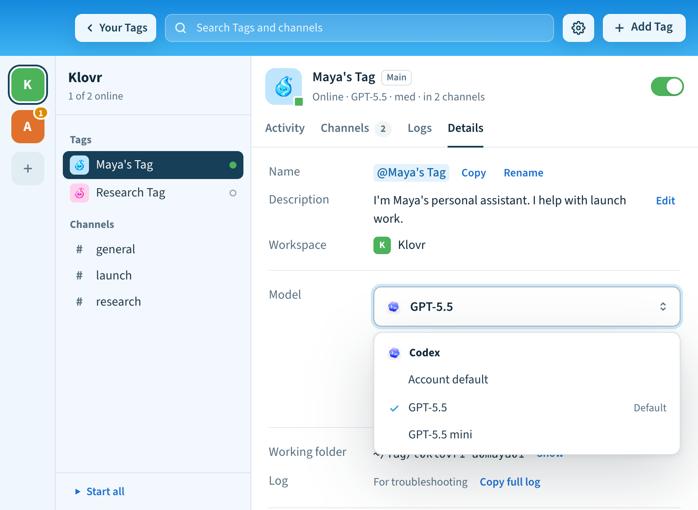

# Models

Any model that works in Codex or Claude Code works in Tag. Pick one for each
Tag, switch whenever you like, and pay with a plan you already have or your own
API key.

## Choose and switch a model

In the app, click a Tag and open its **Details** tab. Choose a **Model**, then
a **Thinking** level. The levels you see depend on the model.



In the terminal:

```sh
tag settings ai models                          # what your accounts can use
tag settings ai model codex:gpt-5.5 --effort medium
```

The list comes from the accounts you've connected. Tag saves your choice and
restarts the Tag if it's running, and every request uses that model.

## Use a plan you already have

Sign in with your ChatGPT plan (for Codex) or your Claude plan (for Claude Code)
in **Settings** → **General** → **AI connections**, or with `tag settings ai`
in the terminal. All your Tags share these sign-ins. Choose **Check
connections** to test them. If a sign-in has expired, choose **Reconnect**.



See [Use your ChatGPT plan](chatgpt-connection.md) for details.

## Use your own API

A compatible API is any service that speaks the same language as Codex or
Claude Code, so Tag can send requests to it instead of to OpenAI or Anthropic
directly. That could be your company's AI gateway, a provider proxy, or your own
OpenAI or Anthropic API key.

- **For Codex**, the service must support the OpenAI **Responses** API.
  Chat Completions-only endpoints don't work.
- **For Claude**, the service must support the Anthropic **Messages** API.

You set this up per Tag from the terminal; the app's AI connections screen
handles sign-ins, not API keys. Copy your key first, then paste the commands.
`pbpaste` sends the key straight from your clipboard, so it never appears in
your shell history.

### Example: an OpenAI-compatible gateway (Codex)

```sh
tag stop
tag config set OPENTAG_CODEX_BASE_URL https://gateway.example.com/v1
pbpaste | tag config set OPENTAG_CODEX_API_KEY --stdin
tag config set OPENTAG_CODEX_MODELS gpt-5.5
tag config set OPENTAG_CODEX_AUTH api
tag config set OPENTAG_DEFAULT_MODEL codex:gpt-5.5
tag start
```

Leave out the base URL line to use OpenAI directly. List more models with
commas, for example `gpt-5.5,gpt-5.5-mini`.

### Example: an Anthropic-compatible gateway (Claude)

```sh
tag stop
tag config set OPENTAG_CLAUDE_BASE_URL https://gateway.example.com
pbpaste | tag config set OPENTAG_CLAUDE_API_KEY --stdin
tag config set OPENTAG_CLAUDE_MODELS claude-opus-5-5
tag config set OPENTAG_CLAUDE_AUTH api
tag config set OPENTAG_DEFAULT_MODEL claude:claude-opus-5-5
tag start
```

Leave out the base URL line to use Anthropic directly.

Use the model IDs your gateway expects. Add `NAME` after `tag` to set up a
Tag other than your main one, for example `tag research-tag config set …`.
`tag doctor` checks the setup without spending tokens; your first real request
confirms the key and model work. To go back to your plan sign-in, set
`OPENTAG_CODEX_AUTH` or `OPENTAG_CLAUDE_AUTH` to `inherit` and restart.

### Then pick the model in the app

After the Tag restarts, the models you listed appear in its model picker. Open
the Tag, go to **Details**, and choose one under **Model**. It works the same
way whether a model comes from your plan or from your API.



## API connection reference

Each Tag can use an explicit API connection for Codex or Claude. Existing Tags
continue to inherit their CLI sign-in unless you select an API connection.
The CLI binaries are still required; Claude also requires Tag's bundled Agent SDK.
API connections are configured per Tag with `tag config set`. The app's AI
connections screen manages sign-ins (Codex, ChatGPT plan, Claude), not API keys.

Stop the Tag before changing connections. Configure the endpoint, key and models
first, then select the authentication mode last and start the Tag. Settings take
effect on the next start. Prefix commands with `tag NAME` for another Tag.

### Azure OpenAI with Codex

Configure a Responses-compatible Azure deployment. The model name is your Azure
**deployment name**, which may differ from the underlying model name.

```sh
tag stop
tag config set OPENTAG_CODEX_BASE_URL https://YOUR_RESOURCE.openai.azure.com/openai
tag config set OPENTAG_CODEX_API_VERSION 2025-04-01-preview
tag config set OPENTAG_CODEX_MODELS YOUR_DEPLOYMENT_NAME
tag config set OPENTAG_CODEX_API_KEY --stdin
tag config set OPENTAG_CODEX_AUTH azure
tag config set OPENTAG_DEFAULT_MODEL codex:YOUR_DEPLOYMENT_NAME
tag start
```

For the key command, provide the key through stdin (for example, pipe it from a
password manager). Do not put keys in command arguments or shell history.

Use the API version supported by your Azure deployment. For Azure's versionless
`/openai/v1` Responses endpoint, set that full base URL and clear
`OPENTAG_CODEX_API_VERSION` with `tag config set OPENTAG_CODEX_API_VERSION ''`.
Tag sends the resource key in the `api-key` header. Microsoft Entra token
acquisition/renewal is not implemented by this connection mode.

### OpenAI or a compatible Codex gateway

Set `OPENTAG_CODEX_AUTH` to `api`. The default URL is
`https://api.openai.com/v1`; optionally set `OPENTAG_CODEX_BASE_URL` to the full
API base of a Responses-compatible gateway. Set `OPENTAG_CODEX_API_KEY` through
stdin and `OPENTAG_CODEX_MODELS` to a comma-separated list of supported model IDs.
API mode uses bearer authentication. Chat Completions-only endpoints are unsupported.

For custom Codex endpoints and Azure, Tag disables Codex's provider-hosted web
search, hosted image generation, and multi-agent tools on every launch. Recent
Codex versions group multi-agent tools in a Responses `namespace`, which gateways
accepting only function/custom tools reject even for a greeting. Local coding
tools and configured MCP servers remain available through Codex Code Mode: the
model calls `exec` (a custom tool) and `wait` (a function tool), which invoke the
underlying tools locally. This avoids sending MCP/app tool namespaces as well.
MCP search can provide web search separately, subject to gateway compatibility.
Custom gateways must support Responses custom tools and the installed Codex
must support Code Mode; this path was checked with Codex 0.157.1.
Direct `api.openai.com` and inherited
connections retain their existing tool settings. This applies automatically to
existing Tags without changing stored settings or global Codex configuration.
Claude uses the Anthropic protocol through its SDK; this Responses-specific
override does not apply. Claude gateway tool support depends on that gateway.

Explicit API mode takes precedence over a saved Tag ChatGPT plan connection and
global Codex sign-in. Failure never switches to another billing account. Set
`OPENTAG_CODEX_AUTH` to `inherit` to return to the saved plan connection or
inherited Codex authentication. Tag does not modify global CLI credentials.

### Claude API or an Anthropic-compatible gateway

Claude gateway provider-routing fields are not supported. Claude uses the native
Anthropic protocol; Codex's optional `provider.only` adapter does not apply.
Unsupported Claude routing environment settings fail validation rather than being
silently ignored.

```sh
tag config set OPENTAG_CLAUDE_API_KEY --stdin
tag config set OPENTAG_CLAUDE_MODELS YOUR_CLAUDE_MODEL_ID
tag config set OPENTAG_CLAUDE_AUTH api
tag config set OPENTAG_DEFAULT_MODEL claude:YOUR_CLAUDE_MODEL_ID
```

The default URL is `https://api.anthropic.com`. Override it with
`OPENTAG_CLAUDE_BASE_URL` for an Anthropic-compatible gateway. Tag passes the key
and URL to the Agent SDK and clears inherited OAuth/auth-token and cloud-provider
switches for that child connection. Set `OPENTAG_CLAUDE_AUTH` to `inherit` to
return to existing Claude CLI authentication. Azure support here is for Codex;
Claude's explicit API mode does not provision a Foundry connection.

### Models, readiness, and credentials

Explicit connections require a nonempty model list. These operator-declared
models populate settings without consulting another account's model catalog.
Listing a model does not prove entitlement or successful inference. Fast Mode and
advertised reasoning controls are unavailable for these custom catalogs because
Tag cannot verify provider support. API connections require Codex App Server or
Claude Agent SDK; legacy exec/print transports fail closed.

Setup recognizes preconfigured API connections. `tag doctor` validates their
configuration and runtime dependencies; it does not spend tokens to test keys.
`tag status` distinguishes configured API credentials from a verified sign-in.
The first real task verifies inference and permissions for the deployment.

Base URLs require HTTPS, except local HTTP gateways. Embedded credentials, query
strings and fragments are rejected; Azure API versions use the separate setting.
Keys are stored in Tag's private settings with owner-only permissions, omitted
from `tag config show`, and redacted from diagnostics and emitted events.
The existing [trusted sandbox credential boundary](../adr/0001-credential-boundary.md)
still applies: local agents with shell access can access inherited credentials.

### Usage and advisory budgets

```sh
tag config set OPENTAG_MONTHLY_BUDGET_USD 50
tag usage
tag usage --json
```

Usage covers Codex App Server and Claude Agent SDK tasks, including inherited
sign-ins, from the time this feature is installed. The local ledger contains
numeric usage and attempt outcomes, with no prompts, answers, keys or endpoint
URLs. It is independent of anonymous telemetry. Legacy transports and other
clients' tasks are not recorded. Months use UTC and each attempt belongs to the
month in which it started. Retries are distinct attempts; repeated cumulative
notifications replace a snapshot rather than adding it again.

Input totals include cached input and reported cache writes for both backends;
Codex reasoning tokens are a subset of output. Do not add these subsets again.
Claude supplies a final usage/cost estimate; interruption before its result may
leave usage unknown. Codex reports cumulative thread usage as it runs. A forced
termination may leave only a partial snapshot. Missing usage, missing cost, and
unfinished attempts are reported separately. An empty ledger is not a claim
that your provider account has never incurred charges.

Claude's reported cost is an SDK estimate. To estimate Codex/Azure costs, configure
your deployment's prices in USD per million tokens:

- `OPENTAG_CODEX_INPUT_USD_PER_MILLION`: ordinary input, excluding cache reads and writes.
- `OPENTAG_CODEX_OUTPUT_USD_PER_MILLION`: output, including reasoning tokens.
- `OPENTAG_CODEX_CACHED_INPUT_USD_PER_MILLION`: cached input reads.
- `OPENTAG_CODEX_CACHE_WRITE_USD_PER_MILLION`: cache writes. Required for an
  estimate when Codex reports a nonzero `cacheWriteInputTokens` count.

No prices are assumed. Missing applicable prices make cost unknown. These rates
apply to **all Codex models for this Tag**; use separate Tags when deployments
have different prices. Each snapshot saves its estimate using the prices active
for that process; subsequent price changes do not reprice historical usage.
Earlier snapshots that omitted cache-write counts cannot be reconstructed.
Tool charges, hosting, discounts, tax and other provider charges are not included.
Custom Claude gateway prices may differ from SDK estimates.

The monthly budget is advisory. Tag reports when recorded estimated costs reach
it, but does not stop tasks, reserve concurrent spend, or impose a provider-side
cap. Incomplete usage can understate spending. Use provider billing controls for
an enforced financial limit.

Storage is an additive, versioned SQLite ledger in `.tag/state/usage.sqlite3`.
Its schema is created automatically on first recorded use, including on upgraded
installations. Creation and repeated startup are idempotent; committed snapshots
survive interruption. No old authentication or operator setting is rewritten.

Codex provider configuration follows the [official configuration documentation](https://developers.openai.com/codex/config-advanced).
Live provider inference requires account-specific qualification; mocked transport
checks do not establish Azure deployment or Anthropic account access.

### Optional Codex gateway provider routing

Some gateways choose among upstream providers separately from the model ID.
For a gateway supporting the `provider.only` request field, configure both
routing settings:

```sh
tag config set OPENTAG_CODEX_GATEWAY_FORMAT provider.only
tag config set OPENTAG_CODEX_GATEWAY_PROVIDER cursor_sdk
tag config set OPENTAG_CODEX_MODELS grok-4.7
tag config set OPENTAG_DEFAULT_MODEL codex:grok-4.7
tag restart
```

This requires `OPENTAG_CODEX_AUTH=api` and an explicit gateway base URL. The
model remains `grok-4.7`; Tag adds `"provider":{"only":["cursor_sdk"]}` to
Responses request bodies. It does not interpret provider prefixes in model IDs.
Only this routing format and one provider are supported initially; this is a
gateway extension, not a standard OpenAI field. Azure and Claude routing are
explicitly unsupported. Clear both settings and restart to disable routing.

When configured, each Codex App Server process gets an authenticated, random-port
loopback adapter. Its token is passed through the child environment, not command
arguments. The adapter removes `OPENTAG_CODEX_API_KEY` from the child environment;
it retains that key for upstream requests. This does not isolate credentials on
disk or remove other inherited credentials; Tag retains its trusted-sandbox
credential boundary. The adapter
replaces any competing provider selection, forwards streamed bytes and upstream
error statuses, and performs no retries, redirects, or provider fallback of its
own. Codex's normal retry policy still applies. Request compression is disabled
for this route. Task shutdown closes the listener and active sockets; a failed
Codex launch also closes the adapter. No prompts or credentials are logged by the
adapter.

Both settings default to absent. Existing installations require no stored-data
migration: each new task derives the route from current configuration and creates
fresh temporary resources. Repeated startups do not rewrite operator settings;
no completion marker or credential migration is needed. Connections without
routing configured keep their existing direct path.

#### Temporary chat-only gateway testing

For a routed Codex connection whose upstream rejects tool declarations, set
`OPENTAG_CODEX_GATEWAY_DISABLE_TOOLS=1` and restart the selected Tag. The adapter
omits `tools`, `tool_choice`, and `parallel_tool_calls` and tells the model that
it can only respond with text. Search, file access, commands, and other agent
actions are unavailable. This is a diagnostic mode, not a tool compatibility fix.
Set the value back to `0` and restart to restore tools. It defaults to off and
requires explicit Codex gateway routing; inherited connections, Azure, and Claude
are unsupported. Use `tag NAME config set` for another Tag.
