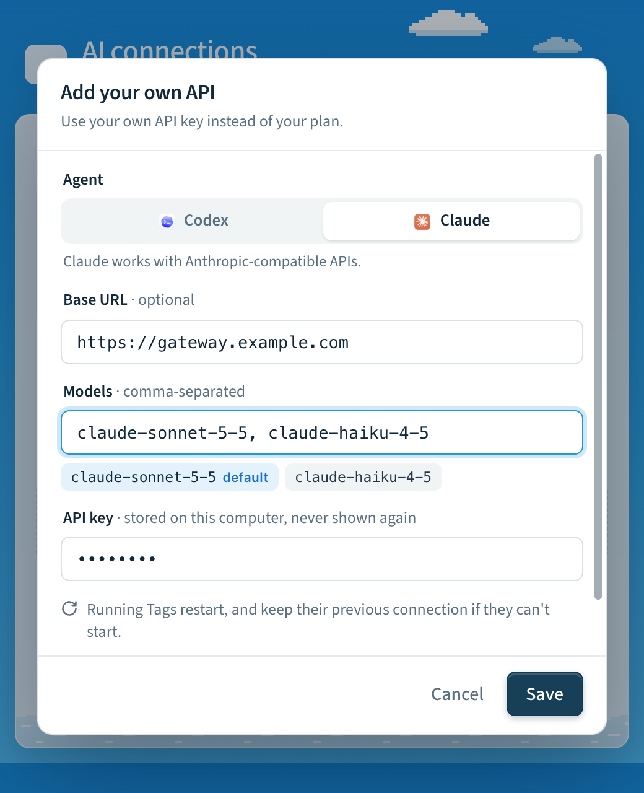
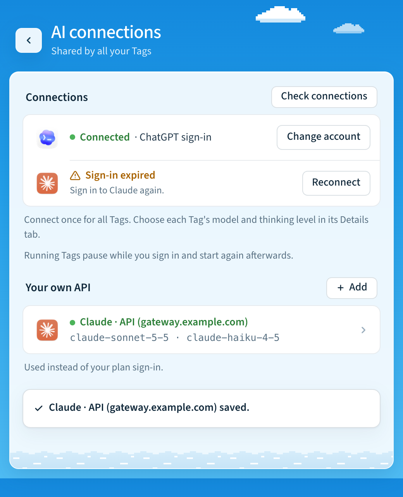

# API connections and monthly usage

Each Tag can use an explicit API connection for Codex or Claude. Existing Tags
continue to inherit their CLI sign-in unless you select an API connection.
The CLI binaries are still required; Claude also requires Tag's bundled Agent SDK.

## Use your own API

### In Tag.app

1. Open **Settings → AI connections** and choose **Add your own API**.
2. Choose the agent. Codex works with OpenAI-compatible APIs, including Azure
   OpenAI. Claude works with Anthropic-compatible APIs. Tag recognizes an Azure
   OpenAI endpoint from its URL and asks for its API version; the models are
   then your deployment names.
3. Enter the base URL (optional), the models, and the API key. The first model
   is the default. The key field is write-only: Tag never shows a saved key
   again.
4. Choose **Save**. Like the sign-ins above it, the API applies to all your
   Tags, which save at the same time. Running Tags stop, switch, and start
   again. A Tag that can't start keeps its previous connection, and **Save**
   again retries only that Tag. A Tag whose default model runs on the other
   agent keeps its model; choose one of the API's models in its Details tab to
   use the API.



Each API is listed under **Your own API**, as `Claude · API (gateway.example.com)`,
with its models. Open it to change the URL, models or key, to
**Check connection** (the same checks as `tag doctor`; nothing is sent to the
provider, so no tokens are spent), or to **Switch back to my plan**.



### In a terminal

```sh
op read op://Private/Gateway/key | tag settings ai api set --backend codex --kind openai \
  --base-url https://gateway.example.com/v1 --models gpt-5.5,gpt-5.5-mini --restart
tag settings ai api check --backend codex
tag settings ai api clear --backend codex --restart
```

Prefix with `tag NAME` for another Tag. The key is read from stdin (or a hidden
prompt in a terminal), so it stays out of command arguments and shell history.
`set` checks every input before stopping anything, writes all settings in one
atomic update. A Tag on that agent keeps its model if the API lists it and
otherwise uses the first one; a Tag on the other agent keeps its model. A running Tag needs `--restart`. `clear` removes the
saved key and returns to the shared sign-in. `tag settings ai api` shows the
Tag's API connections. Add `--json` for the JSON-lines contract Tag.app uses;
see [App protocol](app-protocol.md#api-connections).

The sections below describe each provider and the underlying settings. The
`tag config set` commands still work. With them, stop the Tag first and select
the authentication mode last.

## Azure OpenAI with Codex

Configure a Responses-compatible Azure deployment. The model name is your Azure
**deployment name**, which may differ from the underlying model name.

```sh
tag settings ai api set --backend codex --kind azure \
  --base-url https://YOUR_RESOURCE.openai.azure.com/openai \
  --api-version 2025-04-01-preview --models YOUR_DEPLOYMENT_NAME --restart
```

Use the API version supported by your Azure deployment. For Azure's versionless
`/openai/v1` Responses endpoint, set that full base URL and omit
`--api-version`. Tag sends the resource key in the `api-key` header. Microsoft
Entra token acquisition/renewal is not implemented by this connection mode.

## OpenAI or a compatible Codex gateway

Use `--kind openai`. The default URL is `https://api.openai.com/v1`; optionally
set `--base-url` to the full API base of a Responses-compatible gateway. API mode
uses bearer authentication. Chat Completions-only endpoints are unsupported.
The underlying settings are `OPENTAG_CODEX_AUTH=api`, `OPENTAG_CODEX_BASE_URL`,
`OPENTAG_CODEX_API_KEY`, and `OPENTAG_CODEX_MODELS`.

For custom Codex endpoints and Azure, Tag disables Codex's provider-hosted web
search, hosted image generation, and multi-agent tools on every launch. Recent
Codex versions group multi-agent tools in a Responses `namespace`, which gateways
accepting only function/custom tools reject even for a greeting. Local coding
tools and configured MCP servers remain available through Codex Code Mode: the
model calls `exec` (a custom tool) and `wait` (a function tool), which invoke the
underlying tools locally. This avoids sending MCP/app tool namespaces as well.
MCP search can provide web search separately, subject to gateway compatibility.
Custom gateways must support Responses custom tools and the installed Codex
must support Code Mode; this path was checked with Codex 0.157.1.
Direct `api.openai.com` and inherited
connections retain their existing tool settings. This applies automatically to
existing Tags without changing stored settings or global Codex configuration.
Claude uses the Anthropic protocol through its SDK; this Responses-specific
override does not apply. Claude gateway tool support depends on that gateway.

Explicit API mode takes precedence over a saved Tag ChatGPT plan connection and
global Codex sign-in. Failure never switches to another billing account.
`tag settings ai api clear --backend codex` (**Switch back to my plan** in
Tag.app) returns to the saved plan connection or inherited Codex
authentication. Tag does not modify global CLI credentials.

## Claude API or an Anthropic-compatible gateway

Claude gateway provider-routing fields are not supported. Claude uses the native
Anthropic protocol; Codex's optional `provider.only` adapter does not apply.
Unsupported Claude routing environment settings fail validation rather than being
silently ignored.

```sh
tag settings ai api set --backend claude --kind anthropic --models YOUR_CLAUDE_MODEL_ID --restart
```

The default URL is `https://api.anthropic.com`. Override it with `--base-url`
(`OPENTAG_CLAUDE_BASE_URL`) for an Anthropic-compatible gateway. Tag passes the
key and URL to the Agent SDK and clears inherited OAuth/auth-token and
cloud-provider switches for that child connection.
`tag settings ai api clear --backend claude` returns to existing Claude CLI
authentication. Azure support here is for Codex; Claude's explicit API mode
does not provision a Foundry connection.

## Models, readiness, and credentials

Explicit connections require a nonempty model list. These operator-declared
models populate settings without consulting another account's model catalog.
Listing a model does not prove entitlement or successful inference. Fast Mode and
advertised reasoning controls are unavailable for these custom catalogs because
Tag cannot verify provider support. API connections require Codex App Server or
Claude Agent SDK; legacy exec/print transports fail closed.

Setup recognizes preconfigured API connections. `tag doctor` validates their
configuration and runtime dependencies; it does not spend tokens to test keys.
`tag status` distinguishes configured API credentials from a verified sign-in.
The first real task verifies inference and permissions for the deployment.

Base URLs require HTTPS, except local HTTP gateways. Embedded credentials, query
strings and fragments are rejected; Azure API versions use the separate setting.
Keys are stored in Tag's private settings with owner-only permissions, omitted
from `tag config show`, and redacted from diagnostics and emitted events.
The existing [trusted sandbox credential boundary](../adr/0001-credential-boundary.md)
still applies: local agents with shell access can access inherited credentials.

## Usage and advisory budgets

```sh
tag config set OPENTAG_MONTHLY_BUDGET_USD 50
tag usage
tag usage --json
```

Usage covers Codex App Server and Claude Agent SDK tasks, including inherited
sign-ins, from the time this feature is installed. The local ledger contains
numeric usage and attempt outcomes, with no prompts, answers, keys or endpoint
URLs. It is independent of anonymous telemetry. Legacy transports and other
clients' tasks are not recorded. Months use UTC and each attempt belongs to the
month in which it started. Retries are distinct attempts; repeated cumulative
notifications replace a snapshot rather than adding it again.

Input totals include cached input and reported cache writes for both backends;
Codex reasoning tokens are a subset of output. Do not add these subsets again.
Claude supplies a final usage/cost estimate; interruption before its result may
leave usage unknown. Codex reports cumulative thread usage as it runs. A forced
termination may leave only a partial snapshot. Missing usage, missing cost, and
unfinished attempts are reported separately. An empty ledger is not a claim
that your provider account has never incurred charges.

Claude's reported cost is an SDK estimate. To estimate Codex/Azure costs, configure
your deployment's prices in USD per million tokens:

- `OPENTAG_CODEX_INPUT_USD_PER_MILLION`: ordinary input, excluding cache reads and writes.
- `OPENTAG_CODEX_OUTPUT_USD_PER_MILLION`: output, including reasoning tokens.
- `OPENTAG_CODEX_CACHED_INPUT_USD_PER_MILLION`: cached input reads.
- `OPENTAG_CODEX_CACHE_WRITE_USD_PER_MILLION`: cache writes. Required for an
  estimate when Codex reports a nonzero `cacheWriteInputTokens` count.

No prices are assumed. Missing applicable prices make cost unknown. These rates
apply to **all Codex models for this Tag**; use separate Tags when deployments
have different prices. Each snapshot saves its estimate using the prices active
for that process; subsequent price changes do not reprice historical usage.
Earlier snapshots that omitted cache-write counts cannot be reconstructed.
Tool charges, hosting, discounts, tax and other provider charges are not included.
Custom Claude gateway prices may differ from SDK estimates.

The monthly budget is advisory. Tag reports when recorded estimated costs reach
it, but does not stop tasks, reserve concurrent spend, or impose a provider-side
cap. Incomplete usage can understate spending. Use provider billing controls for
an enforced financial limit.

Storage is an additive, versioned SQLite ledger in `.tag/state/usage.sqlite3`.
Its schema is created automatically on first recorded use, including on upgraded
installations. Creation and repeated startup are idempotent; committed snapshots
survive interruption. No old authentication or operator setting is rewritten.

Codex provider configuration follows the [official configuration documentation](https://developers.openai.com/codex/config-advanced).
Live provider inference requires account-specific qualification; mocked transport
checks do not establish Azure deployment or Anthropic account access.

## Optional Codex gateway provider routing

Some gateways choose among upstream providers separately from the model ID.
For a gateway supporting the `provider.only` request field, configure both
routing settings in **API connections** or use:

```sh
tag config set OPENTAG_CODEX_GATEWAY_FORMAT provider.only
tag config set OPENTAG_CODEX_GATEWAY_PROVIDER cursor_sdk
tag config set OPENTAG_CODEX_MODELS grok-4.7
tag config set OPENTAG_DEFAULT_MODEL codex:grok-4.7
tag restart
```

This requires `OPENTAG_CODEX_AUTH=api` and an explicit gateway base URL. The
model remains `grok-4.7`; Tag adds `"provider":{"only":["cursor_sdk"]}` to
Responses request bodies. It does not interpret provider prefixes in model IDs.
Only this routing format and one provider are supported initially; this is a
gateway extension, not a standard OpenAI field. Azure and Claude routing are
explicitly unsupported. Clear both settings and restart to disable routing.

When configured, each Codex App Server process gets an authenticated, random-port
loopback adapter. Its token is passed through the child environment, not command
arguments. The adapter removes `OPENTAG_CODEX_API_KEY` from the child environment;
it retains that key for upstream requests. This does not isolate credentials on
disk or remove other inherited credentials; Tag retains its trusted-sandbox
credential boundary. The adapter
replaces any competing provider selection, forwards streamed bytes and upstream
error statuses, and performs no retries, redirects, or provider fallback of its
own. Codex's normal retry policy still applies. Request compression is disabled
for this route. Task shutdown closes the listener and active sockets; a failed
Codex launch also closes the adapter. No prompts or credentials are logged by the
adapter.

Both settings default to absent. Existing installations require no stored-data
migration: each new task derives the route from current configuration and creates
fresh temporary resources. Repeated startups do not rewrite operator settings;
no completion marker or credential migration is needed. Connections without
routing configured keep their existing direct path.

### Temporary chat-only gateway testing

For a routed Codex connection whose upstream rejects tool declarations, set
`OPENTAG_CODEX_GATEWAY_DISABLE_TOOLS=1` and restart the selected Tag. The adapter
omits `tools`, `tool_choice`, and `parallel_tool_calls` and tells the model that
it can only respond with text. Search, file access, commands, and other agent
actions are unavailable. This is a diagnostic mode, not a tool compatibility fix.
Set the value back to `0` and restart to restore tools. It defaults to off and
requires explicit Codex gateway routing; inherited connections, Azure, and Claude
are unsupported. Use `tag ALIAS config set` for a named Tag.
