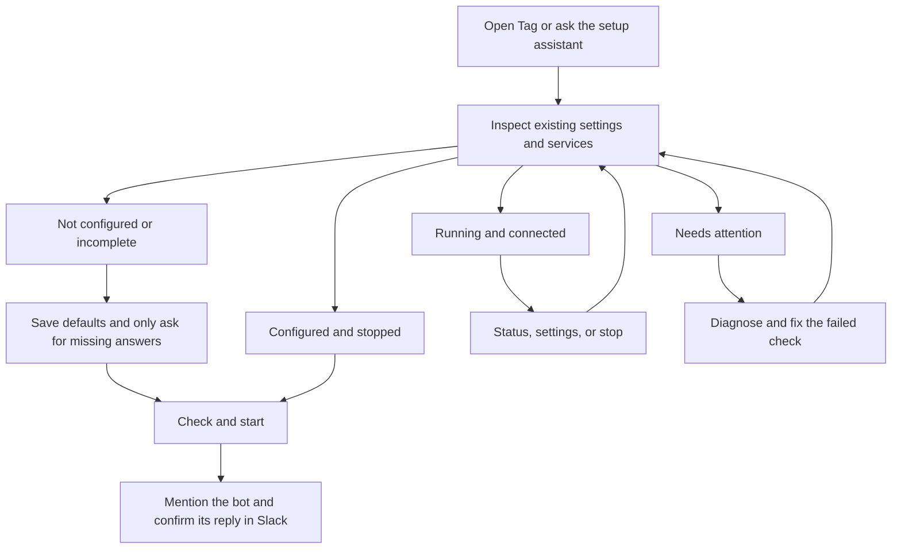

# Tag in the terminal

The Tag app is the easiest way to run Tag on a Mac. Everything it does, you can
also do with the `tag` command in a terminal, on macOS, Windows, or Linux. Both
show the same Tags, so you can switch between them anytime.

A few things are only, or more easily, done in the terminal:

- **Run several Tags in one workspace.** Each has its own Slack app, folder,
  and model. Start or stop all of a workspace's Tags at once with
  `--workspace`.
- **Rename or describe a Tag** with `tag NAME rename` and `tag NAME describe`,
  and give it a short nickname for commands.
- **Change channels, history, and advanced settings** with `tag NAME settings`
  and `tag config set`, or start setup over with `tag NAME reset`.
- **Let a coding agent set Tag up for you.** Setup can run over JSON, one
  question at a time, so Codex or Claude Code can drive it.

New to Tag? Start with [Set up Tag](../getting-started/first-task.md). For
everyday tasks in the app, see [Set up and manage Tag](../tag-management.md).
The rest of this page is a detailed reference for operators, developers, and
coding agents.

## The lifecycle side by side

The Tag desktop app and the CLI use the same Tags, settings, and lifecycle: the app runs
`tag … --json` for every action (see [the app protocol](app-protocol.md)).

| Task | App | Terminal |
| --- | --- | --- |
| Install | Download Tag from the GitHub release. The first run installs the `tag` runtime and shows progress. | `install.sh` or `install.ps1`; see [Installation details](installation-details.md). |
| Add a Tag | **Add Tag** on Home (or the menu bar) | `tag setup` for the first Tag, `tag add` for another |
| Start after setup | Automatic, with start progress | Run the `tag NAME start` command setup prints |
| See your Tags | **Home** | `tag list` |
| Start or stop | The Tag's switch, or **Start all** / **Stop all** for a workspace | `tag NAME start` / `stop` / `restart`; `--workspace TEAM` |
| See activity | The Tag → **Activity** | `tag NAME logs --json`, `tag NAME logs --activity RUN_ID` |
| See logs | The Tag → **Logs** | `tag NAME logs [--follow]` |
| Diagnose | The **Fix** or **View logs** notice | `tag NAME status`, `tag NAME doctor` |
| Rename | Details → **Rename** | `tag NAME rename "Name"` |
| Describe | Details → description **Edit** | `tag NAME describe "…"` |
| Model and thinking level | Details → **Model** | `tag NAME settings ai model VALUE [--effort LEVEL]` |
| AI accounts | Settings → General → **AI connections** | `tag settings ai`, `tag settings ai sign-in codex\|claude` |
| Keep Tags running | Settings → General → **Keep Tags running** | `tag autostart on` |
| Open at login | Settings → General → **Open Tag at login** | Not needed; `tag autostart on` runs without the app |
| Update | Settings → **Updates** → **Update Tag** | `tag upgrade` |
| Release channel | Settings → **Updates** → Stable, Beta, or Alpha | `tag upgrade --channel stable\|beta\|alpha\|edge` |
| Usage data | Settings → General → **Share usage data** | `tag telemetry on\|off` |
| Remove a Tag | Details → **Remove this Tag…** | `tag NAME remove` |
| Start setup over | No app action | `tag NAME reset` |
| Channels, history, advanced settings | No app action | `tag NAME settings`, `tag config set` |

Some things only the app does: its menu bar menu, opening at login,
notifications when a Tag goes offline, updating itself, and opening from
`hover-tag://` links in Slack. Some things only the CLI does: `tag reset`,
guided channel and history changes in `tag settings`, `tag config`, and the
`edge` release channel.

Slack messages that mention **the Tag app** link to `hover-tag://tag/TAG_ID`.
Clicking it opens that Tag's Details in the app. A Tag that isn't on this
computer shows "That Tag isn't on this computer."

## Multiple Tags

One installation can run several independent Tags, each with its own Slack app.
Tags can be in different Slack workspaces or share one. Every Tag is named
after its Slack workspace and app IDs, in lowercase:

```sh
tag add
tag list
tag t0abc123-a0xyz789 start
tag t0abc123-a0xyz789 status
tag t0abc123-a0xyz789 logs
tag t0abc123-a0xyz789 stop
```

The name is the Tag's working folder, `~/Tag/t0abc123-a0xyz789`, with private
data in its `.tag` folder. IDs never collide, so nobody chooses or edits a
name. A Tag gets its name when setup creates or links its Slack app; until then
a new Tag from `tag add` is called `new-tag` (or `new-tag-2`, …), and the first
Tag of a fresh installation is set up before it is named. The Slack display name
(for example “Maya's Tag”) is separate and can be the same for several Tags.

Rename a Tag with `tag NAME rename "Research Tag"`. This changes the
assistant's name in Slack, verifies Slack saved it, and gives the Tag a
nickname for commands, here `research-tag`, so `tag research-tag start` works.
Choose a different nickname with `--nickname`; nicknames never repeat another
Tag's ID or nickname. If Slack needs a fresh `slack login`, nothing changes
locally and the error repeats the exact command to retry.

Change the one-line description people see on the Tag's Slack profile with
`tag NAME describe "Digs through docs to answer research questions"`, up to 140
characters; `tag NAME describe ""` clears it. Like a rename, Slack is changed and
verified first, and nothing changes locally if Slack needs a fresh `slack login`.
In the Tag app, use **Edit** next to the description in the Tag's Details tab.

Tags are grouped by Slack workspace in `tag list`. Start, stop, or restart every
Tag in one workspace with `tag start --workspace T0ABC123` (a team ID or the
workspace's name). Each Tag runs its own lifecycle; one failure doesn't stop the
others, and Tags that haven't finished setup are skipped. `--json` reports each
Tag's outcome.

Commands without a name, such as `tag start`, use the **main Tag**: the first
Tag you set up, or your only Tag. `tag default …` remains an alias for the main
Tag. With several Tags and no main Tag, unnamed commands ask you to name one.

Paused onboarding appears in `tag list` and resumes with the targeted setup
command. Each Tag has its own settings, Slack app, agent working folder,
conversations, logs, and lifecycle. Use Slack's settings for that specific app
to change its profile image.

Installations from earlier releases have a first Tag called `default`. The next
`tag start` or `tag setup` renames it, for example `~/Tag/default` to
`~/Tag/t0abc123-a0xyz789`, after stopping it, and makes it the main Tag. The
folder is moved in one step, never copied; paths saved in Tag's private data are
updated; working files are untouched. A plan file makes an interrupted rename
resume with the same name, and an existing folder at the new name stops the
rename with both preserved. After the rename, rolling back to a release without
named Tags is blocked, as for any named Tag.

MFS is shared by the installation. `tag NAME stop`, restart, reset, and
failed startup leave shared memory and other Tags running. Inspect it with
`tag memory status`; after stopping every Tag bridge, an installation-owned
service can be stopped explicitly with `tag memory stop`. Tag refuses to stop
an externally managed MFS process.

An upgrade restarts each previously running Tag, leaving stopped Tags stopped
and shared MFS online. `--no-restart` defers activation until you restart those
Tags. On startup, legacy root-level settings and old working folders are migrated
automatically after stopping the affected bridge. Private data is consolidated under `~/Tag/NAME/.tag`. Originals are retained;
conflicting destination files stop migration with an actionable path. Interrupted
copies resume on retry, and completed migrations do not overwrite later edits.

Shared storage does not authorize cross-workspace retrieval. Normal Slack
retrieval remains limited to the selected Tag's approved workspace/channel
scopes. These local Tags share the trusted-sandbox limitations described
in the security model; they are not hardened tenants from one another.

For automation, `tag list --json` returns `schema_version`, the installation
root, and one independently readable record per Tag, including `main`, the
Slack display name `slack_name`, `nickname`, `workspace_name` when known,
`workspace_icon`, the path of a local copy of the Slack workspace's icon (`null`
for Slack's default icon or before Tag has saved one), and
`avatar`, the path of the Tag's Slack profile picture when setup created one. Existing inspect/status
objects retain their fields and add `tag` plus nullable `slack_workspace`;
their `next_command` starts with `tag NAME` for named Tags. A malformed Tag is
returned with its own error and does not suppress other records.

The CLI and guided settings share the same settings and lifecycle operations.
Use `tag` for a status summary and next command. An assistant managing Tag should
begin with `tag inspect --json` to inspect what is already configured.
Slack runtime agents load the runtime contract; Tag does not bundle an admin
skill into their workspace.

## Removing a Tag in detail

Remove stops the Tag, removes its Slack history from memory, and moves its
folder to `abandoned/NAME-TIMESTAMP` under the installation root. Files are
never deleted. Deleting the Slack app is permanent: a new app gets a different
App ID and bot. If Slack doesn't confirm the deletion, the Tag is still removed
locally and the error tells you to check the app in Slack. A Tag that never
reached Slack is set aside with `tag NAME abandon` (the app does this when you
discard an unfinished setup).

## Starting a Tag in detail

Reading channels can carry on in the background; the Tag answers before the
first import finishes. If a step fails, it shows the error. These steps come
from `tag NAME start --json`, which prints one `{"type": "progress", …}` line
per step and then one `{"type": "result", …}` line; see
[the app protocol](app-protocol.md).

Two Tags can start at the same time. Each Tag still runs one lifecycle
operation at a time; a second start of the same Tag waits for the first.

## Advanced Slack setup

For organization-level Slack authorization, see
[Enterprise Grid and developer sandboxes](slack-organizations.md).

## The journey



Plain `tag` suggests the next command based on current state.
Use `tag status` for health and `tag doctor` for diagnostics. Settings groups Slack connection/access,
workspace/memory, agent choice, and advanced options. The workspace is managed
by Tag's persistent home. Changing memory scopes does not index new sources.

`tag` and `tag status` share the same overview, including agent sign-in, Slack,
memory and first-reply caveats. `tag status --json` reports the same checks in
structured form. `tag restart` stops Tag's managed processes and starts them
through the normal readiness checks; a failed stop prevents starting again.

Failed Slack requests use a separate, local error-report store. A versioned
startup migration creates and verifies its owner-only directory before
dependent services, then records completion. Interrupted migrations remain
retryable. The store keeps at most 50 bounded records for 30 days.
Failure messages and report previews are private to the original authorized
requester. Sharing with
[Hover Community](https://join.slack.com/t/hover-community/shared_invite/zt-4aghkshid-n7fRukS7_J5sR2jDLBXK9A)
is manual. See [When a request fails](error-reporting.md)
for report contents, recovery actions, and storage details. A troubleshooting
handoff needs local coding-agent access to repair Tag; an upstream code bug is
handled through a regression-tested GitHub PR and canonical issue, while a
local repair is explained in the community report.

Contributors using a prepared source checkout can run `./tag dev` for a
foreground loop that watches `scripts/**/*.py`, reloads the Slack bridge, and
streams bridge logs. It owns both Slack and loopback MFS for the session, so
Ctrl-C stops both; configured remote MFS endpoints remain external. Managed
releases do not expose development watching.

Completed `tag setup` checks readiness and exits without repeating onboarding.
`tag setup` saves approved choices, but it does not start services or index
history; run `tag start` when ready. (The app starts the Tag for you after
setup.) Use
`tag setup --review` to review choices explicitly. For a separate,
resumable test configuration, use `tag setup --test`; it keeps data under
`<TAG_HOME>/testing/onboarding`. This is not a Slack
sandbox: CLI sign-ins are shared and approved Slack app/channel operations are
real. Test mode labels its banner, app-creation choice, review warning, and
default app name (`TEST · <first name>'s Tag`) accordingly. A test home needs a
separate MFS server before you deliberately start it.

Settings offers guided app/workspace changes, credential reconnection,
multi-channel selection, history windows and invitation-memory policy.
Stop Tag first with `tag stop` for these changes. They are prepared in a private
draft using onboarding's validation and approval steps. Pausing or declining
Apply keeps active settings unchanged; reopen the same Settings action to
resume a draft. Slack-side actions already approved are not undone by cancelling
the local draft. Apply preserves the previous settings and app links in the
printed draft directory, keeps unrelated configuration, and never starts Tag
or indexes history. Run `tag start` when ready to use the new settings.

`tag setup` saves each completed answer. Ctrl-C pauses; running it again skips
valid saved answers. It puts timeouts, retries, and other advanced settings
outside the required questions.

### Choose the Tag's model

After the Tag's name and picture, and before the Slack workspace, setup asks
for the Tag's **default model**,
from the models your Codex and Claude accounts on this computer offer, grouped
by agent. Choosing a model also chooses its agent (`OPENTAG_BACKEND` follows
`OPENTAG_DEFAULT_MODEL`). Each group starts with the account's own default. If
an agent is installed but not signed in, setup offers to sign in to it too; a
sign-in opens the browser and can be cancelled and retried. If a saved default
is no longer offered, setup says so and suggests another. A resumed setup keeps
a saved default whose agent is still connected.

Only when no agent is connected does setup list them, because one is required:
each shows **Not signed in**, **Sign-in expired**, **Usage limit reached**,
**Not installed**, or **Update needed**, with the action that fixes it. Account
changes and connection details are in `tag settings` → AI & models, or
the Tag app → Settings → General → **AI connections**.

### AI & models

Change these later in `tag settings` → **AI & models**, in the app's Settings →
General → **AI connections**, or with `tag NAME settings ai`:

```sh
tag settings ai                     # check connections now
tag settings ai models              # models from connected accounts
tag settings ai model claude:opus   # save the default model
tag settings ai effort high         # save the default thinking level
tag settings ai effort default      # use the model's own thinking level
tag settings ai sign-in claude      # sign in, reconnect, or change account
tag settings ai sign-in codex --method chatgpt --restart
```

The default model can also be set with
`tag config set OPENTAG_DEFAULT_MODEL claude:opus` (or `codex:MODEL`, or just
`codex`/`claude` for that account's own default). All Slack requests use the
Tag's model and thinking level, selected in the Tag app → Details or the CLI.
`OPENTAG_BACKENDS=codex` limits the choices to one backend.

The old Slack **Configure** control and per-user overrides are retired for
both Codex and Claude. Startup automatically archives the old preferences as
`state/slack-user-settings.json.retired-v1` before accepting requests. A
versioned completion marker is written after verification; interrupted runs
retry safely. Old Slack buttons only explain where settings moved.

The Tag's **default thinking level** applies to its default model. It must be
one the model offers (`tag settings ai models` lists them); a model without
thinking levels, such as Claude Haiku, doesn't use one. Save a model and level
together with `tag settings ai model codex:gpt-5.5 --effort medium`. Changing
the model keeps the level when the new model offers it and otherwise switches
to that model's own default. `tag config set OPENTAG_DEFAULT_EFFORT high` also
works; leave it empty for the model's default. Both Codex and Claude use the
Tag's level for every request; Slack no longer has its own thinking setting.
A Tag without a saved level, including every Tag set up before this setting
existed, keeps using the model's own default.

`OPENTAG_BOT_DESCRIPTION` holds a one-line description of the Tag, up to 140
characters (`tag list --json` reports it as `description`). Change it with
`tag NAME describe` or the app's Details, which update the Slack app first;
`tag config set` changes only the local copy.

A running Tag reads its default model and model list when it starts. After a
change, Tag asks before restarting it; `--restart` restarts it right away.
Changing a running Tag's ChatGPT plan stops the Tag while you sign in and
starts it again afterwards, even when sign-in doesn't finish. Sign out of either
agent and reopen the picker to remove its models, even if it was the saved
default. `tag status` shows the default model, and `tag list` shows each Tag's
default model and thinking level. In the Tag app, choosing a model or thinking
level in Details saves both together and restarts a running Tag.

### Start setup over

To start onboarding over, run `tag reset` (or `tag NAME reset`). The app has
no reset; use **Remove this Tag…** and add a new one instead. A confirmation defaults to Cancel.
After confirmation, Tag stops its managed services, moves saved settings and
local Slack CLI app-link/creation checkpoints into a private timestamped backup
under `config/backups/` in the Tag home, and launches setup from the beginning.
It also archives the old invitation-memory sync status. Your workspace, skills,
connector files, and CLI sign-ins are kept. Tag unregisters this instance's
Slack history connector from shared MFS, removing the indexed records owned by
that connector without stopping shared memory or affecting other Tags. A
separate prompt offers to keep or permanently delete the Slack app, defaulting
to **Keep**.
It shows the saved bot name, App ID, and workspace Team ID. Deletion requires
typing the exact App ID and matching saved Slack CLI app-link metadata. Tag
backs up the local setup first, then calls Slack CLI with that explicit app and
team. Remote deletion is permanent: the local backup cannot restore the app or
its Slack app data. If deletion fails or its outcome is uncertain, setup does
not restart; check the app in Slack before running `tag setup`. The backup's
`app-deletion.json` records the outcome. Missing or ambiguous identity never
triggers deletion. Reset requires an interactive terminal.
The printed backup contains `restore-paths.json`, mapping each saved item to its
original location. To recover the previous setup, stop Tag and move those items
back, first keeping a copy of any newer configuration you want to preserve.

### Setup steps

Setup first shows **Your Tag**: a name (your computer account's first name,
such as **Maya's Tag**), an optional one-line description of up to 140
characters, and a picture. The picture starts as one of Tag's waterdrops.
**Shuffle picture** draws another from any of the five elements (Metal, Wood,
Water, Fire, Soil); with backgrounds, highlights, and 16 subtle signatures there
are 960, and Tag avoids ones your other Tags on this computer already use.
**Choose my own picture** takes a PNG, JPEG, or GIF from 512 to 2000 pixels on
each side; drag it into the terminal or paste its path. Uploading a picture
needs Slack CLI 4.7 or newer. The description appears on the app's Slack
profile and in Slack's agent view. **Use an existing app** skips naming,
because an existing app keeps its own name and picture.

Next comes the AI, then the Slack workspace. Setup lists the Slack CLI's
sign-ins on this computer and signs in only when there are none or you choose
**Sign in to another workspace**. For an organization sign-in, enter the
workspace's address or `T…` ID (from `app.slack.com/client/T…`); Tag can't list
an organization's workspaces yet. The person signed in to Slack becomes the
Tag's owner: Tag reads it from the sign-in, or asks Slack, and stops with
"Sign in to Slack again" rather than guess. Nothing in Slack changes before
this step.

**Create** shows one recap: name, description, picture, workspace, owner, and
AI, plus an Approval line for organizations, whose admins may need to approve.
**Create in Slack** creates and installs the app; **Edit** and **Edit AI**
change those choices and return to the recap; **Back** chooses the workspace
again. Tag copies the picture into its private Slack CLI project, and the Slack
CLI uploads it while creating the app.

For an existing app, **Your app** lists the apps Tag knows for the workspace:
apps linked to this Tag, apps the Slack CLI lists, and apps your other Tags use,
which can't be picked because one app serves one Tag. **Use a different app**
takes an app address (`api.slack.com/apps/A…`) or App ID; it isn't a token or
Client ID. Tag links the app and shows its checks. **Update app** adds only
Tag's missing settings to the app and keeps the rest; Slack then asks you to
reinstall it. Tag changes the app only after you choose it. **I'll do it
myself** lists the steps in Slack app settings, then checks again. A legacy
Assistant view needs your confirmation, because Slack doesn't allow that
conversion to be reversed. Tag never requests a configuration token.
The app shows the same choices on its **Which app?** screen: pick an app or
**Use a different app**, then **Add them** (the app's name for **Update app**)
or **I'll do it myself**, and **Connect**. Its steps are AI → Workspace → Your
app → Channels.
If setup pauses or fails, run `tag setup` (or `tag NAME setup`) to resume, or
choose the Tag under **Finish setting up** in the app.

The terminal follows five steps: Your Tag → AI → Workspace → Create → Channels.
With an existing app, Create becomes Your app.
**Channels** lists the channels Tag is in, already selected, and public channels
it can join; choosing one adds Tag to it. You can choose none: new Tags follow
invitations, so `/invite` the app in any channel, private ones too, and Tag
picks it up about a minute later while it runs. There is no review after
channels; the Create recap was the approval. Setup saves the configuration
without starting services or indexing history. Run `tag start` to initialize
shared memory and connect Slack. Starting memory for the first time can take a
couple of minutes. Plain terminals fall back to numbered input, and `q` exits so
setup can be finished later.

After the first successful `tag start`, Tag sends a welcome DM to the single
account set as its owner, including a first-task suggestion
and the [Hover Community help link](https://join.slack.com/t/hover-community/shared_invite/zt-4aghkshid-n7fRukS7_J5sR2jDLBXK9A).
Multiple allowed accounts do not receive a broadcast; the welcome is skipped
when there is no single recipient. Delivery is recorded per Slack workspace,
app, and user in private versioned state, so normal restarts and setup reviews
do not repeat it. Existing installations receive it on their next successful
start after upgrading. A delivery failure leaves Tag running and retries on
the next `tag start`. The welcome confirms connectivity, not a tested agent reply.

An app compatibility failure stays on the selected app with Open settings,
Check again, and Exit · finish setup later. Linking is saved separately from compatibility,
so returning does not repeat a successful link. Browser pages open only through
an explicit action. Agent sign-in and startup failures have their own retry step.
Slack onboarding is contained in `tag setup`: it checks Slack CLI authorization,
offers the real CLI login handoff, creates or links an app with explicit
approval, validates three credential roles separately, and uses its existing
channel membership as the fixed baseline. Public channels are optional: setup
asks before joining only those you explicitly add with `channels:join`, then
verifies membership before saving stable channel IDs. New-app templates request
this scope; existing apps need an approved permission update/reinstall or a
manual invitation if it is absent. Private channels require an invitation to
appear.
New onboarding approves invitation-following memory (`SLACK_CHANNEL_POLICY=invited`):
all channels the bot has joined, including later invitations, become eligible
for replies and automatic indexing with the configured history window. Anyone
able to invite the app can expand this set. Public channels the bot has not
joined are never automatically indexed. Authorized callers remain restricted.
The running bridge reconciles membership about every minute and requests an
incremental MFS sync on changes and about every five minutes. History credentials
are validated independently before a request. Current-channel reply scoping
remains enforced by the normal helper flow, not a hardened boundary (ADR 0001).
Leaving a channel removes normal retrieval access after reconciliation; already
indexed data is not automatically erased, and an in-flight index job may finish.
`tag status`/`tag inspect --json` distinguish invitation-memory sync state from
service health. `sync_requested` is not proof of index completion or a reply.

Existing completed setups without this setting retain selected-channel behavior.
To opt in using the updated installation, set
`tag config set SLACK_CHANNEL_POLICY invited`, then stop/start Tag. This authorizes
indexing all currently joined channels as well as future invitations. Use
`selected` to retain a manual allowlist. In invited mode App Home explains the
invitation policy instead of offering a conflicting manual channel picker.
In selected mode its picker changes reply destinations only; setup still approves
new memory channels. Raw IDs remain in the JSON/automation interface by design.
An invalid JSON file must be repaired before settings can be changed; setup
never replaces it silently.

For new apps, Tag runs `slack app install` in its private
`<TAG_HOME>/integrations/slack-cli` project after showing the requested scopes
and receiving approval. Slack CLI owns authorization and app creation; Tag reads
the resulting App ID from CLI metadata instead of asking you to copy it. The
CLI's `deployed` environment label identifies the app record, not a hosted Tag
service: the bridge still runs on your computer. Tag does not run `slack deploy`
or `slack run` during creation.

Installation is checked separately from creation. Pending approval can be
resumed with the same App ID; an uncertain creation without a saved ID stops
instead of automatically creating another app. Existing apps still use explicit
link-by-ID and settings review. Connection now attempts automatic
credential handoff once through Slack CLI's documented custom deploy hook. It repeats
installation checks for the exact saved app in a temporary project using remote
settings; the hook only receives credentials, with no hosted deployment or bot
startup. Approval delays or missing credentials cannot count as connected.
Failures pause on a recovery menu: retry after resolving the issue, enter tokens
privately, open app settings, or finish setup later. Opening settings does not retry.
Recognized CLI error codes receive fixed, actionable explanations; raw CLI output
is never displayed. A service-limit error requires review by the operator/admin
or Slack support, not repeated installation attempts or automatic permission repair.
Bot and Socket Mode credentials are validated separately before being saved
together. History connector credentials remain separate. Hidden terminal entry
is an explicit fallback, not the default. Temporary credential files are private
and removed on exit; these safeguards are not a hardened isolation boundary
(ADR 0001). Live credential handoff acceptance remains pending.

## Commands for people and skills

After an upgrade, `tag start` applies versioned Slack app migrations before
preflight. Existing Slack CLI authorization is used to reconcile the release's
required bot scopes, events, App Home, Socket Mode, and interactivity settings,
refresh the installation,
and save replacement credentials privately. This works without an interactive
terminal and preserves unrelated app settings. The migration is marked complete
only after remote settings and the replacement token's required grants are verified.
Optional permissions are requested the same way but never stop a start. Today
the only one is `team:read`, which shows the workspace icon. If Slack or a
workspace admin hasn't granted it, the receipt records it as pending, `tag
start` says what to approve, and Tag asks again at most once a day.
An existing legacy Assistant view requires explicit approval through
`tag setup --review` before the irreversible Agent conversion. If Slack requires
workspace approval or renewed CLI sign-in, startup stops with recovery guidance;
resolve that requirement and retry `tag start`.

Lifecycle locks for startup, shared-memory startup, reset, and settings apply
are released by the operating system if the CLI exits unexpectedly. A later
attempt recovers the leftover marker without taking a live operation's lock.

Permission failures pause setup and show the missing scope, the operation it blocks,
and instructions to fix it yourself in Slack (or ask a workspace admin).
Choose **Open app settings**, **Check again**, or **Exit · finish setup later**; channel joining
also lets you return to channel selection. Outside the versioned upgrade migrations
above, Tag does not repair permissions or reinstall apps as part of error recovery.
Bot scopes, Socket Mode app-token scopes,
and separate history credentials require different fixes. If Slack issues a new
token, update it privately in Tag settings before retrying. Normal approved
credential handoff remains unchanged; it uses remote app settings without `--force`.
Manual permission recovery still needs live acceptance testing.

| Intent | Command | Behavior |
| --- | --- | --- |
| Decide what to do next | `tag inspect --json` | Read settings, check service health, report state and next command |
| Inspect without network or process probes | `tag inspect --offline --json` | Report configuration and executable availability only |
| Seed defaults | `tag config init --json` | Save missing defaults, preserve all existing values |
| See settings | `tag config show --json` | Redact secrets and unknown extension values |
| Discover editable settings | `tag config keys --json` | List supported keys |
| Change one setting | `tag config set OPENTAG_BACKEND claude --json` | Validate and atomically save only that setting |
| Store a token | `tag config set SLACK_BOT_TOKEN --stdin --json` | Read its value from standard input; never echo it |
| Diagnose | `tag doctor --json` | Check configuration, memory, backend executable, and Slack API access |
| Check services | `tag status --json` | Require healthy MFS and a connected Slack bridge for exit 0 |
| Check for updates | `tag upgrade --dry-run --json` | Verify the saved channel's target without changing the installation |
| Upgrade | `tag upgrade` | Stage and atomically select the verified release, restarting managed services when needed |
| Install an older release | `tag upgrade --version X.Y.Z --allow-downgrade` | Explicitly override the downgrade guard; prefer rollback for the previous release |
| Start or stop | `tag start` / `tag stop` | Use the existing managed-process lifecycle, and remember whether this Tag should keep running |
| Keep Tags running after login | `tag autostart on` / `off` / `status --json` | Register a per-user login service that starts wanted Tags and restarts them if they stop |
| Drive setup from an app | `tag setup --json` / `tag add --json` | Run the same guided setup over a JSON-lines conversation; see below |

Pass secrets through a process stdin pipe or use settings' hidden token prompt;
do not put literal tokens in command arguments or shell history. There is no
unredacted `config show` mode. Empty values clear optional settings in automation, for example
`tag config set SLACK_CHANNEL_ID ''`; required settings cannot be cleared.
Changes take effect on the next start. Restart running Tag with `tag stop` then
`tag start` after reviewing the intended change.

Inspection is read-only and exits 0 when it can describe the current state, even
if setup is incomplete. `status` exits 1 for unhealthy services; `doctor` exits 1
for failed checks. Operational errors exit 1; invalid command usage exits 2.
JSON commands emit a single object with `schema_version: 1`; consumers should
ignore unknown fields. Argparse usage errors are still written to stderr.
Plain `tag` prints a summary, and `tag settings` / `tag setup` (without `--json`) reject nonterminal
input rather than waiting for answers. Agents should use configuration commands.

### Keeping Tags running

`tag start` records that a Tag should keep running and `tag stop` records that
it should stay off; `tag restart` keeps the choice. `tag list --json` reports it
as `keep_running`. `tag autostart on` registers a per-user login service that
starts those Tags after login and checks every minute, restarting a Tag whose
bridge has stopped. After a failed start it waits longer each time, up to an
hour. The service uses the operating system's own mechanism and needs no
administrator rights:

| Platform | Mechanism |
| --- | --- |
| macOS | launchd agent in `~/Library/LaunchAgents` |
| Linux | systemd user service, or an XDG autostart entry without systemd |
| Windows | the per-user `Run` registry key |

The first `tag autostart on` keeps the Tags that are running now, if no choice
was recorded yet. `tag autostart keep NAME...` records that Tags should keep
running without starting them now. A start made by the login service follows
the recorded choice instead of changing it, so stopping a Tag while the
service is starting it leaves the Tag off. Each restart counts until the Tag has
stayed up for five minutes, so a Tag that crashes right after starting also
backs off. `tag autostart off` removes the service and leaves running
Tags as they are; the service is set up so that stopping it never stops the
Tags it started. The service runs Tag's stable launcher, so upgrades take
effect without registering it again. Its output is in
`state/supervisor.log` under the installation root. The app's **Keep Tags
running** setting uses the same commands.

### Guided setup over JSON lines

`tag setup --json` and `tag add --json` run the same guided setup as the
terminal, for graphical clients such as the app. Instead of drawing prompts,
setup writes one JSON object per line to stdout and reads each answer from stdin:

- `{"type": "message", "text": …}` — progress prose, without color.
- `{"type": "question", "id": …, "kind": …, "prompt": …}` — setup is waiting.
  `id` is a stable name such as `profile`, `workspace`, or `approve_setup`;
  match answers by `id`, not by prompt wording. `kind` is `choose` (with
  `options` and `default`), `multi` (channel `options` and `selected`), `text`
  (with `default`), `secret`, `confirm`, `profile_picture`, or `slack_login`.
  See [Setup](app-protocol.md#setup) for each question, in order.
- `{"type": "result", "status": "complete" | "paused" | "failed", "tag": …}` —
  the session is over. `paused` means progress was saved and setup can resume.
  A `complete` result also has `ready`: the Slack workspace, app, channels, and
  AI, so a client can open the Tag in Slack.
- `{"type": "progress", …}` and `{"type": "sign_in", …}` — an agent sign-in
  started from the `ai_connection` question (with `backend`), or app creation
  (`step` `create`, `picture`, `install`, `connect`). Send `{"cancel": true}`
  to cancel an agent sign-in. See [AI connections](app-protocol.md#ai-connections) for the
  `ai_connection` and `default_model` questions.

Answer with `{"answer": …}`: an option index or its exact label for `choose`, a
list of them for `multi`, a string for `text` and `secret`, a boolean for
`confirm`, and `"shuffle"`, `"existing"`, or an object for `profile_picture`. Choosing the exit option, sending `{"answer": null, "pause": true}`,
or closing stdin saves progress and pauses. Questions carry `can_go_back`; when
it is true, `{"back": true}` returns to the previous question with the earlier
answer as its default, after clearing only the setting that question saved.
Back stops at steps that already changed something in Slack (sign-in, creating,
linking, or updating the app, connecting its credentials). With `--step`, use `--back`. Clients should ignore stdout lines
that are not JSON objects.

`slack_login` (id `slack_login`) replaces the terminal's Slack CLI sign-in. Its `sign_in_line` is a
one-time `/slackauthticket` command for the person to send in Slack; answer with
the code Slack then shows. Setup never echoes the code. `tag add --json` never asks
for the Tag's ID; its result reports the ID once setup has named it.

#### One question per command

Clients that can't hold a process open between answers, such as coding agents,
can use `--step` instead of `--json`. Each call prints one JSON object and exits;
setup keeps running in the background between calls:

- `tag setup --step` (or `tag add --step`) starts setup, or continues the one
  already running, and prints the next question.
- `tag setup --answer JSON [--question ID]` answers the current question with a
  JSON value, such as `0`, `true`, or `"Maya's Tag"`, and prints the next one.
  With `--question`, the answer is refused unless setup is asking that `id`.
- `tag setup --stop` pauses setup and saves progress.

The reply has `state` (`waiting`, `working` while setup is busy for more than
about 25 seconds, or `ended`), the new `events` since the last call, the pending
`question`, and the `result` once setup ends. Calling `--step` again while
setup is waiting returns the same question. Only one background setup runs per
Tag home. It listens only on 127.0.0.1, requires a token kept in an owner-only
file under `.setup-session/`, and never writes answers to disk. If nothing talks
to it for 30 minutes, it pauses setup and exits. `--step` can't be combined
with `--test`.

The inspection object includes `configuration.fields` (missing/invalid settings),
`backend`, `services`, `runtime`, `state`, and `next_command`. Offline services
are `null`, never assumed healthy. The current settings file is the source of
configuration state; ambient Slack/backend variables do not complete setup.

## What verification means

Interactive `tag doctor` offers an optional Codex diagnosis after normal checks.
It previews a fixed-field report (health booleans and recognized historical error
categories), then asks `Send this report to Codex? [y/N]`. Raw logs, configuration,
channel names, and Slack messages are not included. Old log signals do not prove
the current cause. Empty input declines; offline/JSON/noninteractive runs never
prompt. Existing Codex authentication and usage apply.

The diagnostic invocation uses read-only mode, disabled shell execution, ignored
user configuration, a temporary working directory and a restricted environment.
Unsupported Codex versions fail closed. These are safeguards, not a hardened
credential-isolation boundary (ADR 0001). Suggestions are not verified or applied;
repairs, restarts and permission changes still require separate approval.

Executable discovery does not prove sign-in or a successful agent run. Inspection
and diagnosis explicitly report backend authentication and task execution as
`not_checked`. Sign in using the chosen backend's own interface. No model task
is launched by inspection or diagnosis.

`doctor` checks API access and memory; `status` checks actual service readiness.
Neither proves a Slack mention produced a reply. After startup, send a mention
in the permitted channel and observe the answer before declaring that journey
verified. `first_reply` stays `not_verified`; it is not an automatic receipt.

For Slack memory failures, rerun setup and review the selected channels,
history credential, window, and indexing approval. `tag start` registers the
saved connector after MFS is healthy, then connects without waiting for the
first import: the Tag answers right away, and history search covers each
channel once memory has indexed it. Additional sources still require normal
MFS configuration and an exact URI in `MFS_ALLOWED_SCOPES`.

If an interrupted settings write leaves `settings.json.lock`, first ensure no
configuration writer is active before removing that specific lock and retrying.
Writes use a private temporary file and atomic replacement to keep the previous
configuration intact on failure.
## Everyday interface

Use `tag setup` to onboard, `tag start` to start services, `tag status` to check
readiness, and `tag settings` to change configuration. Plain `tag` opens the
status summary and next command without prompting, including outside a terminal.
There is no main menu. Use `tag --help` to discover supporting commands such as
`tag stop`, `tag restart`, `tag logs`, and `tag doctor`. Only setup, settings,
and reset are interactive. Reading the summary leaves services unchanged.
Service readiness does not prove a successful reply.

## Upgrade

The app and the runtime share one version. In the Tag app, Settings → **Updates** →
**Update Tag** checks that a complete update is available, updates the app and
your Tags together, and restarts the app if needed. Your settings are kept.
In the CLI:

```sh
tag upgrade --dry-run       # check without changing anything
tag upgrade                 # install and restart running Tags
tag upgrade --channel beta  # switch channel: stable, beta, alpha, or edge
tag upgrade --no-restart    # install now, restart Tags later
```

An upgrade restarts each Tag that was running and leaves stopped Tags stopped.
On the next start, each Tag runs its versioned migrations (settings, stored
data, Slack app manifest, permissions, and credentials) before it connects,
without a terminal. If Slack needs a fresh sign-in or admin approval, `tag
start` says exactly what to do and resumes when you retry. If a Tag can't
restart after an upgrade, the error names it on its own line with
`tag NAME doctor`. The app shows the same message.

The app's channel list offers Stable, Beta, and Alpha; `edge` is CLI only.
Switching to a channel whose newest release is older than yours keeps your
version until that channel catches up.

## ChatGPT account connection

A ChatGPT plan is one shared Codex connection for all Tags. Connect it in
the Tag app → Settings → General → **AI connections**, or with
`tag settings ai sign-in codex --method chatgpt --restart`. `tag chatgpt status
--json` inspects it, and `tag settings ai sign-in codex --method codex` returns
to the computer's Codex sign-in. `--restart` stops running Tags during sign-in
and starts them again afterwards. See
[Use your ChatGPT plan](chatgpt-connection.md) for commands and recovery.

## API connections and usage

Use [Models](api-connections.md) to configure
Codex/Azure or Claude API keys, endpoints, model lists, and advisory budgets.
In the app, open **Settings → General → AI connections → Add your own API**. In a
terminal, run `tag [NAME] settings ai api set|check|clear`; the key is read
from stdin.
`tag usage` and `tag NAME usage --json` report the current UTC month.

Existing Tags named `usage` remain addressable after upgrading: use
`tag usage status` or `tag usage usage --json`. Bare `tag usage` reports usage
for the default Tag. The alias is reserved for newly created Tags.
