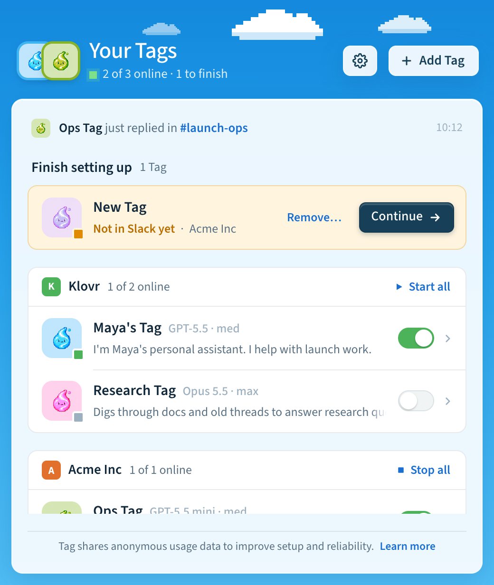

# Usage data

Tag can share a little anonymous usage data, such as whether setup finished,
to help us make installing and running Tag more reliable. You can turn it off
at any time, and it never includes your prompts, Slack messages, agent output, Tag or workspace
names, paths, logs, credentials, or configuration values.

## Your choice

The first time you use Tag, it turns usage data on and tells you with one short
note: "Tag shares anonymous usage data to improve setup and reliability." In the
app, the note appears at the end of setup, or on Home if you skip setup, and
goes away when you move to another screen. **Learn more** opens Settings at
**Privacy**, where you can turn it off.



To change your mind later, open **Settings** → **General** and turn **Share
usage data** on or off. It's under **Privacy**. In the terminal:

```text
tag telemetry status
tag telemetry on
tag telemetry off
```

One choice covers the app, the `tag` command, and every Tag on this computer.
If you turned usage data off in an earlier version, Tag keeps it off.

## How the choice works

Tag contains an optional, privacy-bounded telemetry client that helps Klovr
understand whether people can install, configure, and operate Tag. The `tag`
command and the desktop app share it: one preference, one installation identifier, and
one fixed list of events. Approved
release builds use the dedicated destination and collection boundary described
on this page. Source checkouts have no telemetry destination unless they are
packaged by the release workflow.

At the first interactive run, Tag saves an installation-wide enabled
preference and shows a one-line note, in the terminal or in the app, that says
how to turn it off. Non-interactive runs and runs with telemetry disabled don't
change the setting, and a saved opt-out is never overridden. Turning telemetry off saves a disabled preference, deletes
the local pseudonymous identifier and queued events, and sends no opt-out event.
Non-interactive runs do not choose on the operator's behalf.

Set `TAG_TELEMETRY=off` before running Tag for an immediate, process-only hard
stop. While this override is present, Tag creates no telemetry files and makes
no telemetry network requests. The app's **Share usage data** setting then says
it's off because `TAG_TELEMETRY=off` is set.

The saved preference applies to every Tag in the same installation and lives at
`$TAG_HOME/config/telemetry.json`, outside versioned release directories.

## Events and properties

Tag can emit only the following fixed events and scalar properties. The client
has no general-purpose event API for prompts, arbitrary labels, or application
data.

| Event | Properties |
| --- | --- |
| `tui_started` | Tag version, OS family, CPU architecture, and whether the invocation is interactive |
| `setup_started` | Setup entry point: `setup`, `add`, or `test` |
| `setup_step_completed` | Fixed terminal setup step (notice, Slack, app, channels, or finish) and coarse elapsed-time bucket |
| `setup_abandoned` | Last fixed setup step and coarse elapsed-time bucket |
| `setup_completed` | Coarse elapsed-time bucket and backend kind: Codex or Claude |
| `command_completed` | Fixed command group, outcome, and coarse duration bucket |
| `command_failed` | Fixed command group and stable error category |
| `telemetry_preference_changed` | The value `enabled`; disabling sends no event |
| `app_opened` | App and Tag versions, OS family, and CPU architecture |
| `app_screen_viewed` | Fixed screen: Home, Tag details, Settings, AI settings, or setup |
| `app_setup_started` | Setup entry point: first Tag, another Tag, or finishing an earlier setup |
| `app_setup_step_completed` | Fixed setup step (Your Tag, AI, workspace, existing app, create, or channels) and coarse elapsed-time bucket |
| `app_setup_abandoned` | Last fixed setup step, why it ended (cancelled, failed, or left for AI settings), and coarse elapsed-time bucket |
| `app_setup_completed` | Setup entry point and coarse elapsed-time bucket |
| `app_update_finished` | Whether the update succeeded or failed |
| `app_channel_switched` | Release channel: stable, beta, or alpha (the app does not offer edge) |

The app does not send events itself. It asks the installed `tag` command to
record one of the `app_` events above, and the command checks every event name,
field, and value against the same closed lists before anything is queued. Setup
events come from the position on the app's step track, never from the answers.
When the app runs the `tag` command for its own work, such as refreshing the
list of Tags, the command records no `tui_started`, `setup_*`, or `command_*`
events, so the app's background checks are not counted as terminal use. The app
records nothing before it has installed the `tag` command and shown the notice.

Duration values are reduced to `<5s`, `5–30s`, `30–120s`, or `>120s`. Error
categories are fixed values selected by Tag; exception messages and stack
traces are not collected.

Tag never includes Slack messages, channel or workspace identifiers, Tag or
workspace names, prompts,
agent input or output, retrieval queries, file contents, source code, paths,
host names, account identities, email addresses, command arguments,
configuration values, environment variables, logs, credentials, tokens, or raw
error text in an event.

## Identifier and local queue

After telemetry is enabled, Tag creates a random installation UUID. It does not
identify a person or create a PostHog person profile. `tag telemetry off`
deletes this identifier.

Events briefly enter a local queue containing at most 64 events. Queued events
expire after 24 hours. Delivery happens in a detached background process;
network failures are silent and cannot change command output or exit status.
The queue is deleted when telemetry is disabled.

## Destination and retention

Release builds send events directly to a dedicated Tag project in PostHog EU
Cloud at `https://eu.i.posthog.com`, for both the CLI and the app. They are not
mixed with Hover website or documentation analytics. Tag disables PostHog
person profiles and IP geolocation and does not use autocapture, session
recording, surveys, feature flags, or error and log capture.

The Tag project uses PostHog's Free plan, which retains event data for one
year. Tag does not copy telemetry into another analytics project or maintain a
separate telemetry export.

For privacy questions, access or deletion requests, contact
[team@klovr.co](mailto:team@klovr.co). The broader Hover website privacy notice
is available at [hover.team/privacy](https://www.hover.team/privacy/).
