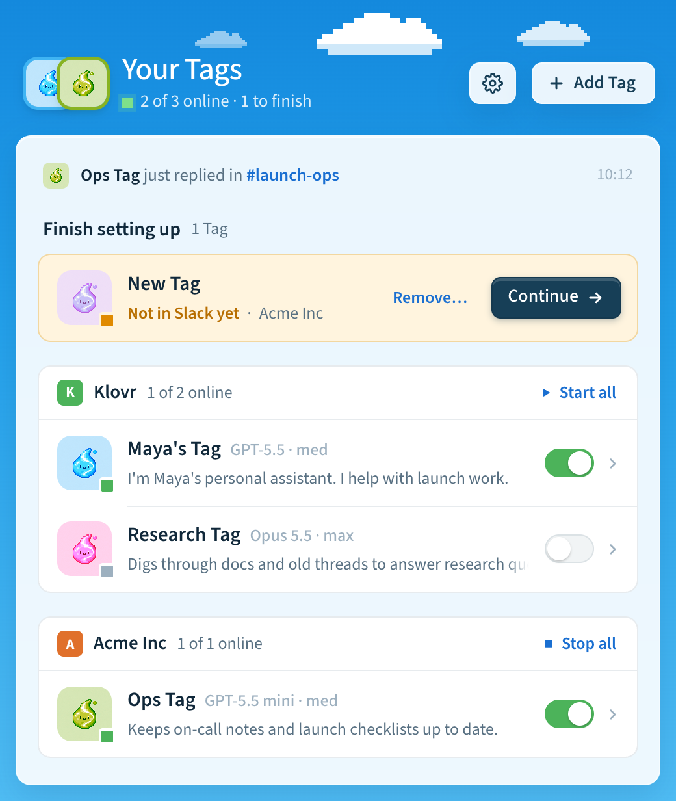
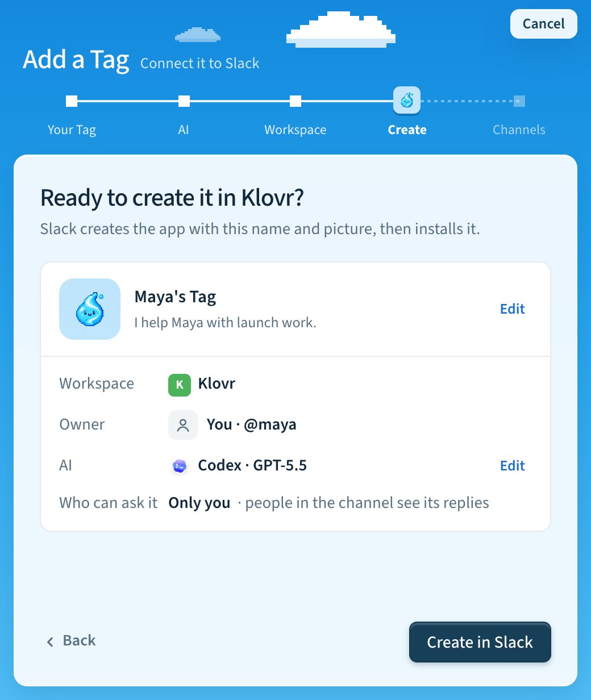
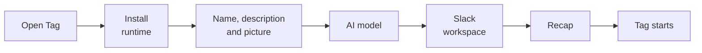

# What's New

Tag 0.3 brings **Tag**, a desktop app for macOS. It installs Tag, sets up new
Tags, keeps them running, and shows what they did. You don't need a terminal.
Claude joins Codex as a full agent, all your Tags share one set of AI
sign-ins, and each Slack thread now keeps one agent conversation.

Already using Tag 0.2? You don't need to set anything up again. Tag upgrades
your settings, credentials, and Slack apps the next time it starts. See
[Upgrade from 0.2](#upgrade-from-02).

## Highlights

- **Tag for macOS.** Install, add, start, stop, rename, and remove Tags without
  a terminal. It lives in the menu bar. Windows and Linux are coming soon.
- **Claude is a full backend.** Claude runs through the Claude Agent SDK with
  the same Slack behavior as Codex: streamed answers, live activity, private
  approvals, Stop and timeouts.
- **Shared AI connections.** Sign in to Codex, a ChatGPT plan or Claude once,
  and every Tag can use it. Each Tag keeps its own model and thinking level.
- **Threads remember the conversation.** Follow-up mentions in a Slack thread
  continue where the last reply stopped, for both backends.
- **Keep Tags running.** A login service starts your Tags and restarts any that
  stop.

**Home** shows all your Tags, grouped by Slack workspace, with a switch to
start or stop each one.

Adding a Tag takes five short steps: **Your Tag**, **AI**, **Workspace**,
**Create**, and **Channels**. One recap shows everything before anything
changes in Slack.

## Get Tag

Download Tag from the
[GitHub release](https://github.com/klovr-co/hover-tag/releases) for your
computer:

| Platform | Download |
| --- | --- |
| macOS (Apple silicon and Intel) | Universal `.dmg` |

Windows and Linux: coming soon. Until then, use the terminal installer.

On first run, the app installs the Tag runtime and shows its progress. You
don't need to install Python or the Slack CLI first. Then it walks you through
adding your first Tag.

You can still install and run Tag from a terminal with `install.sh` or
`install.ps1`. The app and the CLI share the same Tags, settings and lifecycle,
so you can use either. See the [installation guide](../installation.md).

## Everything new in 0.3

### Desktop app

- **Home** lists your Tags by Slack workspace with each Tag's picture, model
  and thinking level, and shows the latest reply or a Tag that needs attention.
- **Tag detail** has four tabs: **Activity** (each reply grouped by Slack
  thread, with a one-sentence summary and its steps), **Channels**, **Logs**
  and **Details** (model, thinking level, description, Rename and Remove).
- **Settings** has General (appearance, AI connections, usage data), Updates
  (release channel) and About (replay onboarding).
- The app can open at login, keep your Tags running, and notify you when a Tag
  goes offline. It updates itself and your Tags together.
- A "Tag app" link in a Slack message opens that Tag's Details in the app.
- Errors explain what to do next and clear once a retry works.

### Setting up a Tag

- Setup now starts with the Tag itself: name, description and picture. Then
  you pick the AI model and the Slack workspace, and one recap shows everything
  before Slack changes. The app and `tag setup` follow the same steps.
- The new Tag starts on its own, and the app shows each start step. Two Tags
  can start at the same time.
- You can reuse an existing Slack app, pick who can use the Tag from a list of
  Slack people, and connect developer sandboxes and Enterprise organizations.
- Each Tag has its own folder, such as `~/Tag/t0abc123-a0xyz789`, and several
  Tags can share one workspace.

### AI connections and models

- Codex and Claude both support streaming, live activity, approvals, Stop,
  timeouts and per-thread conversations.
- Connect a ChatGPT plan to run Codex. Tag renews the token for you.
- Use other AI providers and API gateways with your own API keys and base
  URLs for Codex or Claude, including Azure OpenAI for Codex and an optional
  gateway provider. See
  [Models](../reference/api-connections.md).
- `tag usage` shows token usage, estimated cost and an optional monthly budget.
- Model and thinking level belong to the Tag. Slack no longer shows Configure.

### In Slack

- Live activity shows short steps in the thread while a task runs.
- Codex approvals offer Allow once, Allow for this task, Deny and Deny and
  stop. Claude offers Approve once and Deny.
- Saved files are attached to the thread by default and kept locally.
- Tag can reopen files shared earlier in a thread and keeps generated images.
- Failed requests are shown privately to the requester, with Retry, Fix with
  coding agent and Report issue. See [When a request fails](../reference/error-reporting.md).

## Upgrade from 0.2

Run `tag upgrade`, or install the Tag app and let it take over your existing
installation. Tag runs these migrations automatically before it starts your
Tags. Each one is safe to repeat and resumes if it is interrupted.

| Change | What happens |
| --- | --- |
| Tag folders | Each Tag's settings, credentials and history move into its folder under `~/Tag`. The old location stays until the copy is verified. |
| ChatGPT sign-ins | Per-Tag ChatGPT accounts move to one shared account. If your Tags used different accounts, Tag asks you to choose one. |
| Slack settings | Per-person model overrides set with Configure are archived. Each Tag keeps its default model and thinking level. |
| Slack app | Tag adds `team:read` so the app can show workspace icons. A Tag still starts if this scope isn't granted yet. |
| File delivery | Tags without a saved choice start attaching saved files to Slack. An explicit `local` choice is kept. |
| Python and memory | Tag prepares its own Python and updates the managed memory server, keeping indexes and credentials. You no longer need the `mfs` client. |

When Slack or a provider needs you to sign in again or an admin to approve,
Tag says exactly what to do and resumes on the next start.

## Known limitations

- Live installation, Slack replies, upgrades and app self-updates still need
  qualification. Windows Slack/backend operation through the terminal installer
  has not been qualified live.
- The desktop app is offered for macOS only. Windows and Linux app builds are
  attached to releases but untested; support is coming soon.
- API keys and gateway routing are set with `tag config set`; the app's AI
  connections screen doesn't manage them yet.
- Claude approvals are one-time only. Task-scoped grants, persistent rules and
  approval retries are Codex-only.
- Usage budgets are advisory. They don't stop tasks.
- Additional callers beyond the owner are not yet part of the supported flow.
- Tag runs with your account's files, credentials, tools and permissions. Use
  it with trusted people and workspaces; it is not a hardened multi-tenant
  security boundary.

See the [release contract](../../RELEASE.md), the
[installation guide](../installation.md), [supported capabilities](../reference/supported-capabilities.md)
and the [security policy](../../SECURITY.md).
