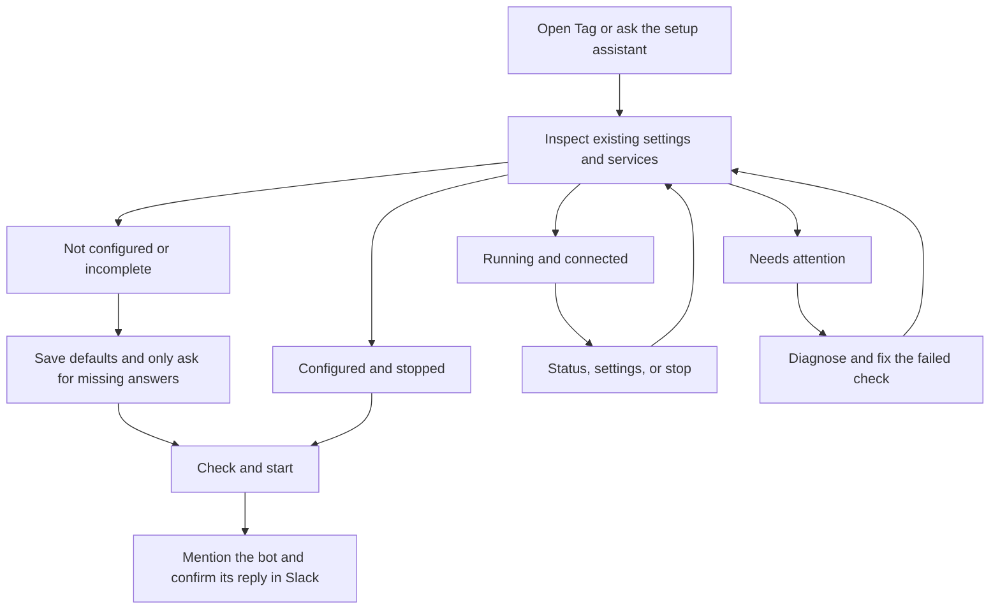

# Set up and manage Tag

## Multiple Slack workspaces

One installation can run independent Tags for separate Slack apps/workspaces.
The reserved `default` Tag uses the same isolated layout as every named Tag:

```sh
tag add
tag list
tag personal setup
tag personal start
tag personal status
tag personal logs
tag personal stop
```

Omitting the alias selects `<TAG_HOME>/instances/default`. During `tag add`, Tag connects
Slack first and suggests a lowercase workspace alias derived from the selected workspace's
name. The alias is only used in local commands; it is independent of the Slack app's display
name. Paused onboarding appears in `tag list` and resumes
with the targeted setup command. Each Tag has its own settings, Slack app,
agent working folder, conversations, logs, and lifecycle. Use Slack's settings
for that specific app to change its remote name or profile image.

MFS is shared by the installation. `tag NAME stop`, restart, reset, and
failed startup leave shared memory and other Tags running. Inspect it with
`tag memory status`; after stopping every Tag bridge, an installation-owned
service can be stopped explicitly with `tag memory stop`. Tag refuses to stop
an externally managed MFS process.

Shared storage does not authorize cross-workspace retrieval. Normal Slack
retrieval remains limited to the selected Tag's approved workspace/channel
scopes. These local Tags share the trusted-sandbox limitations described
in the security model; they are not hardened tenants from one another.

For automation, `tag list --json` returns `schema_version`, the installation
root, and one independently readable record per Tag. Existing inspect/status
objects retain their fields and add `tag` plus nullable `slack_workspace`;
their `next_command` starts with `tag NAME` for named Tags. A malformed Tag is
returned with its own error and does not suppress other records.

The CLI and guided settings share the same settings and lifecycle operations.
Use `tag` for a status summary and next command. An assistant managing Tag should
begin with `tag inspect --json` to inspect what is already configured.
Slack runtime agents load the runtime contract; Tag does not bundle an admin
skill into their workspace.

## The journey



Plain `tag` suggests the next command based on current state.
Use `tag status` for health and `tag doctor` for diagnostics. Settings groups Slack connection/access,
workspace/memory, agent choice, and advanced options. The workspace is managed
by Tag's persistent home. Changing memory scopes does not index new sources.

`tag` and `tag status` share the same overview, including agent sign-in, Slack,
memory and first-reply caveats. `tag status --json` reports the same checks in
structured form. `tag restart` stops Tag's managed processes and starts them
through the normal readiness checks; a failed stop prevents starting again.
Contributors using a prepared source checkout can run `./tag dev` for a
foreground loop that watches `scripts/**/*.py`, reloads the Slack bridge, and
streams bridge logs. It owns both Slack and loopback MFS for the session, so
Ctrl-C stops both; configured remote MFS endpoints remain external. Managed
releases do not expose development watching.

Completed `tag setup` checks readiness and exits without repeating onboarding.
Use `tag setup --review` to review choices explicitly. `tag setup --no-start`
saves approved choices without starting services or indexing. For a separate,
resumable test configuration, use `tag setup --test`; it keeps data under
`<TAG_HOME>/testing/onboarding` and implies `--no-start`. This is not a Slack
sandbox: CLI sign-ins are shared and approved Slack app/channel operations are
real. Test mode labels its banner, app-creation choice, review warning, and
default app name (`TEST · <first name>'s Tag`) accordingly. A test home needs a
separate MFS server before you deliberately start it.

Settings offers guided app/workspace changes, credential reconnection,
multi-channel selection, history windows and invitation-memory policy.
Stop Tag first with `tag stop` for these changes. They are prepared in a private
draft using onboarding's validation and approval steps. Pausing or declining
Apply keeps active settings unchanged; reopen the same Settings action to
resume a draft. Slack-side actions already approved are not undone by cancelling
the local draft. Apply preserves the previous settings and app links in the
printed draft directory, keeps unrelated configuration, and never starts Tag
or indexes history. Run `tag start` when ready to use the new settings.

`tag setup` saves each completed answer. Ctrl-C pauses; running it again skips
valid saved answers. It defaults to Codex and puts timeouts, retries, and other
advanced settings outside the required questions. Claude Code is available in
Settings or with `tag config set OPENTAG_BACKEND claude` and remains experimental.

To start onboarding over, run `tag reset`. A confirmation defaults to Cancel.
After confirmation, Tag stops its managed services, moves saved settings and
local Slack CLI app-link/creation checkpoints into a private timestamped backup
under `config/backups/` in the Tag home, and launches setup from the beginning.
It also archives the old invitation-memory sync status. Your workspace, skills,
connector files, and CLI sign-ins are kept. Tag unregisters this instance's
Slack history connector from shared MFS, removing the indexed records owned by
that connector without stopping shared memory or affecting other Tags. A
separate prompt offers to keep or permanently delete the Slack app, defaulting
to **Keep**.
It shows the saved bot name, App ID, and workspace Team ID. Deletion requires
typing the exact App ID and matching saved Slack CLI app-link metadata. Tag
backs up the local setup first, then calls Slack CLI with that explicit app and
team. Remote deletion is permanent: the local backup cannot restore the app or
its Slack app data. If deletion fails or its outcome is uncertain, setup does
not restart; check the app in Slack before running `tag setup`. The backup's
`app-deletion.json` records the outcome. Missing or ambiguous identity never
triggers deletion.
Setup offers **Create a new Tag app**, **Use an existing app**, or
**Exit · finish setup later**.
Profile-picture selection and upload require Slack CLI 4.7 or newer.
Before creating a new app, setup proposes **&lt;your first name&gt;'s Tag** and a
curated version of Tag's waterdrop, selected from 144 approved base designs and
16 subtle signatures (2,304 identities). Tag remembers the assignment and avoids
known collisions for that workspace on the same installation. Choose **Use my Tag waterdrop** to
keep that branded identity, or **Choose my own picture** and drag or paste one
local PNG, JPEG, or GIF path into the terminal. Images must be 512–2000 pixels
in each dimension. Before creating anything remotely, Tag reviews the chosen
name and picture and offers to open the PNG in the system image viewer, change
either choice, continue, or finish setup later. Tag copies the result into its private
Slack CLI project and the Slack CLI uploads it during the approved app creation.
For an existing app, open https://api.slack.com/apps, sign in if asked, and select
an app you manage for the chosen workspace. In **Basic Information → App Credentials**,
copy the **App ID** (starting with `A`) and paste it into Tag. This is not a token
or Client ID. Tag asks before linking and checks the app's configuration afterward.
No browser-session integration is needed. Saved or archived app identities are
not presented as a list of your Slack apps.
When the compatibility check finds missing settings, it shows the full
checklist. If Agent messaging is missing, setup offers **Enable Agent messaging
with Slack CLI**. Tag exports the remote manifest, adds only the Agent view while
preserving unrelated settings, syncs it, and verifies Slack's saved state. A
legacy Assistant view requires explicit confirmation because Slack does not
allow that conversion to be reversed. Other missing settings still offer
**Open app settings**, **Check again**, or **Exit · finish setup later**. Open app settings
takes you to the selected Slack app; make every listed change there, save it,
then choose Check again. If bot scopes are listed, reinstall the app in Slack
afterward so they take effect. Tag never requests a configuration token.
If setup pauses or fails, run
`tag setup` to resume the new answers. Reset requires an interactive terminal.
The printed backup contains `restore-paths.json`, mapping each saved item to its
original location. To recover the previous setup, stop Tag and move those items
back, first keeping a copy of any newer configuration you want to preserve.

The terminal follows four steps: Connect Slack → App → Channels → Finish.
After you approve Finish setup, Tag initializes shared memory before connecting
to Slack. Starting memory for the first time can take a couple of minutes.
Channels Tag has already joined are included automatically and cannot be
removed from setup. Use arrow keys and Enter to continue; Space opens an
optional checklist only after choosing **Add public channels**. Plain terminals
fall back to numbered input. `q` exits so setup can be finished later. The channel
summary offers Change channels and Change defaults (history window and agent)
before approval. Approving Finish setup authorizes indexing the displayed
history and starting Tag; it never sends a test message.
An app compatibility failure stays on the selected app with Open settings,
Check again, and Exit · finish setup later. Linking is saved separately from compatibility,
so returning does not repeat a successful link. Browser pages open only through
an explicit action. Codex sign-in and startup failures have their own retry step.
Slack onboarding is contained in `tag setup`: it checks Slack CLI authorization,
offers the real CLI login handoff, creates or links an app with explicit
approval, validates three credential roles separately, and uses its existing
channel membership as the fixed baseline. Public channels are optional: setup
asks before joining only those you explicitly add with `channels:join`, then
verifies membership before saving stable channel IDs. New-app templates request
this scope; existing apps need an approved permission update/reinstall or a
manual invitation if it is absent. Private channels require an invitation to
appear.
New onboarding approves invitation-following memory (`SLACK_CHANNEL_POLICY=invited`):
all channels the bot has joined, including later invitations, become eligible
for replies and automatic indexing with the configured history window. Anyone
able to invite the app can expand this set. Public channels the bot has not
joined are never automatically indexed. Authorized callers remain restricted.
The running bridge reconciles membership about every minute and requests an
incremental MFS sync on changes and about every five minutes. History credentials
are validated independently before a request. Current-channel reply scoping
remains enforced by the normal helper flow, not a hardened boundary (ADR 0001).
Leaving a channel removes normal retrieval access after reconciliation; already
indexed data is not automatically erased, and an in-flight index job may finish.
`tag status`/`tag inspect --json` distinguish invitation-memory sync state from
service health. `sync_requested` is not proof of index completion or a reply.

Existing completed setups without this setting retain selected-channel behavior.
To opt in using the updated installation, set
`tag config set SLACK_CHANNEL_POLICY invited`, then stop/start Tag. This authorizes
indexing all currently joined channels as well as future invitations. Use
`selected` to retain a manual allowlist. In invited mode App Home explains the
invitation policy instead of offering a conflicting manual channel picker.
In selected mode its picker changes reply destinations only; setup still approves
new memory channels. Raw IDs remain in the JSON/automation interface by design.
An invalid JSON file must be repaired before settings can be changed; setup
never replaces it silently.

For new apps, Tag runs `slack app install` in its private
`<TAG_HOME>/integrations/slack-cli` project after showing the requested scopes
and receiving approval. Slack CLI owns authorization and app creation; Tag reads
the resulting App ID from CLI metadata instead of asking you to copy it. The
CLI's `deployed` environment label identifies the app record, not a hosted Tag
service: the bridge still runs on your computer. Tag does not run `slack deploy`
or `slack run` during creation.

Installation is checked separately from creation. Pending approval can be
resumed with the same App ID; an uncertain creation without a saved ID stops
instead of automatically creating another app. Existing apps still use explicit
link-by-ID and settings review. Connection now attempts automatic
credential handoff once through Slack CLI's documented custom deploy hook. It repeats
installation checks for the exact saved app in a temporary project using remote
settings; the hook only receives credentials, with no hosted deployment or bot
startup. Approval delays or missing credentials cannot count as connected.
Failures pause on a recovery menu: retry after resolving the issue, enter tokens
privately, open app settings, or finish setup later. Opening settings does not retry.
Recognized CLI error codes receive fixed, actionable explanations; raw CLI output
is never displayed. A service-limit error requires review by the operator/admin
or Slack support, not repeated installation attempts or automatic permission repair.
Bot and Socket Mode credentials are validated separately before being saved
together. History connector credentials remain separate. Hidden terminal entry
is an explicit fallback, not the default. Temporary credential files are private
and removed on exit; these safeguards are not a hardened isolation boundary
(ADR 0001). Live credential handoff acceptance remains pending.

## Commands for people and skills

Permission failures pause setup and show the missing scope, the operation it blocks,
and instructions to fix it yourself in Slack (or ask a workspace admin).
Choose **Open app settings**, **Check again**, or **Exit · finish setup later**; channel joining
also lets you return to channel selection. Tag does not repair permissions or
reinstall apps as part of error recovery. Bot scopes, Socket Mode app-token scopes,
and separate history credentials require different fixes. If Slack issues a new
token, update it privately in Tag settings before retrying. Normal approved
credential handoff remains unchanged; it uses remote app settings without `--force`.
Manual permission recovery still needs live acceptance testing.

| Intent | Command | Behavior |
| --- | --- | --- |
| Decide what to do next | `tag inspect --json` | Read settings, check service health, report state and next command |
| Inspect without network or process probes | `tag inspect --offline --json` | Report configuration and executable availability only |
| Seed defaults | `tag config init --json` | Save missing defaults, preserve all existing values |
| See settings | `tag config show --json` | Redact secrets and unknown extension values |
| Discover editable settings | `tag config keys --json` | List supported keys |
| Change one setting | `tag config set OPENTAG_BACKEND claude --json` | Validate and atomically save only that setting |
| Store a token | `tag config set SLACK_BOT_TOKEN --stdin --json` | Read its value from standard input; never echo it |
| Diagnose | `tag doctor --json` | Check configuration, memory, backend executable, and Slack API access |
| Check services | `tag status --json` | Require healthy MFS and a connected Slack bridge for exit 0 |
| Check for updates | `tag upgrade --dry-run --json` | Verify the saved channel's target without changing the installation |
| Upgrade | `tag upgrade` | Stage and atomically select the verified release, restarting managed services when needed |
| Install an older release | `tag upgrade --version X.Y.Z --allow-downgrade` | Explicitly override the downgrade guard; prefer rollback for the previous release |
| Start or stop | `tag start` / `tag stop` | Use the existing managed-process lifecycle |

Pass secrets through a process stdin pipe or use settings' hidden token prompt;
do not put literal tokens in command arguments or shell history. There is no
unredacted `config show` mode. Empty values clear optional settings in automation, for example
`tag config set SLACK_CHANNEL_ID ''`; required settings cannot be cleared.
Changes take effect on the next start. Restart running Tag with `tag stop` then
`tag start` after reviewing the intended change.

Inspection is read-only and exits 0 when it can describe the current state, even
if setup is incomplete. `status` exits 1 for unhealthy services; `doctor` exits 1
for failed checks. Operational errors exit 1; invalid command usage exits 2.
JSON commands emit a single object with `schema_version: 1`; consumers should
ignore unknown fields. Argparse usage errors are still written to stderr.
Plain `tag` prints a summary, and `tag settings` / `tag setup` reject nonterminal
input rather than waiting for answers. Agents should use configuration commands.

The inspection object includes `configuration.fields` (missing/invalid settings),
`backend`, `services`, `runtime`, `state`, and `next_command`. Offline services
are `null`, never assumed healthy. The current settings file is the source of
configuration state; ambient Slack/backend variables do not complete setup.

## What verification means

Interactive `tag doctor` offers an optional Codex diagnosis after normal checks.
It previews a fixed-field report (health booleans and recognized historical error
categories), then asks `Send this report to Codex? [y/N]`. Raw logs, configuration,
channel names, and Slack messages are not included. Old log signals do not prove
the current cause. Empty input declines; offline/JSON/noninteractive runs never
prompt. Existing Codex authentication and usage apply.

The diagnostic invocation uses read-only mode, disabled shell execution, ignored
user configuration, a temporary working directory and a restricted environment.
Unsupported Codex versions fail closed. These are safeguards, not a hardened
credential-isolation boundary (ADR 0001). Suggestions are not verified or applied;
repairs, restarts and permission changes still require separate approval.

Executable discovery does not prove sign-in or a successful agent run. Inspection
and diagnosis explicitly report backend authentication and task execution as
`not_checked`. Sign in using the chosen backend's own interface. No model task
is launched by inspection or diagnosis.

`doctor` checks API access and memory; `status` checks actual service readiness.
Neither proves a Slack mention produced a reply. After startup, send a mention
in the permitted channel and observe the answer before declaring that journey
verified. `first_reply` stays `not_verified`; it is not an automatic receipt.

For Slack memory failures, rerun setup and review the selected channels,
history credential, window, and indexing approval. `tag start` registers the
saved connector after MFS is healthy. Additional sources still require normal
MFS configuration and an exact URI in `MFS_ALLOWED_SCOPES`.

If an interrupted settings write leaves `settings.json.lock`, first ensure no
configuration writer is active before removing that specific lock and retrying.
Writes use a private temporary file and atomic replacement to keep the previous
configuration intact on failure.
# Everyday interface

Use `tag setup` to onboard, `tag start` to start services, `tag status` to check
readiness, and `tag settings` to change configuration. Plain `tag` opens the
status summary and next command without prompting, including outside a terminal.
There is no main menu. Use `tag --help` to discover supporting commands such as
`tag stop`, `tag logs`, and `tag doctor`. Only setup and settings are interactive.
Reading the summary leaves services unchanged. Service readiness does not prove
a successful reply.

The older installed CLI also offers `tag update` and `tag restart`.
Its `slack-run` command remains a compatibility
alias for `run`; use `run` only for foreground debugging. The workspace lifecycle
does not yet expose the same update/restart commands.
