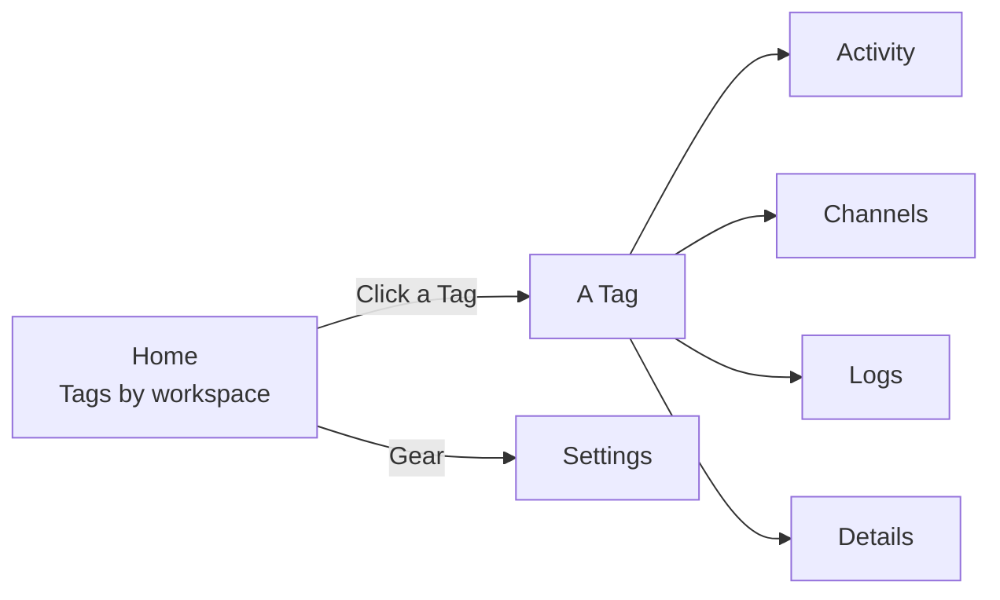
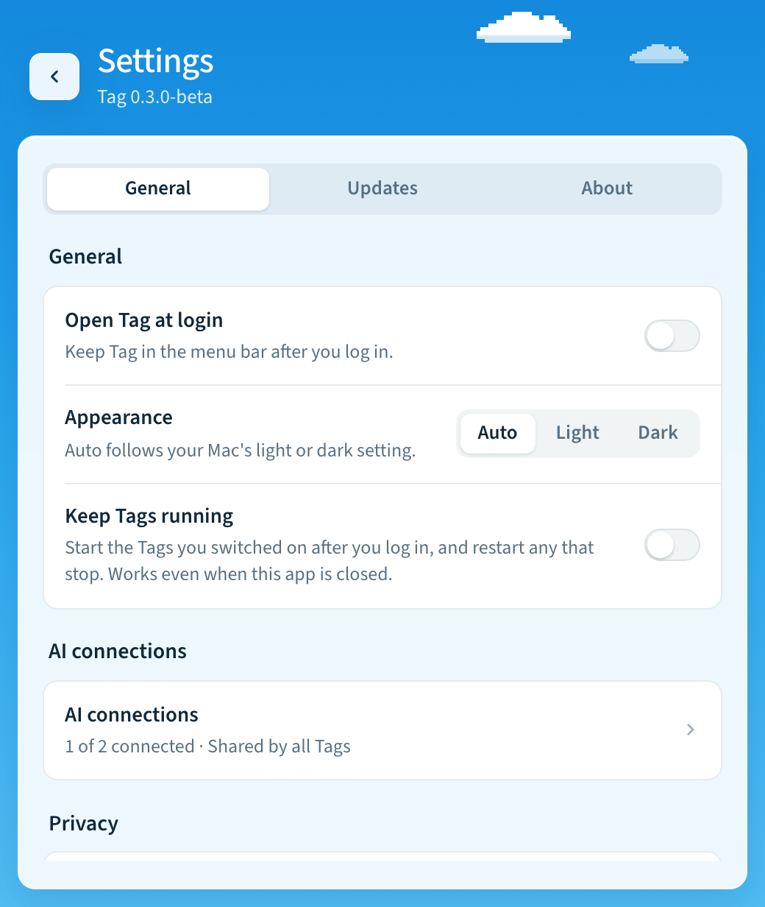
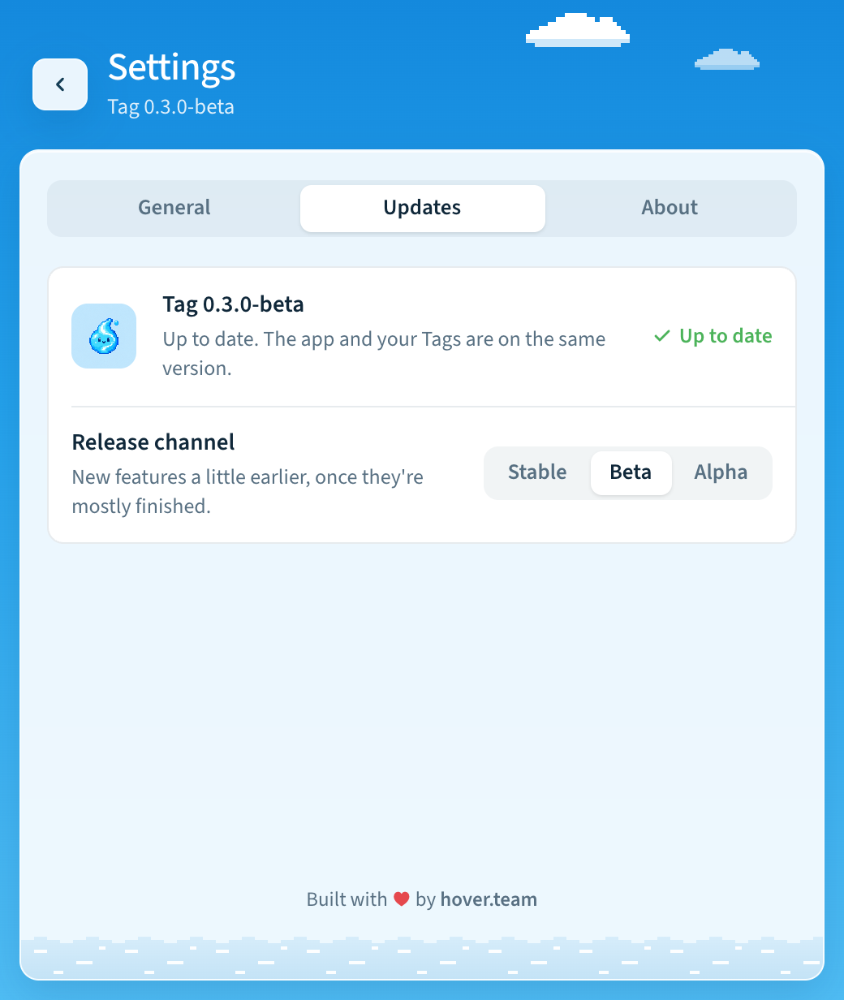
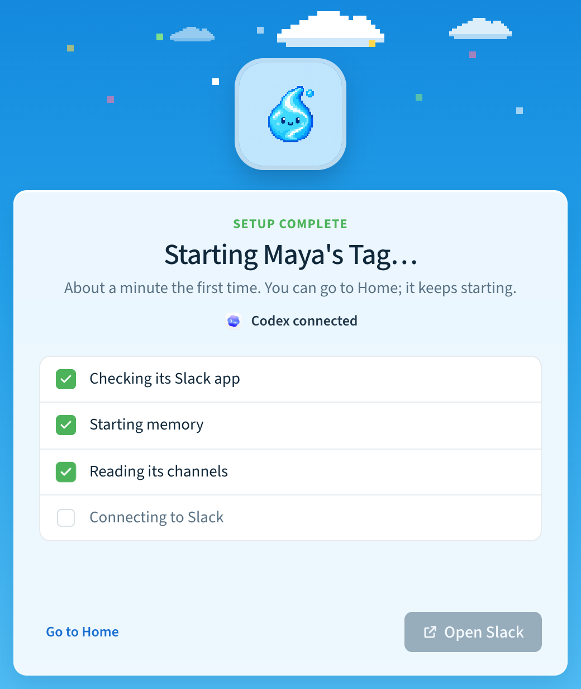

# Set up and manage Tag

The Tag desktop app is the easiest way to manage your Tags. Everything it does, you can
also do with the `tag` command in a terminal. Both show the same Tags, so use
whichever you like.

## A quick tour of the app

```mermaid
flowchart LR
    Home["Home<br/>Tags by workspace"] -->|Click a Tag| Detail["A Tag"]
    Detail --> Activity["Activity"]
    Detail --> Channels["Channels"]
    Detail --> Logs["Logs"]
    Detail --> Details["Details"]
    Home -->|Gear| Settings["Settings"]
```

### Home

**Home** lists your Tags, grouped by Slack workspace. Each workspace shows how
many Tags are online, with **Start all** or **Stop all**. Each Tag has a switch
to start or stop it.

The line at the top shows what matters most right now. That could be a Tag
that can't answer (click **Fix**), the latest reply, or a greeting. Tags that
aren't finished appear under **Finish setting up**. Use search to find a Tag or
channel.

The app also lives in the menu bar.
Its menu has **Open Tag…**, **Add Tag…**, **Settings…**, **Start All Tags**,
**Stop All Tags**, **Keep Tags Running**, and **Quit Tag**. Closing the window
keeps the app running there. The app tells you if a Tag goes offline
unexpectedly.

### A Tag's tabs

Click a Tag to open it. It has four tabs.

- **Activity** shows the Tag's replies, newest at the bottom. Click a reply's
  step count to see what the Tag did. Replies in the same Slack thread are
  grouped together. To see failed requests, tick **Show errors**.
- **Channels** lists where the Tag can reply. Click a channel to see every
  Tag's activity in it.
- **Logs** shows the Tag's log. Click **Copy full log** to share it.
- **Details** shows the Tag's name, description, workspace, model, and working
  folder. You can rename, describe, or remove the Tag here.

When a Slack message mentions **the Tag app**, click the link to open that
Tag's Details in the app.

### Settings

Click the gear to open **Settings**. It has three tabs:

- **General**: **Open Tag at login**, **Appearance**, **Keep Tags running**,
  **AI connections**, and **Share usage data**.
- **Updates**: **Update Tag** and the **Release channel** (Stable, Beta, or
  Alpha).
- **About**: documentation and **Replay onboarding**.

**AI connections** shows your Codex and Claude accounts. Click **Check
connections** to make sure they work, or sign in again.

## Add a Tag

1. On **Home**, click **Add Tag**.
2. Choose a name, a one-line description, and a picture. Click **Shuffle
   picture** for a new one, or upload your own.
3. Choose the AI model.
4. Choose the Slack workspace. Sign in to Slack if asked.
5. Check the recap. Nothing changes in Slack until you click **Create in
   Slack**.
6. Choose channels. You can skip this and `/invite` the Tag to a channel in
   Slack later.

Your new Tag then starts by itself. The app shows each step.

The Tag can answer before it finishes reading your channels. If setup stops,
choose the Tag under **Finish setting up** to carry on.

### Use an existing app

Already have a Slack app you want your Tag to use? On the first step, click
**Use an existing app**. The app keeps its own name and picture, so you skip
naming. The steps become **AI**, **Workspace**, **Your app**, and
**Channels**.

1. Choose the AI model and the workspace your app is in.
2. On **Which app?**, pick your app. The list shows apps made with Tag, apps
   from the Slack CLI, and apps your other Tags use. One app serves one Tag,
   so those can't be picked. To use another app, click **Use a different
   app** and paste its link from `api.slack.com/apps`, or its App ID, which
   starts with `A`.
3. Tag checks the app's settings. If something is missing, click **Add them**.
   Tag adds only what's missing, and Slack asks you to reinstall the app. Or
   click **I'll do it myself** to see the steps in Slack.
4. Click **Connect**, then choose channels.

In the terminal: `tag setup` for your first Tag, `tag add` for another. Then
run the `tag NAME start` command it prints. Choose **Use an existing app** on
the first question to link an app you already have.

## Start or stop

Use the Tag's switch on **Home**. To start or stop every Tag in a workspace,
click **Start all** or **Stop all**. Two Tags can start at the same time, so
you don't have to wait for one to finish before you switch on the next.

In the terminal: `tag NAME start`, `tag NAME stop`, or `tag NAME restart`.

## Change the model

1. Open the Tag and go to **Details**.
2. Choose a **Model** and thinking level.

Tag saves both and restarts the Tag if it is running. Every request in Slack
uses this model. To add an AI account, open **Settings** → **General** → **AI
connections**.

In the terminal: `tag NAME settings ai model VALUE`.

## Rename or describe

1. Open the Tag and go to **Details**.
2. Click **Rename** next to the name, or **Edit** next to the description.

The description is one line, up to 140 characters. It appears on the Tag's
Slack profile. Tag changes it in Slack first. If Slack asks you to sign in
again, nothing changes.

In the terminal: `tag NAME rename "Research Tag"` or
`tag NAME describe "Digs through docs to answer research questions"`.

## Keep Tags running

Open **Settings** → **General** and turn on **Keep Tags running**. Your Tags
start after you sign in to your computer and restart if they stop. Turn on
**Open Tag at login** to open the app too.

In the terminal: `tag autostart on`.

## Update

Open **Settings** → **Updates** and click **Update Tag**. This updates the app
and your Tags together. Your settings are kept. To change how new your updates
are, choose a **Release channel**. See
[Release channels](installation.md#release-channels).

In the terminal: `tag upgrade`.

## Remove a Tag

1. Open the Tag and go to **Details**.
2. Click **Remove this Tag…**.

This stops the Tag and moves its files to an `abandoned` folder. It never
deletes them. The Slack app stays.

To delete the Slack app too, click **Also delete the Slack app…**. Tag shows
the app name, App ID, and workspace, and asks you to type the App ID. This is
permanent. A new app gets a different App ID and bot.

In the terminal: `tag NAME remove`. To also delete the Slack app:
`tag NAME remove --delete-app --confirm-app A0XYZ789`.

To start a Tag's setup over, run `tag NAME reset` in the terminal. The app
doesn't have this. Remove the Tag and add a new one instead.

## Command reference

| Task | App | Terminal |
| --- | --- | --- |
| Add a Tag | **Add Tag** on Home | `tag setup` (first Tag), `tag add` |
| See your Tags | **Home** | `tag list` |
| Start or stop | The Tag's switch, **Start all**, **Stop all** | `tag NAME start` / `stop` / `restart` |
| See activity | The Tag → **Activity** | `tag NAME logs --activity RUN_ID` |
| See logs | The Tag → **Logs** | `tag NAME logs` |
| Find a problem | **Fix** or **View logs** | `tag NAME status`, `tag NAME doctor` |
| Rename | Details → **Rename** | `tag NAME rename "Name"` |
| Describe | Details → **Edit** | `tag NAME describe "…"` |
| Model | Details → **Model** | `tag NAME settings ai model VALUE` |
| AI accounts | Settings → General → **AI connections** | `tag settings ai` |
| Keep Tags running | Settings → General → **Keep Tags running** | `tag autostart on` |
| Update | Settings → Updates → **Update Tag** | `tag upgrade` |
| Release channel | Settings → Updates → **Release channel** | `tag upgrade --channel beta` |
| Usage data | Settings → General → **Share usage data** | `tag telemetry on\|off` |
| Remove a Tag | Details → **Remove this Tag…** | `tag NAME remove` |
| Start setup over | Not available | `tag NAME reset` |
| Channels and advanced settings | Not available | `tag NAME settings` |

`NAME` is the Tag's name from `tag list`. Commands without a name use your main
Tag.

## More help

- [Use your ChatGPT plan](reference/chatgpt-connection.md)
- [Models and your own API](reference/api-connections.md)
- [Enterprise Grid and developer sandboxes](reference/slack-organizations.md)
- [Troubleshooting](troubleshooting.md)
- [Tag in the terminal](reference/cli-operations.md): multiple Tags,
  setup details, upgrades, and automation, for operators and developers.
