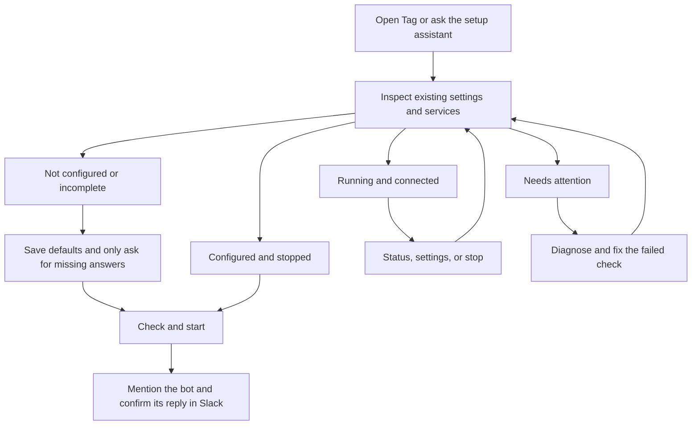

# Set up and manage Tag

## Multiple Tags

One installation can run several independent Tags, each with its own Slack app.
Tags can be in different Slack workspaces or share one. Every Tag is named
after its Slack workspace and app IDs, in lowercase:

```sh
tag add
tag list
tag t0abc123-a0xyz789 start
tag t0abc123-a0xyz789 status
tag t0abc123-a0xyz789 logs
tag t0abc123-a0xyz789 stop
```

The name is the Tag's working folder, `~/Tag/t0abc123-a0xyz789`, with private
data in its `.tag` folder. IDs never collide, so nobody chooses or edits a
name. A Tag gets its name when setup creates or links its Slack app; until then
a new Tag from `tag add` is called `new-tag` (or `new-tag-2`, …), and the first
Tag of a fresh installation is set up before it is named. The Slack display name
(for example “Maya's Tag”) is separate and can be the same for several Tags.

Rename a Tag with `tag NAME rename "Research Tag"`. This changes the
assistant's name in Slack, verifies Slack saved it, and gives the Tag a
nickname for commands, here `research-tag`, so `tag research-tag start` works.
Choose a different nickname with `--nickname`; nicknames never repeat another
Tag's ID or nickname. If Slack needs a fresh `slack login`, nothing changes
locally and the error repeats the exact command to retry.

Tags are grouped by Slack workspace in `tag list`. Start, stop, or restart every
Tag in one workspace with `tag start --workspace T0ABC123` (a team ID or the
workspace's name). Each Tag runs its own lifecycle; one failure doesn't stop the
others, and Tags that haven't finished setup are skipped. `--json` reports each
Tag's outcome.

Commands without a name, such as `tag start`, use the **main Tag**: the first
Tag you set up, or your only Tag. `tag default …` remains an alias for the main
Tag. With several Tags and no main Tag, unnamed commands ask you to name one.

Paused onboarding appears in `tag list` and resumes with the targeted setup
command. Each Tag has its own settings, Slack app, agent working folder,
conversations, logs, and lifecycle. Use Slack's settings for that specific app
to change its remote name or profile image.

Installations from earlier releases have a first Tag called `default`. The next
`tag start` or `tag setup` renames it, for example `~/Tag/default` to
`~/Tag/t0abc123-a0xyz789`, after stopping it, and makes it the main Tag. The
folder is moved in one step, never copied; paths saved in Tag's private data are
updated; working files are untouched. A plan file makes an interrupted rename
resume with the same name, and an existing folder at the new name stops the
rename with both preserved. After the rename, rolling back to a release without
named Tags is blocked, as for any named Tag.

MFS is shared by the installation. `tag NAME stop`, restart, reset, and
failed startup leave shared memory and other Tags running. Inspect it with
`tag memory status`; after stopping every Tag bridge, an installation-owned
service can be stopped explicitly with `tag memory stop`. Tag refuses to stop
an externally managed MFS process.

An upgrade restarts each previously running Tag, leaving stopped Tags stopped
and shared MFS online. `--no-restart` defers activation until you restart those
Tags. On startup, legacy root-level settings and old working folders are migrated
automatically after stopping the affected bridge. Private data is consolidated under `~/Tag/NAME/.tag`. Originals are retained;
conflicting destination files stop migration with an actionable path. Interrupted
copies resume on retry, and completed migrations do not overwrite later edits.

Shared storage does not authorize cross-workspace retrieval. Normal Slack
retrieval remains limited to the selected Tag's approved workspace/channel
scopes. These local Tags share the trusted-sandbox limitations described
in the security model; they are not hardened tenants from one another.

For automation, `tag list --json` returns `schema_version`, the installation
root, and one independently readable record per Tag, including `main`, the
Slack display name `slack_name`, `nickname`, `workspace_name` when known,
`workspace_icon`, the path of a local copy of the Slack workspace's icon (`null`
for Slack's default icon or before Tag has saved one), and
`avatar`, the path of the Tag's Slack profile picture when setup created one. Existing inspect/status
objects retain their fields and add `tag` plus nullable `slack_workspace`;
their `next_command` starts with `tag NAME` for named Tags. A malformed Tag is
returned with its own error and does not suppress other records.

The CLI and guided settings share the same settings and lifecycle operations.
Use `tag` for a status summary and next command. An assistant managing Tag should
begin with `tag inspect --json` to inspect what is already configured.
Slack runtime agents load the runtime contract; Tag does not bundle an admin
skill into their workspace.

## Advanced Slack setup

For organization-level Slack authorization, see
[Developer sandboxes and Enterprise organizations](reference/slack-organizations.md).

## The journey


```mermaid
flowchart TD
    Request[Open Tag or ask the setup assistant] --> Inspect[Inspect existing settings and services]
    Inspect --> Missing[Not configured or incomplete]
    Inspect --> Stopped[Configured and stopped]
    Inspect --> Running[Running and connected]
    Inspect --> Problem[Needs attention]
    Missing --> Setup[Save defaults and only ask for missing answers]
    Setup --> Start[Check and start]
    Stopped --> Start
    Start --> Reply[Mention the bot and confirm its reply in Slack]
    Running --> Manage[Status, settings, or stop]
    Problem --> Diagnose[Diagnose and fix the failed check]
    Diagnose --> Inspect
    Manage --> Inspect
```

Plain `tag` suggests the next command based on current state.
Use `tag status` for health and `tag doctor` for diagnostics. Settings groups Slack connection/access,
workspace/memory, agent choice, and advanced options. The workspace is managed
by Tag's persistent home. Changing memory scopes does not index new sources.

`tag` and `tag status` share the same overview, including agent sign-in, Slack,
memory and first-reply caveats. `tag status --json` reports the same checks in
structured form. `tag restart` stops Tag's managed processes and starts them
through the normal readiness checks; a failed stop prevents starting again.

Failed Slack requests use a separate, local error-report store. A versioned
startup migration creates and verifies its owner-only directory before
dependent services, then records completion. Interrupted migrations remain
retryable. The store keeps at most 50 bounded records for 30 days.
Failure messages and report previews are private to the original authorized
requester. Sharing with
[Hover Community](https://join.slack.com/t/hover-community/shared_invite/zt-4aghkshid-n7fRukS7_J5sR2jDLBXK9A)
is manual. See [Error reporting for failed Slack requests](reference/error-reporting.md)
for report contents, recovery actions, and storage details. A troubleshooting
handoff needs local coding-agent access to repair Tag; an upstream code bug is
handled through a regression-tested GitHub PR and canonical issue, while a
local repair is explained in the community report.

Contributors using a prepared source checkout can run `./tag dev` for a
foreground loop that watches `scripts/**/*.py`, reloads the Slack bridge, and
streams bridge logs. It owns both Slack and loopback MFS for the session, so
Ctrl-C stops both; configured remote MFS endpoints remain external. Managed
releases do not expose development watching.

Completed `tag setup` checks readiness and exits without repeating onboarding.
Setup saves approved choices, but it does
not start services or index history; run `tag start` when ready. Use
`tag setup --review` to review choices explicitly. For a separate,
resumable test configuration, use `tag setup --test`; it keeps data under
`<TAG_HOME>/testing/onboarding`. This is not a Slack
sandbox: CLI sign-ins are shared and approved Slack app/channel operations are
real. Test mode labels its banner, app-creation choice, review warning, and
default app name (`TEST · <first name>'s Tag`) accordingly. A test home needs a
separate MFS server before you deliberately start it.

Settings offers guided app/workspace changes, credential reconnection,
multi-channel selection, history windows and invitation-memory policy.
Stop Tag first with `tag stop` for these changes. They are prepared in a private
draft using onboarding's validation and approval steps. Pausing or declining
Apply keeps active settings unchanged; reopen the same Settings action to
resume a draft. Slack-side actions already approved are not undone by cancelling
the local draft. Apply preserves the previous settings and app links in the
printed draft directory, keeps unrelated configuration, and never starts Tag
or indexes history. Run `tag start` when ready to use the new settings.

`tag setup` saves each completed answer. Ctrl-C pauses; running it again skips
valid saved answers. It defaults to Codex and puts timeouts, retries, and other
advanced settings outside the required questions. Choose the Tag's default
model in Settings → Model or with `tag config set OPENTAG_DEFAULT_MODEL claude:opus`
(or `codex:MODEL`, or just `codex`/`claude` for that backend's own default).
Setting a default model also sets `OPENTAG_BACKEND` to match. In Slack, anyone
authorized can choose any model from the signed-in backends with **Configure**;
`OPENTAG_BACKENDS=codex` limits the choices to one backend.
Settings → Model opens one picker with the live models of every connected
agent. Both Codex and Claude are available by default when installed and signed
in. Sign out of either agent and reopen the picker to remove its models, even
if it was the saved default. Restart Tag to refresh Slack’s model list. `tag status` shows the default model and which other agents Slack users
can switch to, and `tag list` shows each Tag's default model.

To start onboarding over, run `tag reset`. A confirmation defaults to Cancel.
After confirmation, Tag stops its managed services, moves saved settings and
local Slack CLI app-link/creation checkpoints into a private timestamped backup
under `config/backups/` in the Tag home, and launches setup from the beginning.
It also archives the old invitation-memory sync status. Your workspace, skills,
connector files, and CLI sign-ins are kept. Tag unregisters this instance's
Slack history connector from shared MFS, removing the indexed records owned by
that connector without stopping shared memory or affecting other Tags. A
separate prompt offers to keep or permanently delete the Slack app, defaulting
to **Keep**.
It shows the saved bot name, App ID, and workspace Team ID. Deletion requires
typing the exact App ID and matching saved Slack CLI app-link metadata. Tag
backs up the local setup first, then calls Slack CLI with that explicit app and
team. Remote deletion is permanent: the local backup cannot restore the app or
its Slack app data. If deletion fails or its outcome is uncertain, setup does
not restart; check the app in Slack before running `tag setup`. The backup's
`app-deletion.json` records the outcome. Missing or ambiguous identity never
triggers deletion.
Setup offers **Create a new Tag app**, **Use an existing app**, or
**Exit · finish setup later**.
Profile-picture selection and upload require Slack CLI 4.7 or newer.
Before creating a new app, setup proposes **&lt;your first name&gt;'s Tag** and a
curated version of Tag's waterdrop. Choose Metal (white), Wood (green), Water
(the default blue), Fire (red), or Soil (yellow). Backgrounds, highlights, and
16 subtle signatures provide 960 identities. Tag remembers the assignment and
avoids known collisions for that workspace on the same installation. Choose an
element to keep that branded identity, or **Choose my own picture** and drag or paste one
local PNG, JPEG, or GIF path into the terminal. Images must be 512–2000 pixels
in each dimension. Before creating anything remotely, Tag reviews the chosen
name and picture and offers to open the PNG in the system image viewer, change
either choice, continue, or finish setup later. Tag copies the result into its private
Slack CLI project and the Slack CLI uploads it during the approved app creation.
For an existing app, open https://api.slack.com/apps, sign in if asked, and select
an app you manage for the chosen workspace. In **Basic Information → App Credentials**,
copy the **App ID** (starting with `A`) and paste it into Tag. This is not a token
or Client ID. Tag asks before linking and checks the app's configuration afterward.
No browser-session integration is needed. Saved or archived app identities are
not presented as a list of your Slack apps.
When the compatibility check finds missing settings, it shows the full
checklist. If Agent messaging is missing, setup offers **Enable Agent messaging
with Slack CLI**. Tag exports the remote manifest, adds only the Agent view while
preserving unrelated settings, syncs it, and verifies Slack's saved state. A
legacy Assistant view requires explicit confirmation because Slack does not
allow that conversion to be reversed. Other missing settings still offer
**Open app settings**, **Check again**, or **Exit · finish setup later**. Open app settings
takes you to the selected Slack app; make every listed change there, save it,
then choose Check again. If bot scopes are listed, reinstall the app in Slack
afterward so they take effect. Tag never requests a configuration token.
If setup pauses or fails, run
`tag setup` to resume the new answers. Reset requires an interactive terminal.
The printed backup contains `restore-paths.json`, mapping each saved item to its
original location. To recover the previous setup, stop Tag and move those items
back, first keeping a copy of any newer configuration you want to preserve.

The terminal follows four steps: Connect Slack → App → Channels → Finish.
Finish setup saves configuration. Run `tag start` to initialize shared memory
and connect Slack. Starting memory for the first time can take a couple of minutes.
Channels Tag has already joined are included automatically and cannot be
removed from setup. Use arrow keys and Enter to continue; Space opens an
optional checklist only after choosing **Add public channels**. Plain terminals
fall back to numbered input. `q` exits so setup can be finished later. The channel
summary offers Change channels and Change defaults (history window and agent)
before approval. Approving Finish setup saves these choices without starting
services or indexing history.

After the first successful `tag start`, Tag sends a welcome DM to the single
account set as its owner, including a first-task suggestion
and the [Hover Community help link](https://join.slack.com/t/hover-community/shared_invite/zt-4aghkshid-n7fRukS7_J5sR2jDLBXK9A).
Multiple allowed accounts do not receive a broadcast; the welcome is skipped
when there is no single recipient. Delivery is recorded per Slack workspace,
app, and user in private versioned state, so normal restarts and setup reviews
do not repeat it. Existing installations receive it on their next successful
start after upgrading. A delivery failure leaves Tag running and retries on
the next `tag start`. The welcome confirms connectivity, not a tested agent reply.

An app compatibility failure stays on the selected app with Open settings,
Check again, and Exit · finish setup later. Linking is saved separately from compatibility,
so returning does not repeat a successful link. Browser pages open only through
an explicit action. Codex sign-in and startup failures have their own retry step.
Slack onboarding is contained in `tag setup`: it checks Slack CLI authorization,
offers the real CLI login handoff, creates or links an app with explicit
approval, validates three credential roles separately, and uses its existing
channel membership as the fixed baseline. Public channels are optional: setup
asks before joining only those you explicitly add with `channels:join`, then
verifies membership before saving stable channel IDs. New-app templates request
this scope; existing apps need an approved permission update/reinstall or a
manual invitation if it is absent. Private channels require an invitation to
appear.
New onboarding approves invitation-following memory (`SLACK_CHANNEL_POLICY=invited`):
all channels the bot has joined, including later invitations, become eligible
for replies and automatic indexing with the configured history window. Anyone
able to invite the app can expand this set. Public channels the bot has not
joined are never automatically indexed. Authorized callers remain restricted.
The running bridge reconciles membership about every minute and requests an
incremental MFS sync on changes and about every five minutes. History credentials
are validated independently before a request. Current-channel reply scoping
remains enforced by the normal helper flow, not a hardened boundary (ADR 0001).
Leaving a channel removes normal retrieval access after reconciliation; already
indexed data is not automatically erased, and an in-flight index job may finish.
`tag status`/`tag inspect --json` distinguish invitation-memory sync state from
service health. `sync_requested` is not proof of index completion or a reply.

Existing completed setups without this setting retain selected-channel behavior.
To opt in using the updated installation, set
`tag config set SLACK_CHANNEL_POLICY invited`, then stop/start Tag. This authorizes
indexing all currently joined channels as well as future invitations. Use
`selected` to retain a manual allowlist. In invited mode App Home explains the
invitation policy instead of offering a conflicting manual channel picker.
In selected mode its picker changes reply destinations only; setup still approves
new memory channels. Raw IDs remain in the JSON/automation interface by design.
An invalid JSON file must be repaired before settings can be changed; setup
never replaces it silently.

For new apps, Tag runs `slack app install` in its private
`<TAG_HOME>/integrations/slack-cli` project after showing the requested scopes
and receiving approval. Slack CLI owns authorization and app creation; Tag reads
the resulting App ID from CLI metadata instead of asking you to copy it. The
CLI's `deployed` environment label identifies the app record, not a hosted Tag
service: the bridge still runs on your computer. Tag does not run `slack deploy`
or `slack run` during creation.

Installation is checked separately from creation. Pending approval can be
resumed with the same App ID; an uncertain creation without a saved ID stops
instead of automatically creating another app. Existing apps still use explicit
link-by-ID and settings review. Connection now attempts automatic
credential handoff once through Slack CLI's documented custom deploy hook. It repeats
installation checks for the exact saved app in a temporary project using remote
settings; the hook only receives credentials, with no hosted deployment or bot
startup. Approval delays or missing credentials cannot count as connected.
Failures pause on a recovery menu: retry after resolving the issue, enter tokens
privately, open app settings, or finish setup later. Opening settings does not retry.
Recognized CLI error codes receive fixed, actionable explanations; raw CLI output
is never displayed. A service-limit error requires review by the operator/admin
or Slack support, not repeated installation attempts or automatic permission repair.
Bot and Socket Mode credentials are validated separately before being saved
together. History connector credentials remain separate. Hidden terminal entry
is an explicit fallback, not the default. Temporary credential files are private
and removed on exit; these safeguards are not a hardened isolation boundary
(ADR 0001). Live credential handoff acceptance remains pending.

## Commands for people and skills

After an upgrade, `tag start` applies versioned Slack app migrations before
preflight. Existing Slack CLI authorization is used to reconcile the release's
required bot scopes, events, App Home, Socket Mode, and interactivity settings,
refresh the installation,
and save replacement credentials privately. This works without an interactive
terminal and preserves unrelated app settings. The migration is marked complete
only after remote settings and the replacement token's required grants are verified.
Optional permissions are requested the same way but never stop a start. Today
the only one is `team:read`, which shows the workspace icon. If Slack or a
workspace admin hasn't granted it, the receipt records it as pending, `tag
start` says what to approve, and Tag asks again at most once a day.
An existing legacy Assistant view requires explicit approval through
`tag setup --review` before the irreversible Agent conversion. If Slack requires
workspace approval or renewed CLI sign-in, startup stops with recovery guidance;
resolve that requirement and retry `tag start`.

Lifecycle locks for startup, shared-memory startup, reset, and settings apply
are released by the operating system if the CLI exits unexpectedly. A later
attempt recovers the leftover marker without taking a live operation's lock.

Permission failures pause setup and show the missing scope, the operation it blocks,
and instructions to fix it yourself in Slack (or ask a workspace admin).
Choose **Open app settings**, **Check again**, or **Exit · finish setup later**; channel joining
also lets you return to channel selection. Outside the versioned upgrade migrations
above, Tag does not repair permissions or reinstall apps as part of error recovery.
Bot scopes, Socket Mode app-token scopes,
and separate history credentials require different fixes. If Slack issues a new
token, update it privately in Tag settings before retrying. Normal approved
credential handoff remains unchanged; it uses remote app settings without `--force`.
Manual permission recovery still needs live acceptance testing.

| Intent | Command | Behavior |
| --- | --- | --- |
| Decide what to do next | `tag inspect --json` | Read settings, check service health, report state and next command |
| Inspect without network or process probes | `tag inspect --offline --json` | Report configuration and executable availability only |
| Seed defaults | `tag config init --json` | Save missing defaults, preserve all existing values |
| See settings | `tag config show --json` | Redact secrets and unknown extension values |
| Discover editable settings | `tag config keys --json` | List supported keys |
| Change one setting | `tag config set OPENTAG_BACKEND claude --json` | Validate and atomically save only that setting |
| Store a token | `tag config set SLACK_BOT_TOKEN --stdin --json` | Read its value from standard input; never echo it |
| Diagnose | `tag doctor --json` | Check configuration, memory, backend executable, and Slack API access |
| Check services | `tag status --json` | Require healthy MFS and a connected Slack bridge for exit 0 |
| Check for updates | `tag upgrade --dry-run --json` | Verify the saved channel's target without changing the installation |
| Upgrade | `tag upgrade` | Stage and atomically select the verified release, restarting managed services when needed |
| Install an older release | `tag upgrade --version X.Y.Z --allow-downgrade` | Explicitly override the downgrade guard; prefer rollback for the previous release |
| Start or stop | `tag start` / `tag stop` | Use the existing managed-process lifecycle, and remember whether this Tag should keep running |
| Keep Tags running after login | `tag autostart on` / `off` / `status --json` | Register a per-user login service that starts wanted Tags and restarts them if they stop |
| Drive setup from an app | `tag setup --json` / `tag add --json` | Run the same guided setup over a JSON-lines conversation; see below |

Pass secrets through a process stdin pipe or use settings' hidden token prompt;
do not put literal tokens in command arguments or shell history. There is no
unredacted `config show` mode. Empty values clear optional settings in automation, for example
`tag config set SLACK_CHANNEL_ID ''`; required settings cannot be cleared.
Changes take effect on the next start. Restart running Tag with `tag stop` then
`tag start` after reviewing the intended change.

Inspection is read-only and exits 0 when it can describe the current state, even
if setup is incomplete. `status` exits 1 for unhealthy services; `doctor` exits 1
for failed checks. Operational errors exit 1; invalid command usage exits 2.
JSON commands emit a single object with `schema_version: 1`; consumers should
ignore unknown fields. Argparse usage errors are still written to stderr.
Plain `tag` prints a summary, and `tag settings` / `tag setup` (without `--json`) reject nonterminal
input rather than waiting for answers. Agents should use configuration commands.

### Keeping Tags running

`tag start` records that a Tag should keep running and `tag stop` records that
it should stay off; `tag restart` keeps the choice. `tag list --json` reports it
as `keep_running`. `tag autostart on` registers a per-user login service that
starts those Tags after login and checks every minute, restarting a Tag whose
bridge has stopped. After a failed start it waits longer each time, up to an
hour. The service uses the operating system's own mechanism and needs no
administrator rights:

| Platform | Mechanism |
| --- | --- |
| macOS | launchd agent in `~/Library/LaunchAgents` |
| Linux | systemd user service, or an XDG autostart entry without systemd |
| Windows | the per-user `Run` registry key |

The first `tag autostart on` keeps the Tags that are running now, if no choice
was recorded yet. `tag autostart keep NAME...` records that Tags should keep
running without starting them now. A start made by the login service follows
the recorded choice instead of changing it, so stopping a Tag while the
service is starting it leaves the Tag off. Each restart counts until the Tag has
stayed up for five minutes, so a Tag that crashes right after starting also
backs off. `tag autostart off` removes the service and leaves running
Tags as they are; the service is set up so that stopping it never stops the
Tags it started. The service runs Tag's stable launcher, so upgrades take
effect without registering it again. Its output is in
`state/supervisor.log` under the installation root. Tag.app's **Keep Tags
running** setting uses the same commands.

### Guided setup over JSON lines

`tag setup --json` and `tag add --json` run the same guided setup as the
terminal, for graphical clients such as Tag.app. Instead of drawing prompts,
setup writes one JSON object per line to stdout and reads each answer from stdin:

- `{"type": "message", "text": …}` — progress prose, without color.
- `{"type": "question", "id": …, "kind": …, "prompt": …}` — setup is waiting.
  `id` is a stable name such as `workspace`, `history_days`, or
  `approve_setup`; match answers by `id`, not by prompt wording. `kind` is
  `choose` (with `options` and `default`), `multi` (channel `options` and
  `selected`), `text` (with `default`), `secret`, `confirm`, `people`, or
  `slack_login`.
- `{"type": "result", "status": "complete" | "paused" | "failed", "tag": …}` —
  the session is over. `paused` means progress was saved and setup can resume.

Answer with `{"answer": …}`: an option index or its exact label for `choose`, a
list of them for `multi`, a string for `text` and `secret`, a boolean for
`confirm`, and an offered member ID (or `"manual"`) for `people`. Choosing the exit option, sending `{"answer": null, "pause": true}`,
or closing stdin saves progress and pauses. Questions carry `can_go_back`; when
it is true, `{"back": true}` returns to the previous question with the earlier
answer as its default, after clearing only the setting that question saved.
Back stops at steps that already changed something in Slack (sign-in, creating
or linking the app, connecting its credentials). With `--step`, use `--back`. Clients should ignore stdout lines
that are not JSON objects.

The `people` question includes a `people` array with `id`, `name`, `username`,
and `image_url` for each active person. Tag.app lets you search names, usernames,
and member IDs, with profile photos or an initial when no photo loads. The CLI
provides the same people search with text labels. Selecting a person stores their
member ID; choosing `manual` opens member-ID entry. If Slack's directory is
unavailable, setup falls back to manual entry. Existing caller choices are kept.
This uses the already-required `users:read` scope after the bot is connected.

`slack_login` (id `slack_login`) replaces the terminal's Slack CLI sign-in. Its `sign_in_line` is a
one-time `/slackauthticket` command for the person to send in Slack; answer with
the code Slack then shows. Setup never echoes the code. `tag add --json` never asks
for a name; its result reports the Tag's final name once setup has named it.

#### One question per command

Clients that can't hold a process open between answers, such as coding agents,
can use `--step` instead of `--json`. Each call prints one JSON object and exits;
setup keeps running in the background between calls:

- `tag setup --step` (or `tag add --step`) starts setup, or continues the one
  already running, and prints the next question.
- `tag setup --answer JSON [--question ID]` answers the current question with a
  JSON value, such as `0`, `true`, or `"Maya's Tag"`, and prints the next one.
  With `--question`, the answer is refused unless setup is asking that `id`.
- `tag setup --stop` pauses setup and saves progress.

The reply has `state` (`waiting`, `working` while setup is busy for more than
about 25 seconds, or `ended`), the new `events` since the last call, the pending
`question`, and the `result` once setup ends. Calling `--step` again while
setup is waiting returns the same question. Only one background setup runs per
Tag home. It listens only on 127.0.0.1, requires a token kept in an owner-only
file under `.setup-session/`, and never writes answers to disk. If nothing talks
to it for 30 minutes, it pauses setup and exits. `--step` can't be combined
with `--test`.

The inspection object includes `configuration.fields` (missing/invalid settings),
`backend`, `services`, `runtime`, `state`, and `next_command`. Offline services
are `null`, never assumed healthy. The current settings file is the source of
configuration state; ambient Slack/backend variables do not complete setup.

## What verification means

Interactive `tag doctor` offers an optional Codex diagnosis after normal checks.
It previews a fixed-field report (health booleans and recognized historical error
categories), then asks `Send this report to Codex? [y/N]`. Raw logs, configuration,
channel names, and Slack messages are not included. Old log signals do not prove
the current cause. Empty input declines; offline/JSON/noninteractive runs never
prompt. Existing Codex authentication and usage apply.

The diagnostic invocation uses read-only mode, disabled shell execution, ignored
user configuration, a temporary working directory and a restricted environment.
Unsupported Codex versions fail closed. These are safeguards, not a hardened
credential-isolation boundary (ADR 0001). Suggestions are not verified or applied;
repairs, restarts and permission changes still require separate approval.

Executable discovery does not prove sign-in or a successful agent run. Inspection
and diagnosis explicitly report backend authentication and task execution as
`not_checked`. Sign in using the chosen backend's own interface. No model task
is launched by inspection or diagnosis.

`doctor` checks API access and memory; `status` checks actual service readiness.
Neither proves a Slack mention produced a reply. After startup, send a mention
in the permitted channel and observe the answer before declaring that journey
verified. `first_reply` stays `not_verified`; it is not an automatic receipt.

For Slack memory failures, rerun setup and review the selected channels,
history credential, window, and indexing approval. `tag start` registers the
saved connector after MFS is healthy. Additional sources still require normal
MFS configuration and an exact URI in `MFS_ALLOWED_SCOPES`.

If an interrupted settings write leaves `settings.json.lock`, first ensure no
configuration writer is active before removing that specific lock and retrying.
Writes use a private temporary file and atomic replacement to keep the previous
configuration intact on failure.
# Everyday interface

Use `tag setup` to onboard, `tag start` to start services, `tag status` to check
readiness, and `tag settings` to change configuration. Plain `tag` opens the
status summary and next command without prompting, including outside a terminal.
There is no main menu. Use `tag --help` to discover supporting commands such as
`tag stop`, `tag logs`, and `tag doctor`. Only setup and settings are interactive.
Reading the summary leaves services unchanged. Service readiness does not prove
a successful reply.

The older installed CLI also offers `tag update` and `tag restart`.
Its `slack-run` command remains a compatibility
alias for `run`; use `run` only for foreground debugging. The workspace lifecycle
does not yet expose the same update/restart commands.

## ChatGPT account connection

Use `tag chatgpt login` to connect a ChatGPT plan directly to this Tag,
`tag chatgpt status --json` to inspect it, and `tag chatgpt use-codex` to return
to the existing Codex sign-in. Stop the Tag before changing accounts. See
[ChatGPT connection commands and recovery](reference/chatgpt-connection.md).
