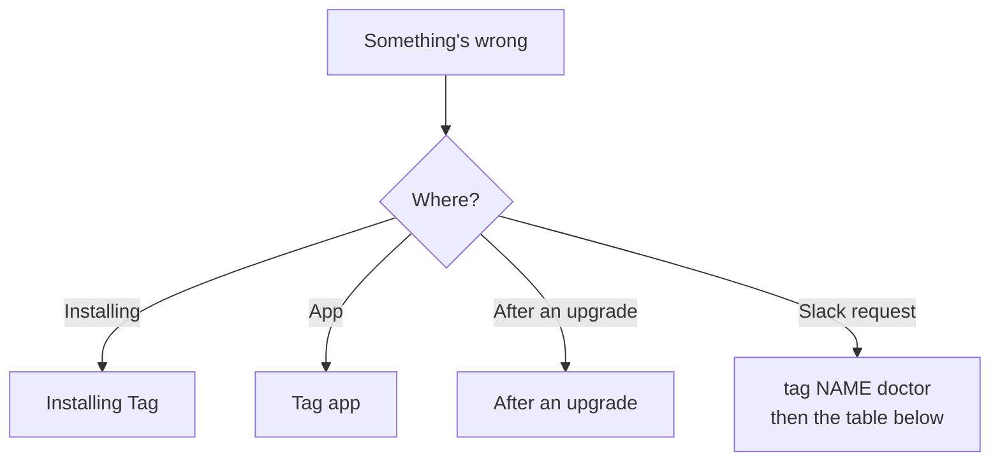

# Troubleshooting

Start with `tag doctor` (or `tag NAME doctor` for one Tag). It groups checks
into runtime, configuration, memory, agent, and Slack, and shows a fix for each
failed check. In the Tag app, open the Tag's **Logs** tab; **Copy full log** copies
every line.

## Installing Tag

| Problem | What it means | Fix |
| --- | --- | --- |
| The install screen says **Installation stopped** | A download or install step failed. The failed step shows the cause. | Check your internet connection and disk space (about 650 MB), then choose **Try again**. It is safe to retry. **Copy details** copies the installer log for a report. |
| macOS won't open Tag | Gatekeeper blocks apps that aren't signed and notarized | Download Tag again from the [releases page](https://github.com/klovr-co/hover-tag/releases). Don't bypass the warning for a build you didn't expect. |
| `tag: command not found` after the terminal installer | Its command directory isn't on your PATH | Add `~/.local/bin` (macOS and Linux) or `%LOCALAPPDATA%\Tag\bin` (Windows) to your PATH, then open a new terminal. |
| `TAG_HOME must be an absolute path` | `TAG_HOME` is set to a relative path | Unset it, or set it to a full path. |

## Desktop app

| Problem | What it means | Fix |
| --- | --- | --- |
| **Couldn't open Tag** on start | The app couldn't run `tag list` to load your Tags. The screen shows the CLI's error. | Fix what the error names, then choose **Try again**. In a terminal, `tag list` shows the same error. |
| The app shows **Install Tag** although you installed it before | The `tag` command was removed or moved | Choose **Install Tag**. A reinstall keeps your Tags and returns to Home; it doesn't repeat setup. |
| A Tag shows an error after **Start** | One start step failed: checking its Slack app, starting memory, reading channels, or connecting to Slack | The failed step shows the cause. Fix it and start the Tag again. `tag NAME start` shows the same steps. Setup is saved if this happens right after setup. |
| Home says a Tag can't answer, with **Fix** | Its AI connection isn't working, for example **Codex sign-in expired** or **Claude isn't signed in** | Choose **Fix**, or open Settings → **General** → **AI connections** and sign in again. In a terminal, use `tag settings ai`. Running Tags pause during the change and restart afterwards. |
| Home says a Tag can't reach Slack or memory | The Tag is running, but its Slack connection or local memory failed | Choose **View logs** to open the **Logs** tab, then run `tag NAME doctor`. |
| **Couldn't check for updates** | The update feed for your channel couldn't be read | Check your connection and try again later. You can still change channel. |
| **The update didn't finish** | An update stopped after it began | Choose **Try again**. Your settings and channel are kept. |
| A `hover-tag://` link from Slack does nothing | The app isn't installed on this computer, or the Tag isn't on it | Open the link on the computer that runs the Tag. |

When a Tag can't answer because of its AI connection, **AI connections** shows
which sign-in needs attention. Choose **Reconnect** next to it.

## After an upgrade

Tag applies upgrade migrations on the first start after an upgrade. They need
no setup, and a failed one is retried on the next start.

| Problem | What it means | Fix |
| --- | --- | --- |
| A Tag doesn't restart after an upgrade | The new release failed one of the Tag's start checks | `tag upgrade` prints one line for each failed Tag, with the cause and a `tag NAME doctor` command. Fix what it names, then run `tag NAME start`. The app shows the same error on the Tag. |
| `tag start` stops and asks you to sign in to Slack again | The Slack app migration needs a fresh Slack CLI sign-in | Sign in to Slack CLI as the message says (it names the exact command), then run `tag NAME start` again. The migration resumes where it stopped. |
| `tag start` stops for workspace approval | The workspace requires an administrator to approve the app's new permissions | Ask a workspace owner or app manager to approve the app update in Slack, then start the Tag again. Tag can't bypass workspace policy. |
| **Icon waits for team:read** | `team:read` lets the app show the workspace icon. It's optional and hasn't been approved. | Nothing breaks: the Tag starts and the workspace shows as a letter. To show the icon, approve Tag's app update in Slack, or ask an administrator to. Tag asks again at most once a day. |
| Model choices made in Slack are gone | Slack's **Configure** view was removed. Per-person model choices were archived. | Choose the Tag's model and thinking level in the app's **Details** tab or with `tag NAME settings ai model`. They apply to every request. |
| `tag list` shows a new name for your first Tag | v0.3 names Tags after their Slack workspace and app IDs; `~/Tag/default` moved to `~/Tag/t0abc123-a0xyz789` | Nothing to do. Commands without a name still use your main Tag. Use `tag NAME rename` to give it a nickname. |

## Running Tags

| Problem | What it means | Fix |
| --- | --- | --- |
| `mfs-server` missing or the wrong version | The pinned memory runtime is unavailable | Run the installer again: the [terminal installer](installation.md#install-from-a-terminal), or reinstall from the app. Ensure `~/.local/bin` (or `%LOCALAPPDATA%\Tag\bin` on Windows) is on `PATH`. |
| MFS health fails | Nothing is listening at `MFS_URL` | Run `tag start`; inspect `tag logs` and `~/.mfs/server.log`. |
| Local MFS is healthy but untracked | Another process owns the loopback endpoint | `tag start` and `tag dev` replace an identifiable `mfs-server` with Tag's current runtime. If another kind of service owns the port, stop it or configure a different `MFS_URL`. Remote endpoints are never replaced. |
| MFS status has no connectors | MFS has no indexed source | Add a source with MFS, then include its exact root in `MFS_ALLOWED_SCOPES`. |
| MFS scope fails | The scope is absent, outside policy, or its connector credential is unavailable | Check that each URI in `MFS_ALLOWED_SCOPES` (`tag config show`) is, or lies under, a source MFS has indexed (a channel scope sits beneath its connector's root); run `tag doctor`; restart MFS after exporting credentials referenced by connector configuration. |
| Cross-channel search rejects a channel | The requested name is absent or non-unique in the caller's live grant | Check the channel name, bot membership, caller membership for private/guest access, indexing, and Slack connectivity. The runtime helper never searches outside its bridge-generated grant. |
| Slack app token fails | Socket Mode cannot connect | Create an `xapp-` app-level token with `connections:write`. |
| Slack bot token fails | Web API calls cannot authenticate | Reinstall the Slack app and rerun `tag NAME setup`; enter the `xoxb-` token only in its hidden prompt. |
| Slack allowed users fails | No caller is authorized, so the bridge fails closed | Rerun `tag NAME setup` to choose the owner again, or set the owner's member ID in `SLACK_ALLOWED_USER_IDS`. |
| Slack channel/history fails | The bot is absent or lacks scopes | Invite the bot, choose the channel again in setup, Settings, or App Home, and reinstall after changing manifest scopes. |
| Slack app installation asks for approval | Workspace or Enterprise app approval is enabled | Submit the Slack app request to a workspace owner or app manager. Tag can't bypass workspace policy. Setup resumes where it stopped. |
| Generated image is described but not attached | The app lacks `files:write`, the result is unsupported or over 15 MB, or the backend did not save it in the prompted result directory | Reinstall the app from the current manifest, retry with PNG/JPEG/GIF/WebP, and inspect Tag logs for the per-file upload error. |
| **Open filename** reports that a local file could not be opened | The file was moved or deleted, its path no longer resolves inside the workspace, or the Tag host has no active desktop application for that file type | Confirm the file still exists in the configured workspace and open it directly on the Tag host to verify its desktop file association. |
| Agent missing | No supported backend is installed and signed in | Install and sign in to Codex CLI (`codex login status`) or Claude Code (`claude auth status`) in the same shell that starts Tag, or use `tag settings ai` (the app: Settings → General → AI connections), which checks both and offers sign-in. A disconnected account's models disappear from the default-model picker. |
| Bridge immediately stops | Runtime dependency or configuration failed after preflight | Run `tag logs`, or open the Tag's **Logs** tab in the app. |
| Mention is denied | The caller is not in the Slack user allowlist | Add their exact member ID to `SLACK_ALLOWED_USER_IDS` only if the owner intends to share access. |
| Mention receives no reply | Slack did not emit an event or the bridge rejected the channel | Confirm Socket Mode is connected, mention your Tag from an authorized human account, and verify the channel is in `SLACK_CHANNEL_IDS`. |
| Tag stops replying while the computer travels or sleeps | The computer is asleep, or Slack's connection dropped when the network changed | Tag can't reply while its computer sleeps, for example with the lid closed on battery. Once the computer is awake and online, Tag reconnects by itself: a connection that stays down for a minute is replaced with a fresh one, and `tag logs` shows `replaced it with a fresh one`. You don't need to restart it. |
| Direct message receives no reply | DM invocation was disabled, its automatic Slack migration is pending, or the sender is not authorized | Ensure `OPENTAG_SLACK_DM_ENABLED` is not `0`, run `tag restart` in an interactive terminal and approve Slack's permission prompt if shown, then confirm the sender is in `SLACK_ALLOWED_USER_IDS`. |

## Failed Slack requests

When a backend request fails, Tag shows the requester an evidence-based cause,
an error reference, and recovery actions in a private Slack message. If Tag
doesn't recognize the failure, it shows the backend's own error message, with
credentials redacted. A timeout does not by itself mean that the network failed.
Retrying creates a new reference and keeps the earlier attempt linked in the
local report.

**Report issue** opens a private preview for the authorized person who made the
request. The preview contains an allowlisted report with the Tag version,
backend identity when available, failed stage, recognized cause, bounded
diagnostics, and later health-check timestamps. It does not include tokens,
conversation text, file contents, or raw logs by default. Add context only after
reviewing it. Slack does not provide a clipboard button for this surface, so
select the report text manually. Nothing is posted automatically.

To share a report, select the reviewed text, [join Hover Community](https://join.slack.com/t/hover-community/shared_invite/zt-4aghkshid-n7fRukS7_J5sR2jDLBXK9A),
and paste it into the discussion. GitHub Issues remain the canonical record for
confirmed bugs; community posting is a manual first-release handoff. Reports
are stored in the selected Tag's private state for up to 30 days, bounded to 50
records, and an expired or unavailable reference is not treated as authorization
to read anything.

**Fix with coding agent** posts a short, copyable prompt with the sanitized
diagnostic report in a message only the requester can see. In a direct message,
the prompt stays in that private conversation. Give it to an agent with access
to the machine running Tag for a local repair. The separate **Report issue**
action provides a private report preview for manual sharing. See
[When a request fails](reference/error-reporting.md) for
the full action, report, and retention details.

When reporting a problem, include the Tag version (`tag version`), operating
system, AI backend, failing check, and a redacted log excerpt. Never include tokens.

## Slack indexing is rate-limited

Tag-managed memory honors Slack's HTTP 429 `Retry-After` delay, shares the
cooldown across channels in the same workspace, and retries the current API
request without restarting the channel's in-progress history read. Channel
listings are cached for up to a minute so readiness checks do not repeatedly
consume Slack's discovery quota.

During a cooldown, `tag status` shows **Indexing paused by Slack** with the
retry delay. `tag start` doesn't wait for it: the Tag connects and answers, and
indexing continues in the background. History search covers each channel once
it is indexed. Repeating setup or restarting memory does not clear Slack's
limit. A memory restart preserves
the cooldown, but may require replaying an interrupted indexing task.

Existing Tag-managed memory processes automatically migrate to the rate-aware
runtime on the next start. Tag verifies process identity before restarting
memory and verifies the new runtime and HTTP health before recording the
migration. This briefly interrupts shared memory for other running Tags;
stored indexes, connector configuration, and credentials are preserved.
Independently managed or remote MFS servers require an equivalent connector
update by their operator; Tag does not replace their runtime.
