# How Tag works

This is a map of what happens after someone mentions Tag. Operators can use
it to set up or demo the bot. Contributors can use it to find where a feature
belongs. It also tells teammates what the bot can and cannot do today.

> **Launch scope:** `main` is intentionally Slack-only for v0.1 alpha. The
> unfinished Zulip implementation is preserved on the `feature/zulip` branch
> and is not included in the installer, runtime, or supported flow below.

Examples use `@<bot-name>` because the Slack display name is configurable. A
mention must target the same Slack app whose tokens are used by the running
bridge.

## Product at a glance

Tag brings a locally authenticated Codex or Claude Code agent into a shared
Slack conversation. Slack supplies the request and a
bounded slice of the conversation, the CLI backend performs the work, and MFS
supplies retrieval from sources approved by the operator. A working deployment
requires MFS and at least one allowed source, although any individual task may
finish without performing retrieval.

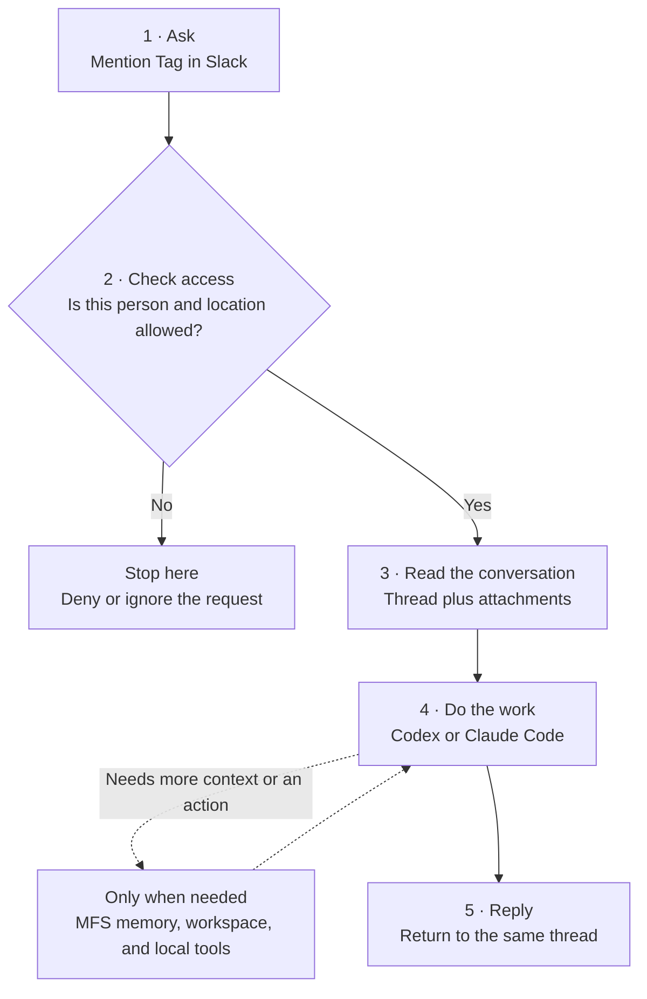

Read the solid line from top to bottom. The dashed branch is optional: simple
questions can go straight from the agent to the reply.

### Example: summarize a Slack thread

1. Maxine writes `@<bot-name> summarize this thread and list the open questions.`
2. Tag confirms that Maxine and the channel are allowed.
3. It reads up to 30 messages from the thread.
4. Codex or Claude writes the summary. It can search MFS if the request refers
   to older material outside the thread.
5. Tag posts the answer back in the same Slack thread.

A few rules matter:

- **Chat** is the shared interface, not the source of model authentication.
- **Brain** is a fresh CLI run for each Slack mention.
- **Memory** setup is required for deployment. At runtime it contains only
  sources already indexed by MFS and allowed by `MFS_ALLOWED_SCOPES`; retrieval
  is used only when a request needs it.
- **Tools** are inherited from the local backend environment and keep their own
  credentials and authorization rules.

## Actors

| Actor | Responsibility |
|---|---|
| Workspace operator | Installs Tag, connects the chat app, chooses the backend and workspace, approves data scopes, and starts/stops the service. |
| Authorized teammate | Mentions the bot, supplies thread context or attachments, requests work, and reviews the shared result. |
| Unauthorized teammate | Receives a denial; their request does not read the thread or start the backend. |
| Slack | Delivers the conversation and displays progress and results. |
| Codex or Claude Code | Reasons, retrieves context, uses permitted local tools, and performs workspace tasks. |
| MFS | Searches and reads previously indexed, operator-approved sources. |

## Connected lifecycle

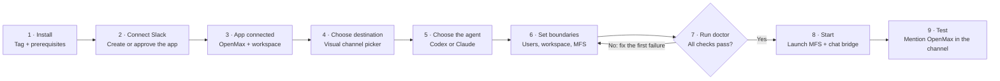

Once this path works, normal use is much shorter: mention, work, reply. Return
to configuration and `doctor` only when you change the setup or diagnose a
failure.

## How to read the levels

| Depth | Read this when you need | What it shows |
|---|---|---|
| **Level 1 · Journey** | A fast orientation | The happy path and its main outcome. |
| **Level 2 · Task flow** | To perform or demonstrate the workflow | Exact user steps, choices, limits, and visible recovery paths. |
| **Level 3 · Service blueprint** | To implement, operate, or debug it | Handoffs among Slack, Tag, the backend, MFS, files, and persistent state. |

Start with Level 1. Continue only as deep as the job requires; Level 3 appears
only where understanding the system boundary materially helps.

## Flow 1: First-time setup

The first setup connects one Slack identity to one Tag worker. The terminal menu
and admin skill share the same commands, inspect current state first, and resume
missing answers. See [setup and management](tag-management.md) for the current
CLI contract and recovery flow.

### Level 1 · Journey

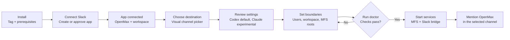

### Level 2 · Task flow

1. Install Python 3.10+, `uv`, and an authenticated Codex or experimental Claude
   Code CLI. Run `./install.sh` (or `./install.ps1` on Windows) for Tag's runtime.
2. Open `tag` for the menu or ask the admin skill to inspect with `tag inspect --json`.
3. Use `tag setup` to resume missing answers, or let the skill seed defaults with
   `tag config init --json` and apply targeted `tag config set` operations.
   Timeouts and retry options stay under advanced settings; Tag manages a stable
   workspace in its application home.
4. `tag setup` reuses Slack CLI authorization (or launches its real login
   handoff), creates or links the app with explicit approval, and validates the
   Socket Mode and bot credentials separately. Slack CLI can hand them off
   privately after approval; hidden prompts are an explicit fallback.
5. The operator selects one or more joined channels by name. Setup separately
   validates the Slack-history credential and asks before writing/indexing an
   MFS connector limited to those channel IDs and the chosen history window.
6. `tag doctor --json` diagnoses configuration, backend executable availability,
   MFS access, and Slack API access. A stopped MFS server must be started to pass
   these live checks; `tag start` handles the local server before its preflight.
7. `tag start` starts MFS, runs preflight, and launches the Slack bridge.
8. `tag status --json` and `tag logs` provide the first operational check;
   `tag logs --limit N --follow` keeps a bounded initial history and then
   streams new service output.
   `tag restart` is a single user-facing flow rather than two complete stop and
   start screens.

Verify the complete journey by mentioning the bot in the permitted Slack channel
and observing its reply. Executable discovery does not prove agent sign-in, and
service readiness does not prove that a mention received a response.

### Level 3 · Service blueprint

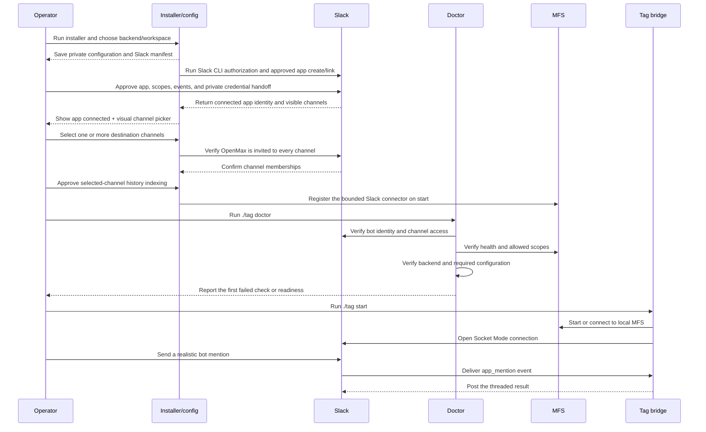

## Flow 2: Delegate a task from Slack

### Level 1 · Journey

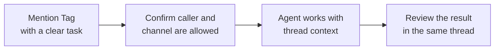

### Level 2 · Task flow

Try this:

> `@<bot-name> summarize this thread and list decisions, owners, and open questions.`

1. Mention the bot in a new channel message to start a fresh Slack thread, or
   inside an existing thread to continue that conversation. By default, an
   authorized user may instead send a top-level message from OpenMax's Messages
   tab without an `@mention`.
2. Keep the request explicit about the deliverable, evidence, and whether any
   side effect such as posting or editing is intended.
3. Watch Slack's loading state while the bounded backend run is active.
4. Review the answer in the invoking thread. Long results may arrive as
   multiple readable replies.
5. If the result needs refinement, mention the bot again in the same thread so
   the next run receives the recent discussion.

### Level 3 · Service blueprint

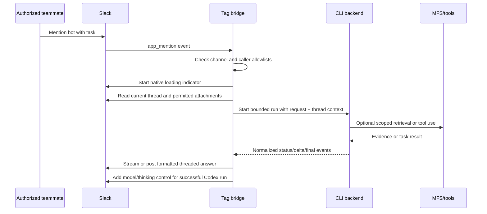

Runtime behavior:

- A top-level mention starts a new Slack thread; a mention inside an existing
  thread continues with that thread's context.
- The bridge strips the mention before sending the request to the backend.
- Slack's native loading indicator is used while work is in progress.
- Claude can stream answer text. Codex uses App Server by default to stream
  final-answer deltas and report observed tool activity without exposing raw
  commentary, reasoning, or tool output.
- Long answers are split into readable threaded replies.
- Failures are returned in the same thread with a bounded error message.

## Flow 3: Continue work with thread context and attachments

### Level 1 · Journey

For example:

> `@<bot-name> compare that proposal with the earlier recommendation.`

> `@<bot-name> review the attached screenshot and explain the failure.`

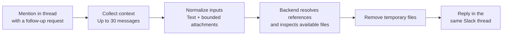

### Level 2 · Task flow

1. Tag fetches one Slack replies page containing up to 30 messages from the
   current thread rather than only the newest message. It does not currently
   paginate longer threads or separately guarantee that a triggering message
   beyond Slack's returned page is retained.
2. Plain message text, legacy attachment fields, and bounded text-file content
   are normalized into the prompt.
3. Image attachments are downloaded into a per-invocation directory under
   `TAG_HOME/tmp`; generated images, HTML, and other disposable artifacts use
   the same private temporary subtree. Images are exposed to the backend for
   inspection. Each downloaded file is limited to
   15 MB; a larger file is skipped with a retrieval-failure marker rather than
   truncated. Embedded text is limited to 12,000 characters per value/file.
   There is no separate aggregate attachment-byte limit beyond the single
   30-message page and per-file limit.
4. The backend resolves references such as “that”, “the previous answer”, or
   “use the screenshot” from the collected thread.
5. Temporary attachment files are removed when the invocation finishes. A
   failed download is represented in the prompt so the backend can explain what
   it could not inspect instead of silently inventing content.

Attachments are treated as untrusted input. Instructions embedded in an image
or document do not override the teammate's request or the runtime policy.

### Level 3 · Service blueprint

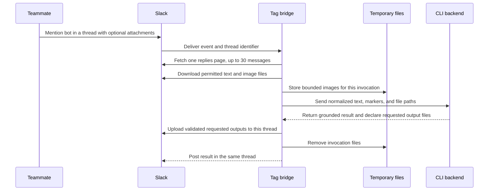

## Flow 4: Retrieve durable context through MFS

Thread history is short-term conversational context. MFS provides durable,
searchable context from approved sources.

### Level 1 · Journey

For a cross-source task:

> `@<bot-name> find the original decision, compare it with the current code, and explain what changed.`

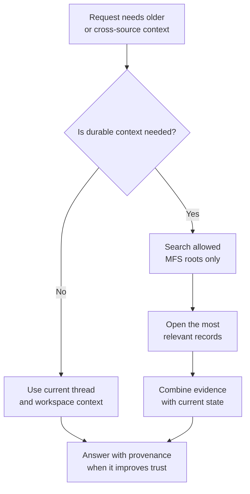

### Level 2 · Task flow

1. The backend decides that external context is needed.
2. It searches only roots listed in `MFS_ALLOWED_SCOPES`.
3. It reopens relevant hits when precise lines or records are needed.
4. It combines retrieved evidence with the current thread and workspace state.
5. It cites paths/records when requested or when provenance materially improves
   the answer.

### Level 3 · Service blueprint

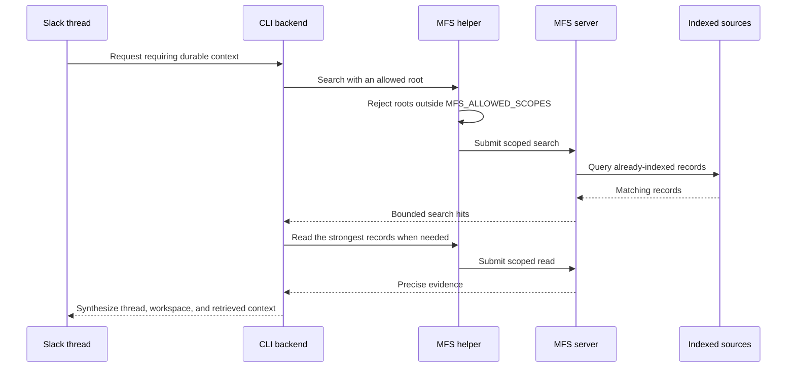

Supported MFS source types can include Slack history, local files, GitHub, Jira,
Linear, databases, object stores, and other configured connectors. Indexing a
source and allowing its root are separate operator decisions; both are required.

For a channel summary:

> `@<bot-name> summarize this channel and identify unresolved action items.`

For a channel-level request, the backend looks up the current channel inside an
allowed indexed Slack source. It does not mistake the current thread for the
whole channel. If no matching indexed Slack source exists, it says that channel
history is unavailable.

## Flow 5: Perform workspace work

### Level 1 · Journey

Try this:

> `@<bot-name> fix the failing parser test, run the focused suite, and summarize the changed files.`

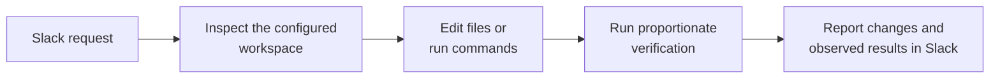

### Level 2 · Task flow

1. The backend receives the configured working directory and runtime contract.
2. It inspects files, runs commands, or edits code with the local account's
   permissions.
3. It uses installed skills and commands when they match the task and are
   available to that backend process.
4. It runs proportionate verification.
5. It reports changed files and observed test/command results in Slack.

Tag does not add a hardened sandbox. The operator should use a trusted
workspace for demos and an external sandbox for stronger production isolation.

## Flow 6: Create shared Slack outputs

The default result is a reply in the invoking Slack thread. Two explicit output
flows are also available:

### Level 1 · Journey

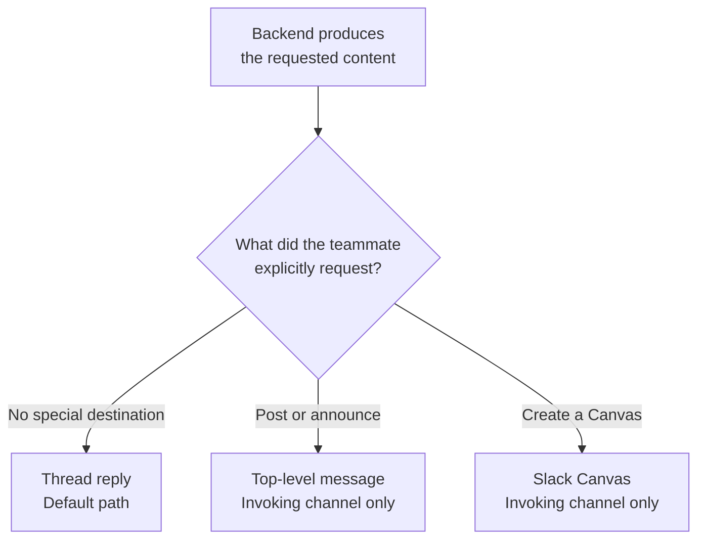

### Level 2 · Task flow

#### Post a top-level channel message

Try this:

> `@<bot-name> turn the agreed release notes into a short announcement and post it in this channel.`

When the request explicitly says to post, send, or share, the backend can call
the channel-post helper. The helper is restricted to the channel that invoked
Tag; the backend cannot select an arbitrary destination.

#### Create a Slack Canvas

Try this:

> `@<bot-name> create a Canvas called “Launch Checklist” from the decisions in this thread.`

The backend writes Markdown in the configured workspace and calls the Canvas
helper. The helper creates a Canvas only in the invoking channel and enforces a
500 KB content limit.

## Flow 7: Change a user's Codex settings

After a successful Codex reply, an authorized teammate can open the compact
overflow menu and select **Codex settings…**.

### Level 1 · Journey

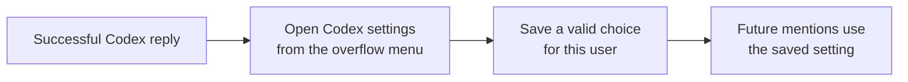

### Level 2 · Task flow

1. Tag shows only available Codex models, their native reasoning levels,
   and Fast Mode availability, narrowed by operator allowlists when configured.
2. The teammate selects a model, a reasoning level or **Default**, and whether
   Fast Mode is on or off.
3. Validation prevents unsupported combinations from being saved.
4. An ephemeral confirmation identifies the saved choices.
5. The user's future mentions use the saved setting across channels and threads.

### Level 3 · Service blueprint

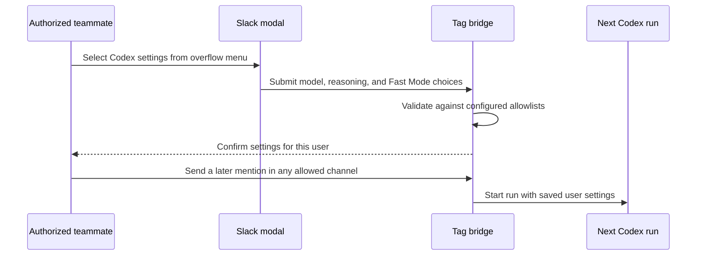

Settings are user-specific, so each authorized teammate can choose a model,
reasoning level, and Fast Mode without changing another teammate's settings.
Saved choices follow that user across channels and threads and survive bridge
restarts. Reasoning levels retain the names reported by Codex; Fast Mode is an
independent latency setting that uses increased usage. “Default” delegates
model or reasoning selection to the Codex CLI. If a saved choice is no longer
available, Tag normalizes it back to the applicable default. Claude replies do
not show this control.

## Flow 8: Denials, failures, and recovery

### Level 1 · Journey

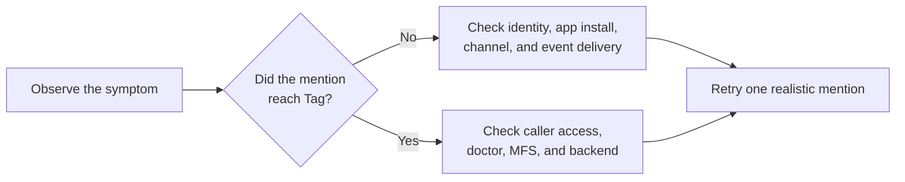

### Level 2 · Decision flow

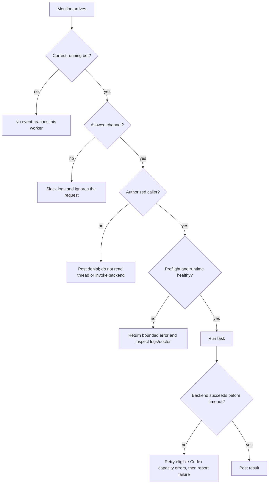

### Level 3 · Operator runbook

Recommended recovery order:

For a completely silent mention, debug event delivery first:

1. Confirm the mentioned Slack identity matches the running worker.
2. Run `./tag status` and confirm the Slack bridge is running.
3. Confirm the bot is invited and has the required scopes/events.
4. Confirm the channel policy allows that location.
5. Run `./tag logs` and look for a received, ignored, or rejected event.

If the event arrives but the task fails, debug runtime dependencies next:

1. Run `./tag doctor` and correct the first failed check.
   If a source checkout reports an incomplete runtime, run
   `./install.sh --dependencies-only`; a managed installation should be repaired
   by rerunning its installer. Startup never installs packages implicitly.
2. Confirm the caller allowlist. An unauthorized Slack caller receives a
   threaded denial before Tag reads the thread or invokes the backend.
3. Inspect the transport/backend error in `./tag logs`.
4. For retrieval failures, confirm MFS is healthy and the requested source root
   is both indexed and allowed. MFS cannot cause Slack to omit the original
   mention event.
5. Restart only after configuration changes that require a new process.

## Flow 9: Operate, update, and remove Tag

### Level 1 · Journey

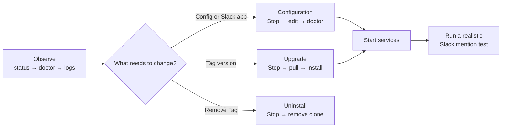

### Level 2 · Task flow

| Operator intent | User flow |
|---|---|
| Check health | `./tag status` → `./tag doctor` → `./tag logs` when needed. |
| Start | Preflight succeeds → MFS starts → Slack bridge starts. |
| Stop | Slack bridge stops → local MFS process stops. |
| Change configuration | Stop → edit private `.env`/rerun guided setup → doctor → start → realistic mention test. |
| Change Slack scopes/interactivity | Ship a versioned additive manifest migration → `tag start` syncs it → Slack requests approval only for new OAuth permissions → Tag refreshes credentials → mention/DM test. |
| Upgrade | Stop → pull the intended release → rerun installer → doctor → start → smoke test. Existing private `.env` is preserved. |
| Uninstall | Stop → remove the clone; optionally remove MFS binaries/data separately. |

### Level 3 · Service blueprint

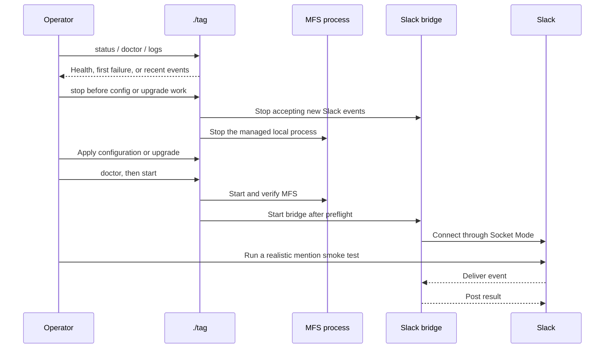

## A demo that covers the product

Use this 10-step script for a product demo. Run it in a sandbox workspace and an
isolated chat location. Skip an optional step when its dependency is not set up.

1. Show `./tag status`, `./tag doctor`, and the startup summary. Confirm that the
   displayed bot identity matches the mention.
2. Mention `@<bot-name>` and ask it to summarize a short discussion.
3. In that thread, reply with `@<bot-name> turn that into three next actions.`
   Channel invocations require a mention; DMs from authorized users do not.
4. Attach a supported screenshot or text file and mention `@<bot-name>` for an
   explanation grounded in the attachment. Use an image-capable backend/model
   for the screenshot path.
5. With an indexed and allowed MFS root, mention the bot and ask for a fact or
   decision stored there.
6. With an indexed and allowed Slack source, mention the bot and ask for a
   summary of that channel.
7. Request a small code or documentation change and focused verification in the
   sandbox workspace.
8. Explicitly request a top-level channel announcement. To demonstrate a Canvas
   instead, confirm the installed bot has the
   `canvases:write` scope; reinstall the app if that scope was newly added.
9. With the Codex backend, reinstall the updated manifest with Slack
   interactivity enabled. Change the model, reasoning, and Fast Mode choices,
   then invoke a later task as that user.
10. If a separate non-allowlisted test account is available, mention the bot and
    show that the backend is not invoked.

## Capability coverage and current boundaries

| Capability | Current path | Important condition or boundary |
|---|---|---|
| Slack mentions and threaded replies | Implemented | Mention must target the installed app used by the running tokens. |
| Caller authorization | Implemented | `SLACK_ALLOWED_USER_IDS` is required and fails closed. |
| Explicit channel restriction | Implemented | Setup requires one or more joined channel IDs and the bridge fails closed when none are configured. |
| Thread text and text attachments | Implemented | Content is bounded and treated as untrusted. |
| Image attachment understanding | Implemented bridge path | Images up to 15 MB are downloaded temporarily; successful interpretation still depends on the selected backend/model. |
| Generated-file delivery | Implemented | Only explicitly declared regular files inside the workspace are uploaded to the invoking thread and returned as private Slack file links; each file is limited to 15 MB. |
| Generated-image upload to Slack | Implemented bridge path | The backend saves up to 10 final PNG, JPEG, GIF, or WebP files in the invocation's dedicated result directory; the bridge validates files up to 15 MB and uploads them to the requesting thread. |
| Slack loading state and answers | Implemented | Claude streams text deltas; Codex App Server streams final-answer deltas and observed activity. |
| Long-answer splitting | Implemented | Results remain in the invoking thread. |
| Model/reasoning/Fast Mode settings | Implemented for Codex | Requires Slack interactivity and a reinstalled updated manifest; Fast Mode uses increased usage. |
| Top-level channel posts | Implemented on explicit request | Restricted to the invoking channel. |
| Slack Canvas creation | Implemented on explicit request | Restricted to the invoking channel; `canvases:write` required. |
| Slack MFS search/read | Implemented; live acceptance pending | Setup creates selected-channel scopes; each reply receives only its current channel's Slack scope. ADR 0001 still applies. |
| Workspace commands and edits | Implemented through backend | Uses local account permissions; not a hardened sandbox. |
| Slack durable session | Not provided | Each invocation launches a fresh agent; thread text and MFS restore context. |
| Slack direct messages | Implemented, enabled by default | Requires an allowlisted sender. `tag start` migrates existing linked apps to `message.im` + `im:history` and opens Slack approval when needed. Set `OPENTAG_SLACK_DM_ENABLED=0` to disable it. Top-level DMs are separate tasks; thread replies provide bounded context. |
| Duplicate-event idempotency | Not implemented | Avoid concurrent mentions in the same thread. |
| Codex cancellation | Implemented with App Server | Slack's native Stop button interrupts the active Codex turn; the legacy exec transport remains a rollback path. |
| Side-effect confirmation layer | Not provided by Tag | Workspace and connected-tool actions follow the selected backend/tool's permissions and confirmation behavior. |
| Enterprise governance/audit/approvals | Not provided | Add external sandboxing and policy systems for production use. |

## Related documentation

- [Slack setup and behavior](../references/slack-adapter.md)
- [Backend behavior](../references/backends.md)
- [Runtime agent contract](../references/runtime-agent.md)
- [Memory model](../references/memory.md)
- [Troubleshooting](troubleshooting.md)
- [Security policy](../SECURITY.md)
