# How Tag works

This is a map of what happens from installing Tag to a reply in Slack.
Operators can use it to set up or demo Tag. Contributors can use it to find
where a feature belongs. It also tells teammates what Tag can and cannot do
today.

> **Scope:** Tag is Slack-only. The unfinished Zulip implementation is kept on
> the `feature/zulip` branch and is not part of the installer, runtime, or the
> flows below.

Examples use `@<bot-name>` because each Tag has its own Slack display name. A
mention must target the Slack app of a Tag that is running on this computer.

## Product at a glance

Tag brings a Codex or Claude agent, signed in on your computer, into a shared
Slack conversation. Slack supplies the request and the thread. The agent does
the work on your computer. Memory (the bundled MFS server) supplies search over
the channels and sources you approved. Each Tag is a separate Slack app with its
own folder, model, and channels. You run Tags from the **Tag app** or the `tag`
command; both use the same settings.

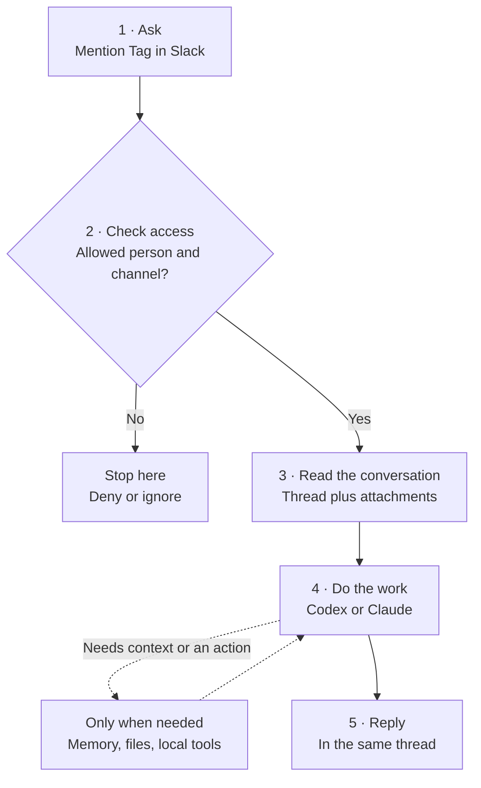
```mermaid
flowchart TD
    Ask["1 · Ask<br/>Mention Tag in Slack"]
    Gate{"2 · Check access<br/>Allowed person and channel?"}
    Stop["Stop here<br/>Deny or ignore"]
    Context["3 · Read the conversation<br/>Thread plus attachments"]
    Brain["4 · Do the work<br/>Codex or Claude"]
    Extra["Only when needed<br/>Memory, files, local tools"]
    Reply["5 · Reply<br/>In the same thread"]

    Ask --> Gate
    Gate -->|No| Stop
    Gate -->|Yes| Context
    Context --> Brain
    Brain -.->|Needs context or an action| Extra
    Extra -.-> Brain
    Brain --> Reply
```

Read the solid line from top to bottom. The dashed branch is optional: simple
questions go straight from the agent to the reply.

### Example: summarize a Slack thread

1. Maxine writes:

   > @Tag summarize this thread and list the open questions.

2. Tag confirms that Maxine and the channel are allowed.
3. It reads the thread, up to the latest 30 messages.
4. Codex or Claude writes the summary. It can search memory if the request
   refers to older material outside the thread.
5. Tag posts the answer in the same thread.

A few rules matter:

- **Chat** is the shared interface. It is not where the agent signs in.
- **Brain** is one agent conversation per Slack thread. A later mention in the
  same thread continues it, for the person who started it.
- **Memory** holds only channels and sources that are indexed and allowed.
  Tag uses it only when a request needs it.
- **Tools** come from the agent's environment on your computer and keep their
  own credentials and permissions.

## Actors

| Actor | Responsibility |
|---|---|
| Operator (owner) | Installs Tag, adds Tags, connects the AI, chooses channels and the model, and starts or stops Tags. Setup makes the person signed in to Slack the owner. |
| Authorized teammate | Mentions Tag, supplies thread context or attachments, and reviews the result. |
| Unauthorized teammate | Receives a denial. Tag does not read the thread or start the agent. |
| Slack | Delivers the conversation and shows progress and results. |
| Codex or Claude | Reasons, searches, uses permitted local tools, and works in the Tag's folder. |
| Memory (MFS) | Searches and reads indexed, approved sources. |
| Tag app / `tag` | Install, set up, run, watch, and change Tags on this computer. |

## How to read the levels

| Depth | Read this when you need | What it shows |
|---|---|---|
| **Level 1 · Journey** | A fast orientation | The happy path and its outcome. |
| **Level 2 · Task flow** | To perform or demonstrate the flow | Exact steps in the app and the CLI, choices, limits, and recovery. |
| **Level 3 · Service blueprint** | To implement, operate, or debug it | Handoffs between Slack, Tag, the agent, memory, and files. |

Start with Level 1. Go only as deep as the job needs.

## Flow 1: Install and set up the first Tag

See [Set up and manage Tag](tag-management.md) for every option and recovery
step.

### Level 1 · Journey

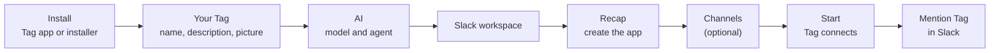
```mermaid
flowchart LR
    Install["Install<br/>Tag app or installer"]
    Name["Your Tag<br/>name, description, picture"]
    AI["AI<br/>model and agent"]
    Workspace["Slack workspace"]
    Create["Recap<br/>create the app"]
    Channels["Channels<br/>(optional)"]
    Start["Start<br/>Tag connects"]
    Test["Mention Tag<br/>in Slack"]

    Install --> Name --> AI --> Workspace --> Create --> Channels --> Start --> Test
```

### Level 2 · Task flow

| Step | App | Terminal |
| --- | --- | --- |
| Install | Download Tag from the GitHub release (macOS DMG; Windows and Linux: coming soon, use the terminal installer). On first run it installs the `tag` runtime and shows progress. | Run `install.sh` (macOS, Linux) or `install.ps1` (Windows). It installs a pinned Python with `uv` and the Slack CLI; you don't need Python yourself. |
| Usage data | Turned on at first run with a short note; **Learn more** opens Settings → Privacy to turn it off. | The terminal shows the same note on first interactive use; `tag telemetry off` turns it off. |
| Add the Tag | **Add your first Tag** | `tag setup` (or `tag add` for another Tag) |
| Your Tag | Name, one-line description (up to 140 characters), and a picture: shuffle Tag's waterdrops or choose your own. Or use an existing Slack app. | The same questions in the terminal. |
| AI | Pick the default model from your connected Codex and Claude accounts. If none is connected, the app opens Settings → AI connections, then returns. | Pick the model. With nothing connected, sign in with `tag settings ai sign-in codex\|claude` in another terminal, then choose **Check again**. |
| Workspace | Choose a Slack sign-in, or sign in to another workspace. The signed-in person becomes the owner. | Same. Nothing changes in Slack before this step. |
| Recap | One recap approves creating the app. Tag creates it, adds the picture, installs it, and connects it. | Same, with **Create in Slack**, **Edit**, **Edit AI**, or **Back**. |
| Channels | Choose channels, or none: the Tag follows invitations, so `/invite` it later. | Same. |
| Start | The Tag starts by itself and shows each start step. | Setup saves and stops. Run the `tag NAME start` command it prints. |
| Check | Home shows the Tag online. **Try it in Slack** opens Slack. | `tag NAME status`, then `tag NAME logs`. |

The Tag's folder is `~/Tag/<team>-<app>`, named after its Slack workspace and
app IDs. After its first successful start, the Tag sends its owner a welcome
DM.

Verify the whole journey by mentioning the Tag in an allowed channel and
reading its reply. A running service does not prove that a mention gets a
reply.

### Level 3 · Service blueprint

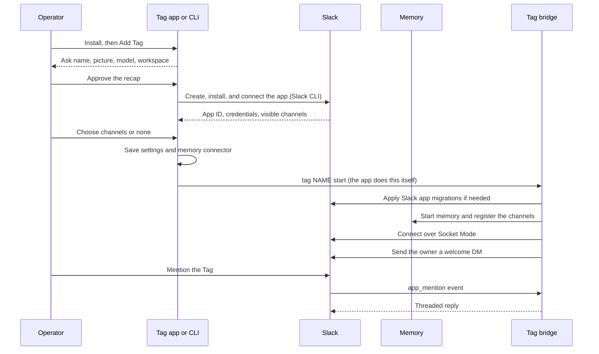
```mermaid
sequenceDiagram
    participant O as Operator
    participant A as Tag app or CLI
    participant S as Slack
    participant M as Memory
    participant B as Tag bridge

    O->>A: Install, then Add Tag
    A-->>O: Ask name, picture, model, workspace
    O->>A: Approve the recap
    A->>S: Create, install, and connect the app (Slack CLI)
    S-->>A: App ID, credentials, visible channels
    O->>A: Choose channels or none
    A->>A: Save settings and memory connector
    A->>B: tag NAME start (the app does this itself)
    B->>S: Apply Slack app migrations if needed
    B->>M: Start memory and register the channels
    B->>S: Connect over Socket Mode
    B->>S: Send the owner a welcome DM
    O->>S: Mention the Tag
    S->>B: app_mention event
    B-->>S: Threaded reply
```

The Tag connects before memory finishes importing channel history. It can
answer right away; history search covers each channel once it is indexed.

## Flow 2: Delegate a task from Slack

### Level 1 · Journey

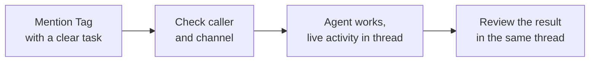
```mermaid
flowchart LR
    Ask["Mention Tag<br/>with a clear task"]
    Check["Check caller<br/>and channel"]
    Work["Agent works,<br/>live activity in thread"]
    Reply["Review the result<br/>in the same thread"]

    Ask --> Check --> Work --> Reply
```

### Level 2 · Task flow

Try this:

> @Tag summarize this thread and list decisions, owners, and open questions.

1. Mention the Tag in a channel message to start a thread, or inside a thread to
   continue it. An authorized user can also message the Tag directly in its
   Messages tab without a mention.
2. Say what you want back, what evidence to use, and whether Tag should post or
   change anything.
3. Watch **Agent activity** in the thread: short steps such as reading a file
   or running a script. Repeated steps are grouped. See
   [Watch Tag work](reference/supported-capabilities.md#watch-tag-work).
4. If the agent asks to do something outside its sandbox, only you see the
   approval. Codex offers **Allow once**, **Allow for this task**, **Deny**, and
   **Deny and stop**; Claude offers **Allow once**, **Deny**, and **Deny and
   stop**, plus **Allow for this task** and **Always allow** when it proposes
   a rule.
5. Review the answer. It ends with the agent, model, thinking level, and how
   long it took. Long answers arrive as several replies. Use Slack's **Stop**
   button to stop a running task.
6. To refine it, mention the Tag again in the same thread. The agent continues
   the same conversation.

The operator can see every request in the Tag app: open the Tag, then **Activity**, or with
`tag NAME logs --json` and `tag NAME logs --activity RUN_ID`.

### Level 3 · Service blueprint

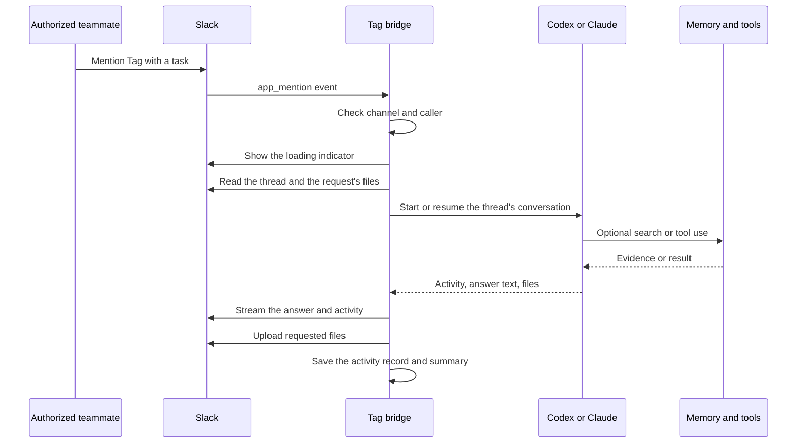
```mermaid
sequenceDiagram
    participant U as Authorized teammate
    participant S as Slack
    participant T as Tag bridge
    participant B as Codex or Claude
    participant M as Memory and tools

    U->>S: Mention Tag with a task
    S->>T: app_mention event
    T->>T: Check channel and caller
    T->>S: Show the loading indicator
    T->>S: Read the thread and the request's files
    T->>B: Start or resume the thread's conversation
    B->>M: Optional search or tool use
    M-->>B: Evidence or result
    B-->>T: Activity, answer text, files
    T->>S: Stream the answer and activity
    T->>S: Upload requested files
    T->>T: Save the activity record and summary
```

Runtime behavior:

- The bridge removes the mention before it sends the request to the agent.
- Codex (App Server) and Claude (Agent SDK) stream answer text and show
  **Agent activity**. Private reasoning and raw tool output stay out of Slack.
- One Slack thread runs one request at a time.
- A failed request sends the requester a private message with the cause and
  recovery choices. See [Error reporting](reference/error-reporting.md).

## Flow 3: Continue work with thread context and attachments

### Level 1 · Journey

For example:

> @Tag compare that proposal with the earlier recommendation.

> @Tag review the attached screenshot and explain the failure.

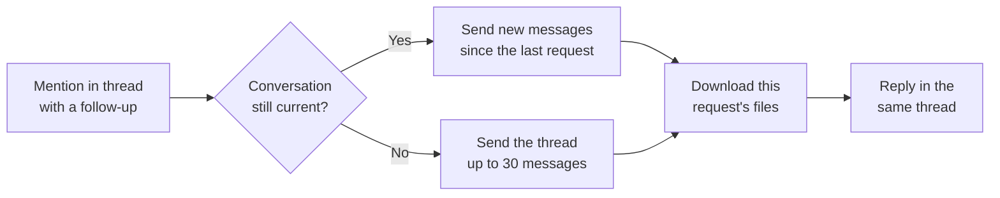
```mermaid
flowchart LR
    Mention["Mention in thread<br/>with a follow-up"]
    Resume{"Conversation<br/>still current?"}
    New["Send new messages<br/>since the last request"]
    Fresh["Send the thread<br/>up to 30 messages"]
    Files["Download this<br/>request's files"]
    Reply["Reply in the<br/>same thread"]

    Mention --> Resume
    Resume -->|Yes| New --> Files
    Resume -->|No| Fresh --> Files
    Files --> Reply
```

### Level 2 · Task flow

1. Tag saves one agent conversation per Slack thread, for Codex and Claude. A
   later mention by the same person continues it, so earlier tool results carry
   forward. It receives only the messages posted since its last request.
2. A fresh conversation starts when the conversation reaches
   `OPENTAG_THREAD_MAX_CONTEXT_TOKENS` (default 150000), after
   `OPENTAG_THREAD_IDLE_HOURS` without activity (default 4), or for a different
   requester. It receives the latest 30 messages of the thread.
3. Tag downloads the files on the request, up to 10 files, 15 MB each and 30 MB
   in total. Text content is limited to 12,000 characters per file.
4. Earlier files in the thread are listed by name. The agent can open one that
   was shared in this channel when the request needs it. An earlier file over
   15 MB is skipped and named in the prompt instead of blocking the request.
   Images Tag generated are also kept in the Tag's folder under
   `artifacts/<channel>/images`.
5. Temporary downloads are removed when the request finishes. A file Tag could
   not open is named in the prompt, so the agent says what it could not see.

Attachments are untrusted input. Instructions inside an image or document do
not override the teammate's request or Tag's rules.

### Level 3 · Service blueprint

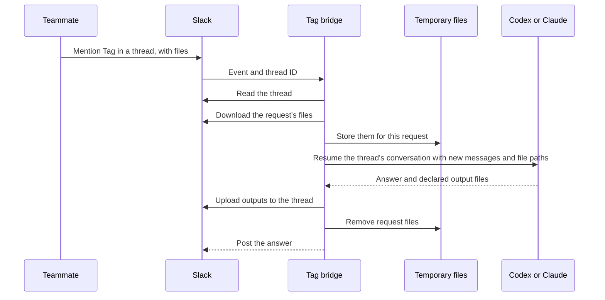
```mermaid
sequenceDiagram
    participant U as Teammate
    participant S as Slack
    participant T as Tag bridge
    participant F as Temporary files
    participant B as Codex or Claude

    U->>S: Mention Tag in a thread, with files
    S->>T: Event and thread ID
    T->>S: Read the thread
    T->>S: Download the request's files
    T->>F: Store them for this request
    T->>B: Resume the thread's conversation with new messages and file paths
    B-->>T: Answer and declared output files
    T->>S: Upload outputs to the thread
    T->>F: Remove request files
    T-->>S: Post the answer
```

## Flow 4: Search memory

Thread history is short-term context. Memory gives durable, searchable context
from approved sources.

### Level 1 · Journey

> @Tag find the original decision, compare it with the current code, and explain what changed.

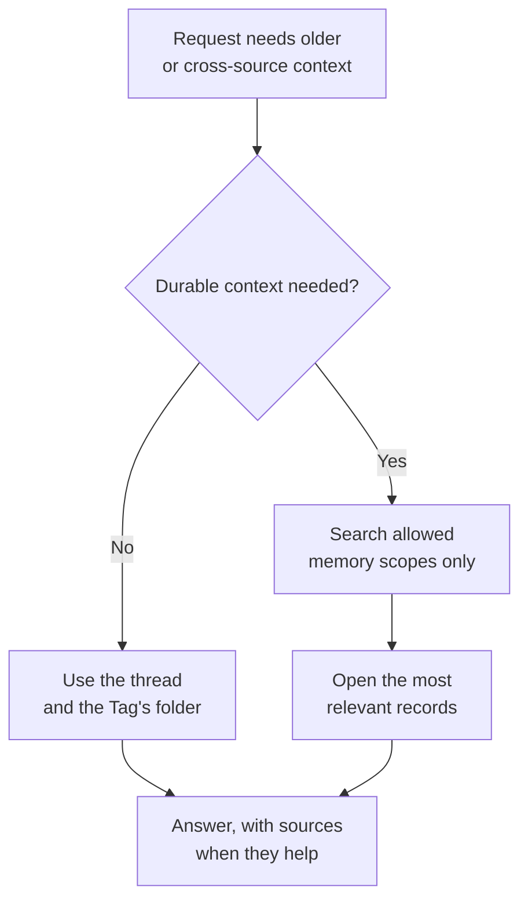
```mermaid
flowchart TD
    Request["Request needs older<br/>or cross-source context"]
    Decide{"Durable context needed?"}
    Thread["Use the thread<br/>and the Tag's folder"]
    Search["Search allowed<br/>memory scopes only"]
    Reopen["Open the most<br/>relevant records"]
    Answer["Answer, with sources<br/>when they help"]

    Request --> Decide
    Decide -->|No| Thread --> Answer
    Decide -->|Yes| Search --> Reopen --> Answer
```

### Level 2 · Task flow

1. The agent decides that it needs outside context.
2. It searches only the scopes in `MFS_ALLOWED_SCOPES`. A Slack request gets
   only its own channel's history, plus any sources `MFS_CHANNEL_SCOPES` maps
   to that channel.
3. It reopens the best results when it needs exact lines or records.
4. It combines that evidence with the thread and the Tag's folder.
5. It cites sources when asked or when they make the answer more trustworthy.

New Tags follow invitations: every channel the Tag joins, including later
invitations, is answered in and indexed. Leaving a channel stops search there
after about a minute; data already indexed is not erased.

### Level 3 · Service blueprint

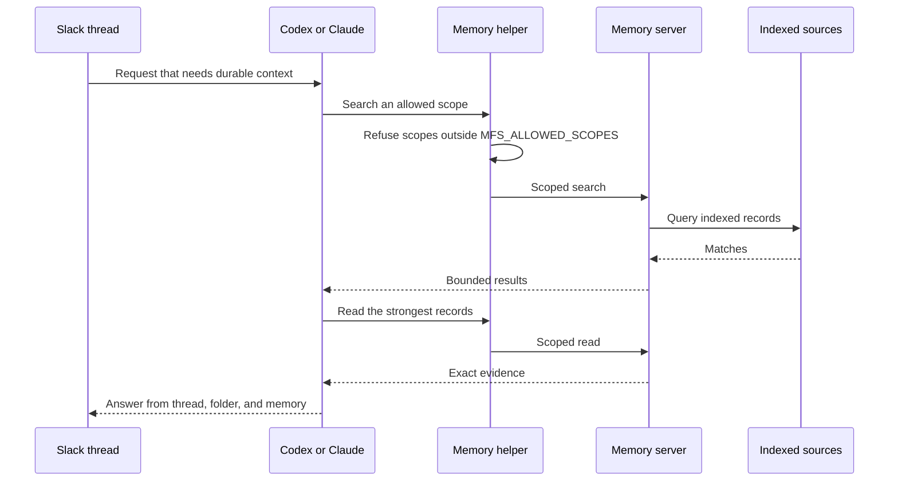
```mermaid
sequenceDiagram
    participant S as Slack thread
    participant B as Codex or Claude
    participant H as Memory helper
    participant M as Memory server
    participant X as Indexed sources

    S->>B: Request that needs durable context
    B->>H: Search an allowed scope
    H->>H: Refuse scopes outside MFS_ALLOWED_SCOPES
    H->>M: Scoped search
    M->>X: Query indexed records
    X-->>M: Matches
    M-->>B: Bounded results
    B->>H: Read the strongest records
    H->>M: Scoped read
    M-->>B: Exact evidence
    B-->>S: Answer from thread, folder, and memory
```

Memory can index Slack history, local files, GitHub, Jira, Linear, databases,
object stores, and other connectors. Indexing a source and allowing its scope
are separate decisions; both are needed.

For a channel summary:

> @Tag summarize this channel and identify unresolved action items.

The agent looks up the current channel in the indexed Slack history. It does
not mistake the thread for the whole channel. If the channel isn't indexed yet,
it says so.

## Flow 5: Work in the Tag's folder

### Level 1 · Journey

> @Tag fix the failing parser test, run the focused suite, and summarize the changed files.

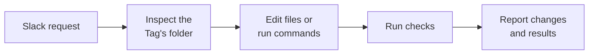
```mermaid
flowchart LR
    Request["Slack request"]
    Inspect["Inspect the<br/>Tag's folder"]
    Work["Edit files or<br/>run commands"]
    Verify["Run checks"]
    Report["Report changes<br/>and results"]

    Request --> Inspect --> Work --> Verify --> Report
```

### Level 2 · Task flow

1. The agent works in the Tag's folder, `~/Tag/<team>-<app>`.
2. It reads files, runs commands, or edits code with your account's
   permissions, within the agent's own sandbox and approvals.
3. It uses installed skills and commands when they fit the task.
4. It runs checks that fit the change.
5. It reports changed files and results in Slack.

Tag is not a hardened sandbox. Use a trusted folder for demos, and an external
sandbox for stronger isolation.

## Flow 6: Share outputs in Slack

The default result is a reply in the thread. Files and two explicit outputs are
also available.

### Level 1 · Journey

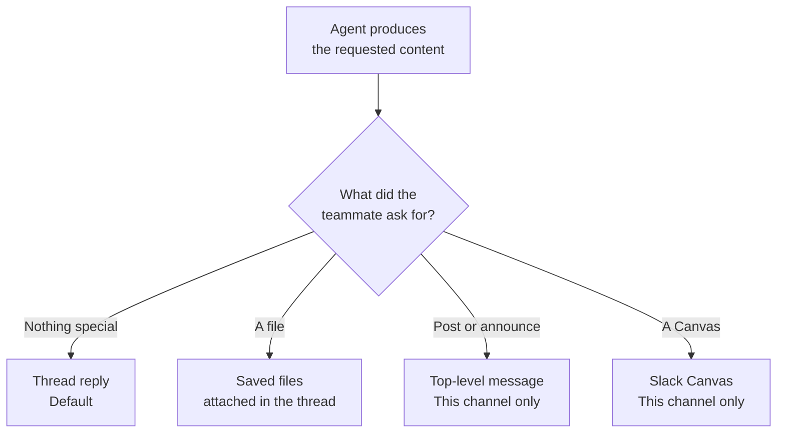
```mermaid
flowchart TD
    Result["Agent produces<br/>the requested content"]
    Destination{"What did the<br/>teammate ask for?"}
    Thread["Thread reply<br/>Default"]
    Files["Saved files<br/>attached in the thread"]
    Channel["Top-level message<br/>This channel only"]
    Canvas["Slack Canvas<br/>This channel only"]

    Result --> Destination
    Destination -->|Nothing special| Thread
    Destination -->|A file| Files
    Destination -->|Post or announce| Channel
    Destination -->|A Canvas| Canvas
```

### Level 2 · Task flow

#### Get a file

> @Tag read launch-plan.md and create launch-checklist.md.

Tag keeps the file in its folder and attaches it in the thread, up to 15 MB per
file. Say "keep it local" to skip the upload. The app shows the file under the
request in Activity.

#### Post a top-level channel message

> @Tag turn the agreed release notes into a short announcement and post it in this channel.

When the request says to post, send, or share, the agent can post a top-level
message, but only in the channel that asked.

#### Create a Slack Canvas

> @Tag create a Canvas called “Launch Checklist” from the decisions in this thread.

The agent writes Markdown in the Tag's folder and creates a Canvas in the
channel that asked, up to 500 KB.

## Flow 7: Choose the Tag's model and thinking level

Each Tag has one default model and thinking level. Every request uses them.
Slack has no per-user model setting.

### Level 1 · Journey

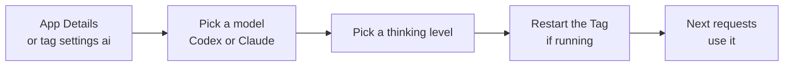
```mermaid
flowchart LR
    Open["App Details<br/>or tag settings ai"]
    Model["Pick a model<br/>Codex or Claude"]
    Level["Pick a thinking level"]
    Restart["Restart the Tag<br/>if running"]
    Next["Next requests<br/>use it"]

    Open --> Model --> Level --> Restart --> Next
```

### Level 2 · Task flow

| Step | App | Terminal |
| --- | --- | --- |
| See choices | The Tag → **Details** → **Model** lists models from connected accounts, grouped by agent. | `tag NAME settings ai models` |
| Choose a model | Pick one. The agent follows the model. | `tag NAME settings ai model claude:opus` |
| Choose a thinking level | Pick one the model offers, or the model's default. | `tag NAME settings ai effort high` (or `default`) |
| Apply | The app restarts a running Tag. | Add `--restart`, or confirm when asked. |
| Connect accounts | Settings → General → **AI connections** | `tag settings ai sign-in codex\|claude` |

Accounts are shared by all Tags on the computer. If the saved model is no longer
offered, the app and Slack's error message say so; pick another model.

Old Slack **Configure** buttons and per-user choices are retired. Startup
archives the old preferences. An old button only explains where the setting
moved, with a link to the Tag app.

## Flow 8: Denials, failures, and recovery

### Level 1 · Journey

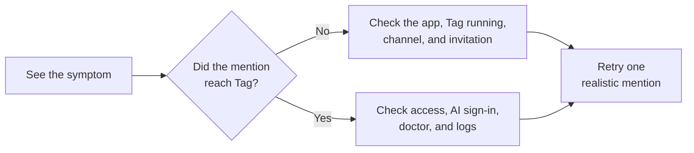
```mermaid
flowchart LR
    Symptom["See the symptom"]
    Delivery{"Did the mention<br/>reach Tag?"}
    Slack["Check the app, Tag running,<br/>channel, and invitation"]
    Runtime["Check access, AI sign-in,<br/>doctor, and logs"]
    Verify["Retry one<br/>realistic mention"]

    Symptom --> Delivery
    Delivery -->|No| Slack --> Verify
    Delivery -->|Yes| Runtime --> Verify
```

### Level 2 · Decision flow

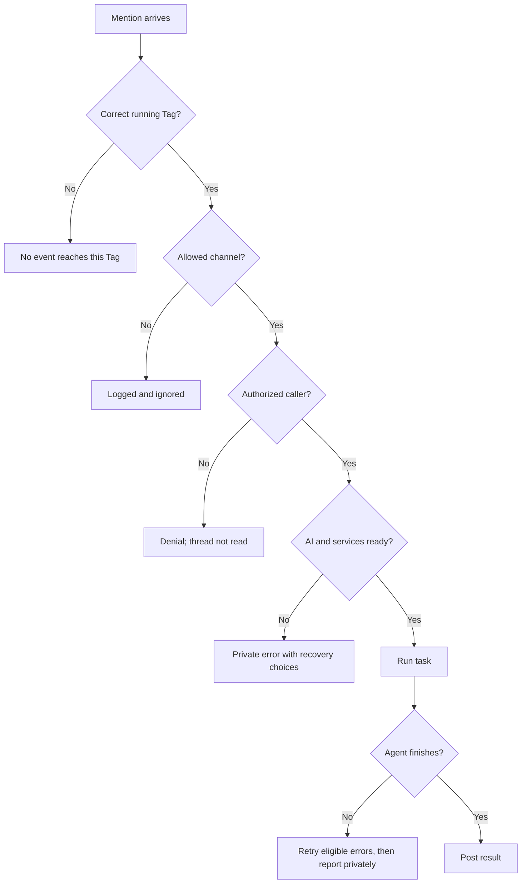
```mermaid
flowchart TD
    A[Mention arrives] --> B{Correct running Tag?}
    B -->|No| C[No event reaches this Tag]
    B -->|Yes| D{Allowed channel?}
    D -->|No| E[Logged and ignored]
    D -->|Yes| F{Authorized caller?}
    F -->|No| G[Denial; thread not read]
    F -->|Yes| H{AI and services ready?}
    H -->|No| I[Private error with recovery choices]
    H -->|Yes| J[Run task]
    J --> K{Agent finishes?}
    K -->|No| L[Retry eligible errors, then report privately]
    K -->|Yes| M[Post result]
```

### Level 3 · Operator runbook

For a silent mention, check delivery first:

| Check | App | Terminal |
| --- | --- | --- |
| The right Tag is running | Home shows it **Online**. | `tag list`, `tag NAME status` |
| It is in the channel | The Tag → **Channels** | `tag list --json` (`channels`) |
| The event arrived | The Tag → **Logs** | `tag NAME logs` |

If the event arrives but the task fails:

1. Read the private error message in Slack, or the request in Activity
   (**Show errors**). `tag NAME logs --activity RUN_ID` shows its steps.
2. Run `tag NAME doctor` and fix the first failed check. The app's **Fix**
   notice points to the same fix.
3. Check the AI connection in Settings → AI connections or with
   `tag settings ai`.
4. For search failures, check that memory is healthy and the source is indexed
   and allowed.
5. Restart the Tag only after a change that needs a new process.

## Flow 9: Run, update, and remove Tags

### Level 1 · Journey

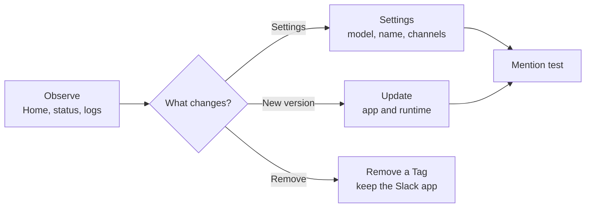
```mermaid
flowchart LR
    Observe["Observe<br/>Home, status, logs"]
    Change{"What changes?"}
    Settings["Settings<br/>model, name, channels"]
    Upgrade["Update<br/>app and runtime"]
    Remove["Remove a Tag<br/>keep the Slack app"]
    Smoke["Mention test"]

    Observe --> Change
    Change -->|Settings| Settings --> Smoke
    Change -->|New version| Upgrade --> Smoke
    Change -->|Remove| Remove
```

### Level 2 · Task flow

| Intent | App | Terminal |
| --- | --- | --- |
| Check health | Home: *N of M online*; the Tag's Logs tab | `tag NAME status`, `tag NAME doctor`, `tag NAME logs` |
| Start or stop | The Tag's switch; **Start all** / **Stop all** per workspace; the menu bar | `tag NAME start` / `stop`; `tag start --workspace TEAM` |
| Keep running after login | Settings → General → **Keep Tags running** and **Open Tag at login** | `tag autostart on` |
| Rename or describe | Details → **Rename** / description **Edit** | `tag NAME rename "Name"`, `tag NAME describe "…"` |
| Change the model | Details → **Model** | `tag NAME settings ai model VALUE` |
| Update | Settings → **Updates** → **Update Tag** updates the app and the runtime together; choose Stable, Beta, or Alpha | `tag upgrade`; `tag upgrade --channel beta` |
| Remove a Tag | Details → **Remove this Tag…** (keeps the Slack app) | `tag NAME remove` |
| Also delete the Slack app | **Also delete the Slack app…**, then type the App ID | `tag NAME remove --delete-app --confirm-app A…` |
| Start setup over | No app action | `tag NAME reset` (keeps the Slack app unless you choose to delete it) |

An update restarts the Tags that were running and runs any migrations before
they connect. Removing a Tag moves its folder to `abandoned/` under `~/Tag`
and removes its Slack history from memory; it never deletes files. Deleting a
Slack app is permanent and can't be undone.

### Level 3 · Service blueprint

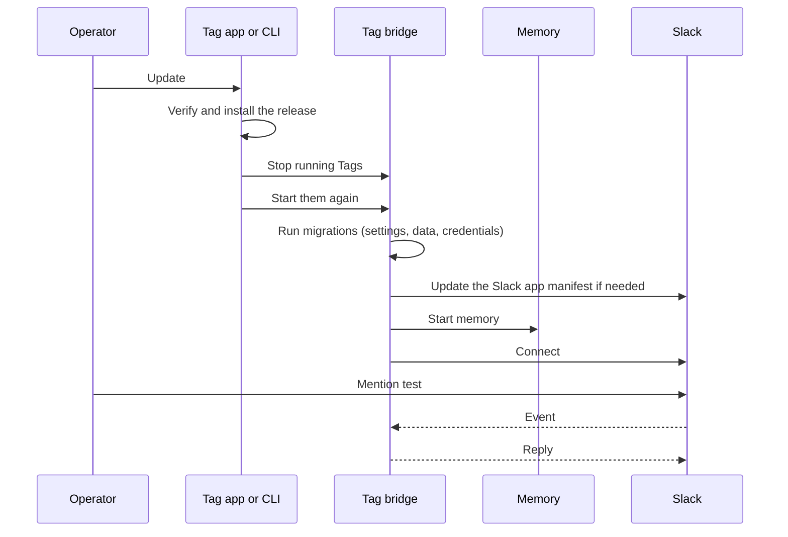
```mermaid
sequenceDiagram
    participant O as Operator
    participant A as Tag app or CLI
    participant B as Tag bridge
    participant M as Memory
    participant S as Slack

    O->>A: Update
    A->>A: Verify and install the release
    A->>B: Stop running Tags
    A->>B: Start them again
    B->>B: Run migrations (settings, data, credentials)
    B->>S: Update the Slack app manifest if needed
    B->>M: Start memory
    B->>S: Connect
    O->>S: Mention test
    S-->>B: Event
    B-->>S: Reply
```

## A demo that covers the product

Run it in a test workspace and a quiet channel. Skip a step if its dependency is
not set up.

1. Open the app. Show Home and the Tag online. In a terminal, show
   `tag list` and `tag NAME status`.
2. Mention the Tag and ask it to summarize a short discussion.
3. In that thread, reply with this follow-up. The Tag continues the same
   conversation:

   > @Tag turn that into three next actions.

4. Attach a screenshot or text file and ask about it. Use a model that reads
   images for the screenshot.
5. With channel history indexed, ask for a summary of the channel.
6. Ask for a file, for example a checklist, and show it attached in the thread.
7. Ask for a small code or documentation change and a focused check in the
   Tag's folder. Show **Agent activity**, and an approval if one appears.
8. Ask for a top-level announcement or a Canvas in the channel.
9. In the Tag app, open the request in Activity and its steps. Change the model in
   Details and ask again.
10. With a second test account that is not allowed, mention the Tag and show
    that the agent does not run.

## Capability coverage and current boundaries

| Capability | Status | Condition or boundary |
|---|---|---|
| Mentions and threaded replies | Implemented | The mention must target a running Tag's app. |
| Direct messages | Implemented, on by default | Allowed senders only. `OPENTAG_SLACK_DM_ENABLED=0` turns it off. |
| Caller authorization | Implemented | `SLACK_ALLOWED_USER_IDS` is required and fails closed. Setup sets the owner. |
| Channel restriction | Implemented | Channels the Tag joined (invitation policy) or a saved list. |
| One conversation per thread | Implemented for Codex and Claude | Per requester; bounded by token and idle limits. Legacy transports start fresh. |
| Thread text and attachments | Implemented | Bounded and untrusted. Earlier thread files can be reopened. |
| Live activity and streamed answers | Implemented with App Server or Agent SDK | No private reasoning or raw tool output in Slack. |
| Approvals | Codex and Claude: scoped choices, including saved rules | Private to the requester; unanswered requests are denied. |
| Stop a task | Implemented with App Server or Agent SDK | Slack's Stop button. |
| Saved files | Implemented | Kept locally and attached in Slack by default; 15 MB per file. |
| Generated images | Implemented | Up to 10 per request, uploaded and kept in the Tag's folder. |
| Top-level posts and Canvases | On explicit request | This channel only; Canvases need `canvases:write`. |
| Memory search | Implemented | Allowed scopes only; each reply gets its own channel's history. |
| Model and thinking level | Per Tag | The app's Details tab or `tag settings ai`. No per-user overrides. |
| Failure reports | Implemented | Private to the requester; sharing is manual. |
| Activity history | Implemented | The app's Activity tab or `tag NAME logs --json`; kept 30 days. |
| Work in the Tag's folder | Through the agent | Your account's permissions; not a hardened sandbox. |
| Duplicate-event protection | Partial | One request per thread at a time. |
| Organization governance and audit | Not provided | Add external sandboxing and policy for production use. |

## Related documentation

- [Set up and manage Tag](tag-management.md)
- [Supported capabilities](reference/supported-capabilities.md)
- [Slack setup and behavior](../references/slack-adapter.md)
- [Backend behavior](../references/backends.md)
- [Runtime agent contract](../references/runtime-agent.md)
- [Memory model](../references/memory.md)
- [Troubleshooting](troubleshooting.md)
- [Security policy](../SECURITY.md)
